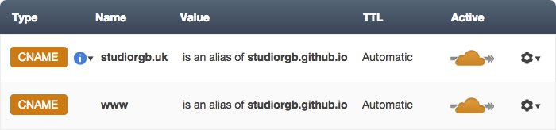
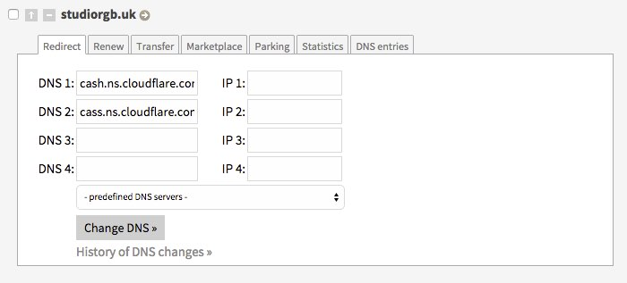

On daily basis I work a lot with Wordpress. In the company that I work for we build cool looking websites for clients that are not necessarily very familiar with technology behind it. It is fantastic tool, with easy to grasp backend and almost endless possibilities. Wordpress was a first thing that came to my mind when I decided to build my own blog. After a quick research I found out that it is many tools that better suits my simple text based blog than Wordpress. Node.js based [Ghost](https://ghost.org/), very popular [Tumblr](https://www.tumblr.com/) or Twitter’s founders [Medium](https://medium.com/). Shortly we can expect a new kid on the block - [typed.com](https://vimeo.com/117604881). All this tools are amazing but I wanted something even simpler and then I found a power of static sites generators.

Idea of static site generators isn’t any new. As we can see [on this website](https://staticsitegenerators.net/) selection of static site generators isn’t small neither (today is 389 of them). One of the most popular one is [Jekyll](https://jekyllrb.com/) created by Github’s authors. It’s a first choice of many of my favourite bloggers so I decided to give it a try.

## Why Jekyll?

Less stuff to care about, more time to do productive stuff. It doesn’t require database at all because all files are static. It doesn’t require advanced server with specific configuration because all files are .html documents. [Github Pages](https://pages.github.com/) lets you host your website directly from Github repository totally for free! Another good reason to use Github to store your files is constant version controlling (no more manual backups).

## Getting started

It’s no point to describe how to create your Jekyll blog because you can find fantastic documentation on [official website](https://jekyllrb.com/). It takes literally 3 minutes and everything that you need is Ruby and Node.js installed on your Linux or Mac computer. Windows isn’t officially supported platform however with few little tweaks you can run Jekyll on this platform as well (more information [here](https://jekyllrb.com/docs/windows/)). At this point let me quote Bryan Jones who answered a question on [CodeKit FAQ](https://codekitapp.com/help/faq/) page “I’m on Windows. What do you recommend I use to work with Less, Sass, etc?”:

> A Mac.

## Hosting Jekyll on Github Pages

Using [Github Pages](https://pages.github.com/) to host your Jekyll website is fantastic idea. You can use it to host your personal or project website. Process of creating one is dead easy but you need to decide first what kind of website is that going to be. Procedure of creating a personal and project website is slightly different. To learn more about differences go to [official website](https://pages.github.com/) where you can find illustrated tutorial. I will go through process of creating personal website.

The only thing that you need to do is create a Github repository for your project. One requirement here is to use specific pattern to name your repo - githubusername.github.io. My Github username is `pawelgrzybek` so name of my repository is [pawelgrzybek.github.io](https://github.com/pawelgrzybek/jekyll-pawelgrzybek). Then push your Jekyll project to this repository. Make sure you have “_site” inside your .gitignore file. Thats the trick - you use repository for your source files and output is automatically generated in the background. After pushing your changes it takes literally few seconds to see your website live under http://githubusername.github.io. Yeah, easy like that :)

## Using custom domain for your Jekyll website

This is another very easy process. Add to your repository CNAME file (without any extension) and inside just put your desirable domain. For example, use mydomain.com (without protocol). Don’t forgot to push your new file to your repo.

Next step is to do changes on your domain name settings. Log in to your domain’s provider website and inside DNS settings you need to add two A records.

```
192.30.252.153
192.30.252.154
```

On Github Pages documentation you can find this [process described more in depth](https://help.github.com/articles/tips-for-configuring-an-a-record-with-your-dns-provider/#configuring-an-a-record-with-your-dns-provider) but let me show you a better option…

## CloudFlare with Jekyll blog hosted on Github Pages

First thing first let me introduce you what [CloudFlare](https://www.cloudflare.com) is. This is an information that you can find on their website:

> We automatically optimize the delivery of your web pages so your visitors get the fastest page load times and best performance. The result: CloudFlare-powered websites see a significant improvement in performance and a decrease in spam and other attacks.

They didn’t lie. Don’t be scared of terms like “Compare plans” or “Pricing” on their website, because all we need is Free account. Create one now!

Time to add our website to our account. Go to Websites page and type your domain name (this one that you placed inside your CNAME file) and hit big green button “Add website”. After initial scan click big button “Continue setup”. Now the tricky bit! Add two CNAME records. Name of first one is your domain name (the same as in CNAME file in your Github repository). Name of a second one is “www” (this one redirects www.mydomain.com to mydomain.com). Alias for both is: githubusername.github.io (in my case githubusername.github.io). Have a look on screen shoot of my DNS settings.



But hola, wait a second! Why the hell did we set two CNAME records if we can clearly see on Github Pages documentation we should create two A records? Since March 31 2014 CloudFlare is using something called CNAME Flattening. Basically it presents a CNAME as an A record. You can read more about this feature in on [CloudFlare support page](https://support.cloudflare.com/hc/en-us/articles/200169056-CNAME-Flattening-RFC-compliant-support-for-CNAME-at-the-root). On this stage feel free to add more records if you need to. For example MX records to use email accounts with your custom domain. If all records are in the place click green button “I’m done entering my DNS records”.

On next screen just choose a Free plan, leave rest of the setting as they are and go to a next step. Time to change name servers on your domain’s provider website. This process may vary dependable of your provider. Read the FAQ section or contact the support if you struggle to do that. That how it looks like on backend of my domain’s provider:



Once updated, return to this CloudFlare and go to next step. This process can take up to 24 hours but normally it’s ready to go after less than 5 minutes. Be patient.

BOOM! At this point when you go to your domain you should see your Jekyll project live! But don’t close the CloudFlare tab yet cause we need to adjust some settings. Go to Websites -> mydomian.com -> CloudFlare settings. Navigate to Performance Settings and change Caching level to Aggressive, Minimum expire TTL to 1month and tick js, css and html under Auto Minify settings. You can adjust tons of more advanced settings here but this is good enough to just start blogging and enjoying well optimised website.

## Helpful resources

I did struggle with few minor things during building my website but google.com helped me a lot to solve all issues. The main website that helped me a lot is [David Ensinger’s blog](http://davidensinger.com/). I really recommend to follow David’s blog or [himself on twitter](https://twitter.com/DavidEnsinger).

That’s it guys. I’m really glad I learned how to use Jekyll and I’m more than sure I will use this tool on many projects. Feel free to check the source code of my blog on [Github repository](https://github.com/pawelgrzybek/jekyll-pawelgrzybek). That can be amazing alternative to globally overused Wordpress when you create a blog, portfolio or simple static website. If you have any question just use a comments below and I’ll be more than happy to help you whenever I’m able to do so.
