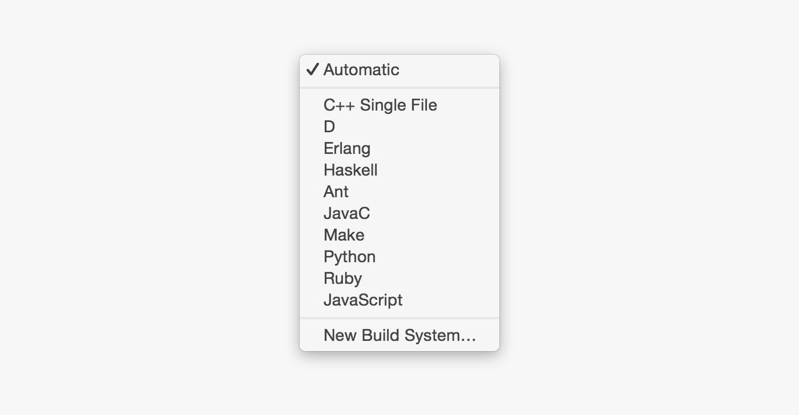
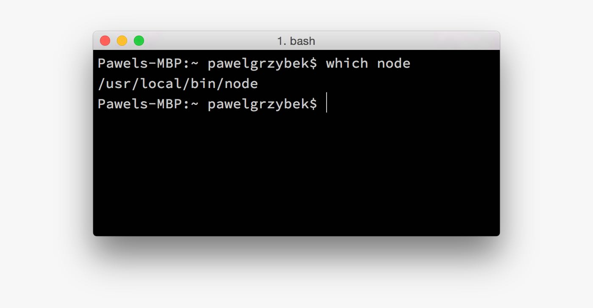
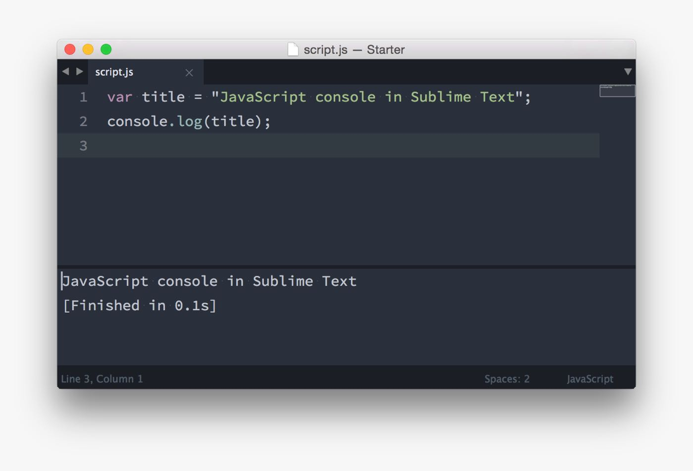

Learning JavaScript can be a long and difficult journey. You can read tons of books and articles, attend reputable conferences and watch many videos but you are wasting your time if you won't practice it. Google Chrome Javascript Console isn't the most comfortable tool for sure. Tools like [jsbin.com](http://jsbin.com/) or [jsfiddle.net](http://jsfiddle.net/) are super cool but lets confirm that, nothing is more convenient to write a piece of code than your favourite editor. Let me share with you how you can test your JavaScript scripts and execute it via [build systems](http://docs.sublimetext.info/en/latest/file_processing/build_systems.html) feature in Sublime Text 3.

Build systems allows you to run your files through external programs without manually switching between code editor and Terminal. Sublime Text comes with few predefined profiles.



Our mission is to add a new one for JavaScript. We are going to use [node.js](https://nodejs.org/). Make sure it is already installed on your device.

## Create JavaScript build system in Sublime Text

Every built system is described on JSON file with `.sublime-build` extension. To create new one go to Tools > Build System > New Build System... If you are mac OS user, copy and paste this bit of code:

```json
{
  "cmd": ["/usr/local/bin/node", "$file"],
  "selector": "source.js"
}
```

Windows users...

```json
{
  "cmd": ["C:/Program Files/nodejs/node.exe", "$file"],
  "selector": "source.js"
}
```

In most cases single `node` command does the job instead of passing a full path to node. I found this method more reliable though. If you are not sure where node is installed, just type `which node` in Terminal (mac OS) or `where node` in command prompt (windows users) to get the path.



Save this file as a JavaScript.sublime-build in "User" directory inside Sublime Text settings folder.

Time for fun part. Create and save a JavaScript file (to execute a node interpreter, file needs to be saved), code some super amazing script and click Cmd + B (mac OS) or F7 (Windows). You can run this task manually from Tools > Build. Sublime Text should automatically run your script through appropriate build system. If something doesn't work correctly go to Tools > Build System and make sure that Automatically or JavaScript is selected. Enjoy!


