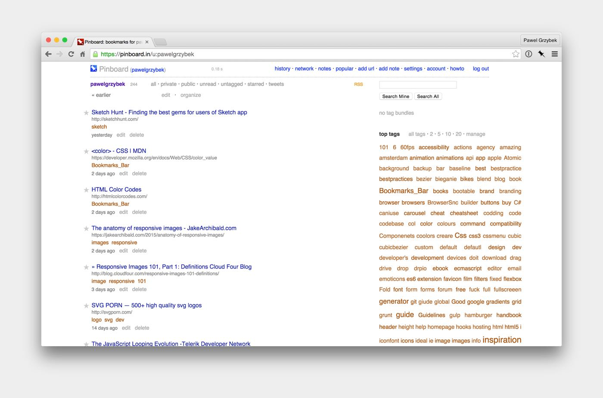
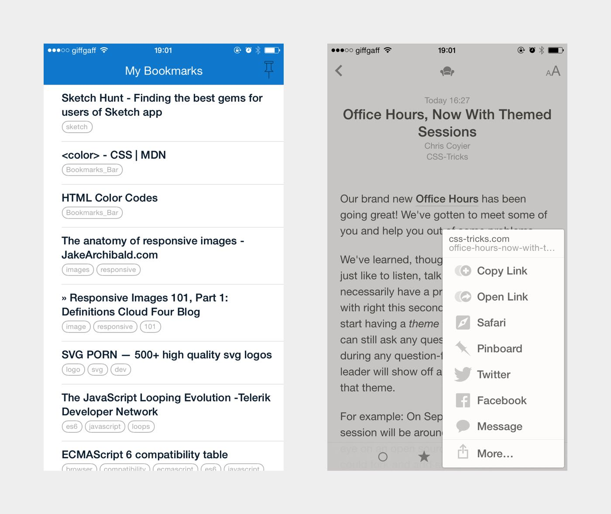

The internet is full of things that you don’t want to forget, you would like to watch in the future, read later or buy after pay day. That’s what bookmarks are made for, yeah? Standard bookmarks in your browser are fine as long as you don’t have many of them. Things are getting more complicated when you have hundreds or sometimes thousands of URLs worth revisiting. Services like Pocket or do the job pretty well, but [Pinboard](https://pinboard.in/) gives you a real power.

Pinboard is a bookmarking service created in 2009 by a polish developer Maciej Cegłowski. The difference between his project and mentioned before popular bookmarking services is huge. First — Pinboard is ugly compared to competitors. Second — you need to pay money for it (yearly cost is equal to two pints of good beer). You are probably thinking now “Why should I pay for an ugly bookmarking service?” but the answer is easy. It works!

## I tested many of them…

As everybody, I started from bookmarks in my browser. Then I moved all this mess to Pocket, Digg later on, then I tested Google Bookmarks, then Delicious and then I lost my hope to find something that simply works fine. Some time ago I finally found the hero of this post - [Pinboard](https://pinboard.in/). Importing list items from competitors cannot be easier. After months of using it I feel that I will never move my stuff somewhere else. Why? Let me mention a few really strong reasons why should you try it.

## Bookmarks, tags and tags bundles

Adding new URLs to your collection can’t be easier and quicker. Pinboard is lightning fast! You can use small JavaScript snippets or install a browser extension. Tags are very useful to keep your finds filterable. Consistent way of adding tags and describing your items makes so much sense, especially if you work with hundreds or thousands of links. Optional ‘tags bundle’ is an experimental feature that makes managing your collection much neater (I don’t know why this feature is experimental — works 100% fine for me). Well documented API gives independent developers ability to integrate service with their tools. I use on a daily basis few apps (mainly Mac OS X and iOS Reeder and iOS Pinswift) that are using this API, and it works brilliant. Smooth integration with maximum three Twitter accounts can be a nice selling point for some users.

## Bye bye Instapaper and Readability

Don’t get me wrong, these services are amazing and I still like them, I just don’t need them anymore. Pinboard comes with ‘read later’ option. It just works as a reminder of things that you would like to watch or read in the feature. Bookmark, read or watch, mark as a read, done — as easy as that!

## Tab sets

Next to standard bookmarks, ‘tab sets’ is definitely my favourite feature. Essentially you can save a collection or currently opened tabs in your browser, and recover the same tabs via one click later on. I know there is many extensions to do that, but why should I use them if this awesome feature comes with something that I already use? I found it really useful when I work on my Mac Mini and then I want carry on with my MacBook on the train.

## Support

To be honest, you will never need to contact Maciej directly because the documentation is amazing and very detailed. If you really struggle with something you can ask on Twitter and I’m sure you will get your answer immediately.

## Should you use Pinboard?

As always — it depends. If you constantly saving new stuff with hope to come back to it later you definitely should give it a try. I do not regret this tiny fee that I spent on [Pinboard](https://pinboard.in/), and you won’t neither.

Let me know about your experiences with bookmarking services. Maybe you built some app that is using Pinboard API — let me know, I’m keen to give it a try. Happy bookmarking :)
