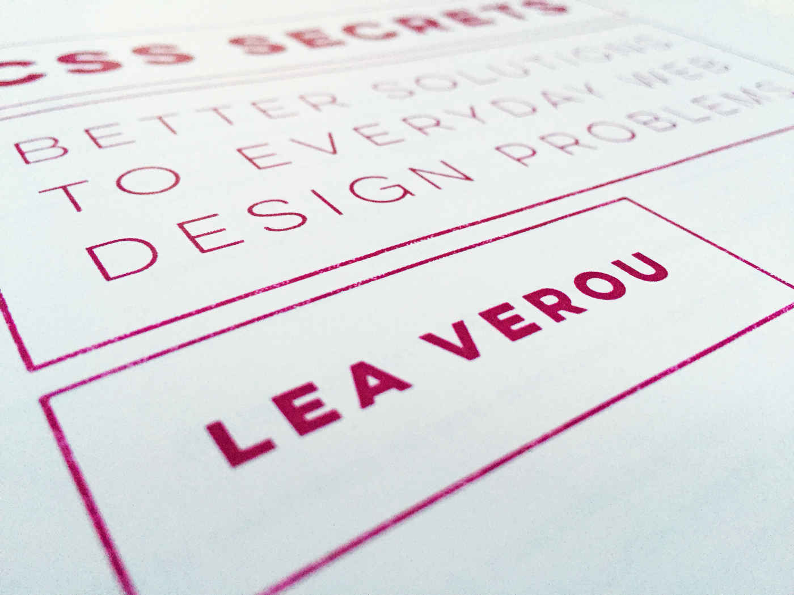

It was a day like any other. Morning coffee and a little bit or reading, got ready, work, home, playing with my lovely kitty, a bit of cycling and then quick Twitter check. That was the moment when this day stopped being ordinary. My Twitter’s feed changed colour to pink and white. No, they haven’t done any rebranding. That was a hue of a book — [“CSS Secrets” by Lea Verou](http://shop.oreilly.com/product/0636920031123.do). This book was everywhere, literally every second post was about it. My initial thought was “Damn, another book about CSS. What else can be done in CSS? Hmmm?”. I tried to ignore those pinky photos, but hype about this book didn’t slow down. Eric loved it, Jeffrey loved it, Hugo loved it, everybody loved it. My second thought was “BUY!”. Yeah I bought it, and I exactly month after that (well done Amazon), I posted [my own pinky picture](https://twitter.com/pawelgrzybek/status/634399068157046784) :)

This book is absolutely beautiful, well designed and most interestingly, created entirely in CSS! Gorgeous typography, tons of colourful images and cute kitties! Each of 47 secrets is well explained, easy to follow and understand. Sometimes very technical, sometimes reminds me a math class, but all way through it’s full of Lea’s sense of humour. This book will revive your passion to CSS, no doubt.

If you like CSS, buy it. If you don’t like CSS, buy it anyway and you will like CSS. Buy it even if you don’t know what CSS is and give it to someone who knows — best gift ever guaranteed! I’m looking forward to next Lea’s book.
