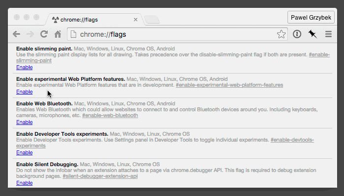
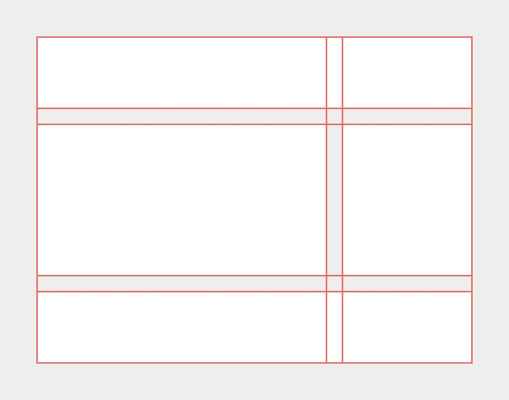
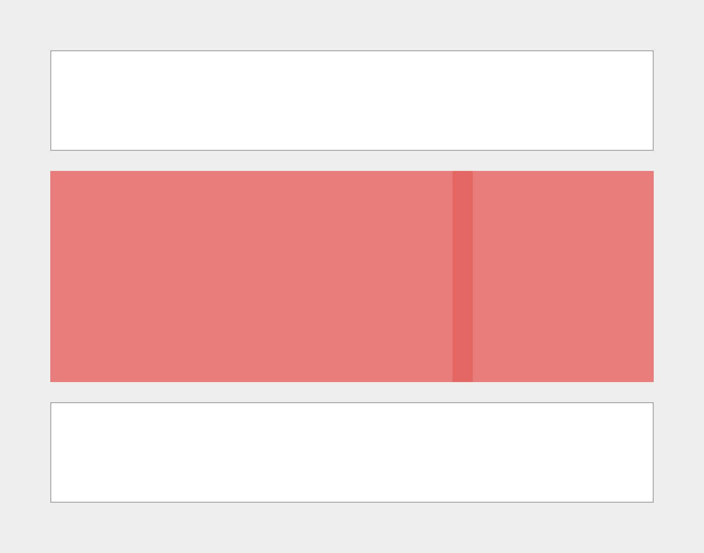
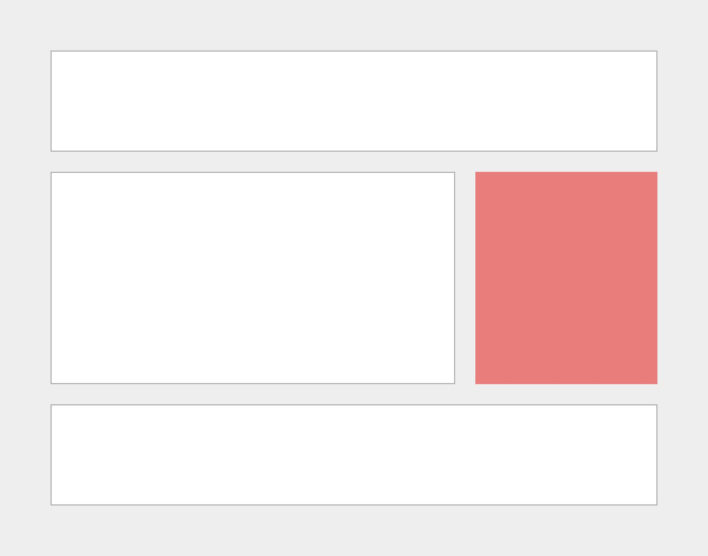
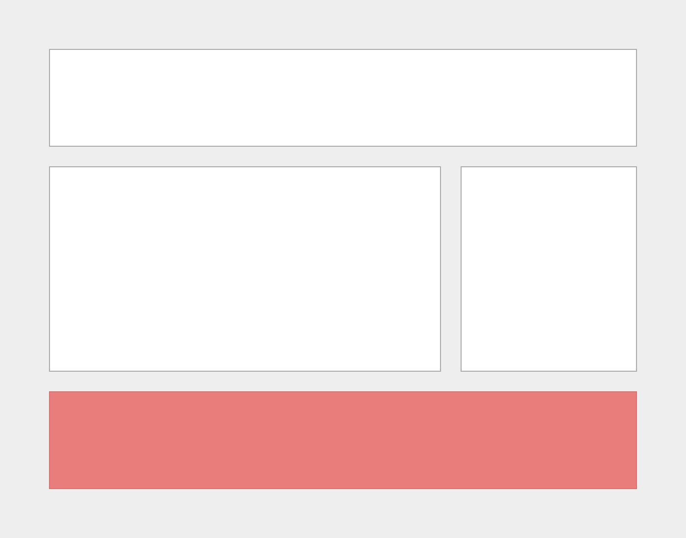
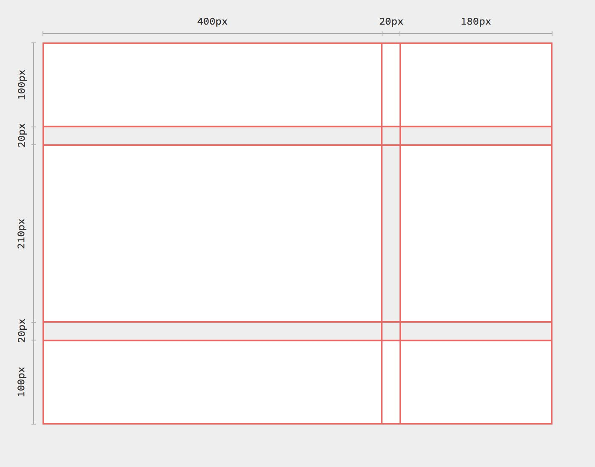
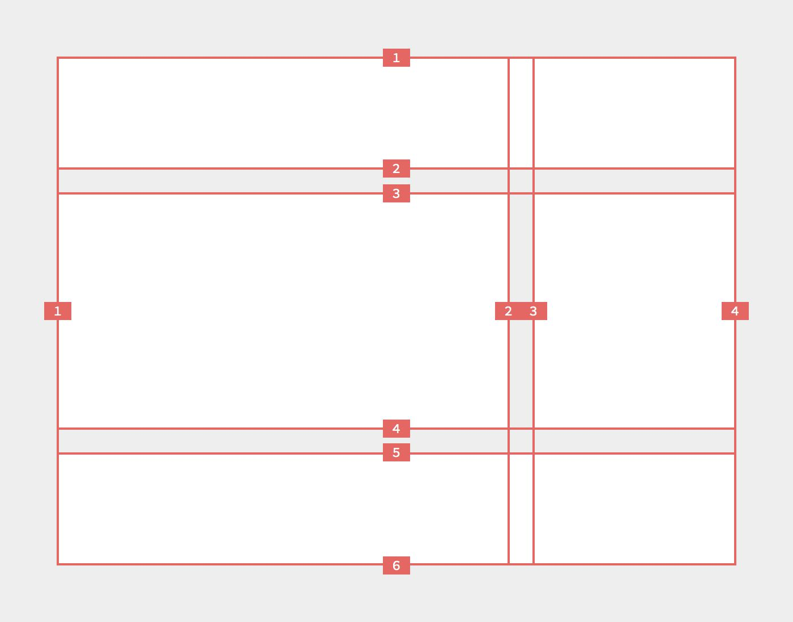

CSS is getting stronger and gives us much more power than a few years ago. It is difficult to miss the huge buzz about Flexbox recently. This powerful part of CSS is well supported in all modern browsers and you don't have an excuse for not using it yet. I found it very helpful in some circumstances, but it's definitely not the ideal candidate for building entire layouts. We tend to build them using floating or inline blocking elements, but it’s definitely not reason why these features were created. For me this is a broken idea, exactly the same like using fonts for icons. CSS never had a built in feature just for building layouts so we don’t have a much choice and we need to use these hacks. The good news is that CSS Grid Layout Model is just around the corner and I'm really looking forward to using it. Let's dive into it together and rebuild some standard looking layout using some basic features of brand new model.

At the point of writing this article [browser support for CSS Grid Layout Model](https://caniuse.com/#feat=css-grid) is minimal. The only browsers that supports it are Edge and latest Internet Explorer. Luckily we have full implementation of that feature in Google Chrome, not as a default setting though. The only thing that we need to do is to switch the 'Enable experimental Web Platform' flag and restart the browser.



## Standard blog layout revisited

A few years ago it was close to impossible to visit a blog without header on top, content section and narrow sidebar under neath followed by a footer. Despite many [discussions about the existence of the sidebar](http://shoptalkshow.com/episodes/185-this-idea-must-die/), this is still a very popular blog layout and it's going to work well as an example.


## Gridy terminology

Before we go any further it's necessary to mention a little bit of related terminology. Easy, just few new words, hopefully your brain won't explode. Knowledge of these few terms will make your further grid exploration much easier.

- Grid container
- Grid lines
- Grid track
- Grid cell
- Grid area

### Grid container

[Grid container](http://www.w3.org/TR/2015/WD-css-grid-1-20150917/#grid-model) establishes a new grid formatting context for its contents. Essentially, it is our parent selector which is forming the boundaries of inner grid items.


### Grid lines

[Grid lines](http://www.w3.org/TR/2015/WD-css-grid-1-20150917/#grid-line-concept) are the horizontal and vertical dividers. We are going to use them to describe grid tracks, grid cells and grid areas. They have a numerical index, or optionally we can give them a specific name.



### Grid track

[Grid track](http://www.w3.org/TR/2015/WD-css-grid-1-20150917/#grid-track-concept) is a vertical or horizontal space between two lines.



### Grid cell

[Grid cell](http://www.w3.org/TR/2015/WD-css-grid-1-20150917/#grid-track-concept) is the item between two adjacent horizontal and two adjacent vertical grid lines. It is the smallest unit that we can put content into.



### Grid area

[Grid area](http://www.w3.org/TR/2015/WD-css-grid-1-20150917/#grid-area-concept) is very similar to grid cell, it's bounded by any two horizontal and two vertical grid lines (not necessarily adjacent). Theoretically speaking, grid cell is the smallest form of grid area.



## It's all about grid areas between grid lines

Enough of boring theory now, lets get our hands dirty with some code. This is the markup of our super complex example.

```html
<div class="blog">
  <div class="header">Header</div>
  <div class="content">Content</div>
  <div class="sidebar">Sidebar</div>
  <div class="footer">Footer</div>
</div>
```

Finally the exciting part. To enable grid layout we need to apply `grid` value for `display` property. For additional settings I’m going to use absolute values (pixels) just for simplicity of my example, but in real life scenario it’s probably a better idea to use some relative values (percentage, ems, rems, vw or vh). New properties `grid-template-columns` and `grid-template-rows` will split grid container for few grid tracks. You can easily use `auto` instead of fixed values for these properties. Look at the code and compare applied values with the picture below.

```css
.blog {
  display: grid;
  grid-template-columns: 400px 20px 180px;
  grid-template-rows: 100px 20px 210px 20px 100px;
}
```



Time to define how our grid looks. Examine carefully the code below. Hopefully the image below the snippet of code will make your life easier.

```css
.header {
  grid-row-start: 1;
  grid-row-end: 2;
  grid-column-start: 1;
  grid-column-end: 4;
}
.content {
  grid-row-start: 3;
  grid-row-end: 4;
  grid-column-start: 1;
  grid-column-end: 2;
}
.sidebar {
  grid-row-start: 3;
  grid-row-end: 4;
  grid-column-start: 3;
  grid-column-end: 4;
}
.footer {
  grid-row-start: 5;
  grid-row-end: 6;
  grid-column-start: 1;
  grid-column-end: 4;
}
```



Hopefully that makes sense. To simplify our code, can can use a handy short notation.

```css
.header {
  grid-row: 1 /2;
  grid-column: 1 /4;
}
.content {
  grid-row: 3 /4;
  grid-column: 1 /2;
}
.sidebar {
  grid-row: 3 /4;
  grid-column: 3 /4;
}
.footer {
  grid-row: 5 / 6;
  grid-column: 1 / 4;
}
```

How about even shorter? `grid-area` follows this order: `grid-row-start`, `grid-column-start`, `grid-row-end`, `grid-column-end`.

```css
.header {
  grid-area: 1 / 1 / 2 / 4;
}
.content {
  grid-area: 3 / 1 / 4 / 2;
}
.sidebar {
  grid-area: 3 / 3 / 4 / 4;
}
.footer {
  grid-area: 5 / 1 / 6 / 4;
}
```

And finally the result looks like this. Feel free to fork the [CodePen](https://codepen.io/pawelgrzybek/pen/EVWKBd) example and play around with it.

```css
.wrapper {
  display: grid;
  grid-template-columns: 400px 20px 180px;
  grid-template-rows: 100px 20px 210px 20px 100px;
}
.header {
  grid-area: 1 / 1 / 2 / 4;
}
.content {
  grid-area: 3 / 1 / 4 / 2;
}
.sidebar {
  grid-area: 3 / 3 / 4 / 4;
}
.footer {
  grid-area: 5 / 1 / 6 / 4;
}
```

<p data-height="496" data-theme-id="14885" data-slug-hash="EVWKBd" data-default-tab="result" data-user="pawelgrzybek" class='codepen'>See the Pen <a href='https://codepen.io/pawelgrzybek/pen/EVWKBd/'>2015-10-04 Lets get into basics of CSS Grid Layout Model</a> by Pawel Grzybek (<a href='https://codepen.io/pawelgrzybek'>@pawelgrzybek</a>) on <a href='http://codepen.io'>CodePen</a>.</p>
<script async src="//assets.codepen.io/assets/embed/ei.js"></script>

## Whats next?

Hopefully this very easy example gives you an idea of how upcoming CSS Grid Layout Model works. It’s good fun to play around with things that will become a daily routine in few years time. I highly recommend you to dive deeper into the [specifications](http://www.w3.org/TR/2015/WD-css-grid-1-20150917/) because it comes with much more super useful features that has been presented in this article. If you are more visual learner check amazing talk from CSSconf EU 2014, [CSS Grid Layout by Rachel Andrew](https://youtu.be/GRexIOtGhBU). Let me know what you think about it. I'm keen to see your CSS grid experiment results.
