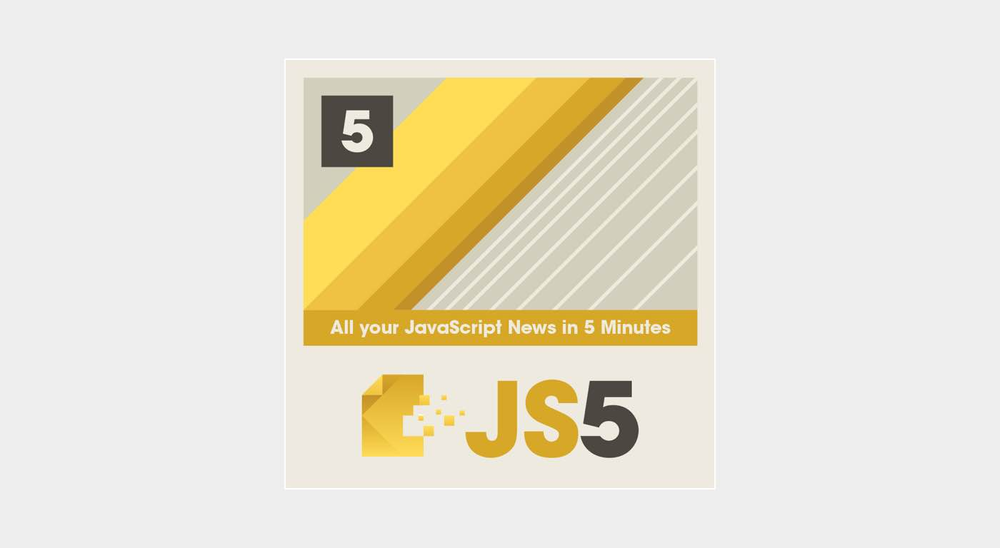
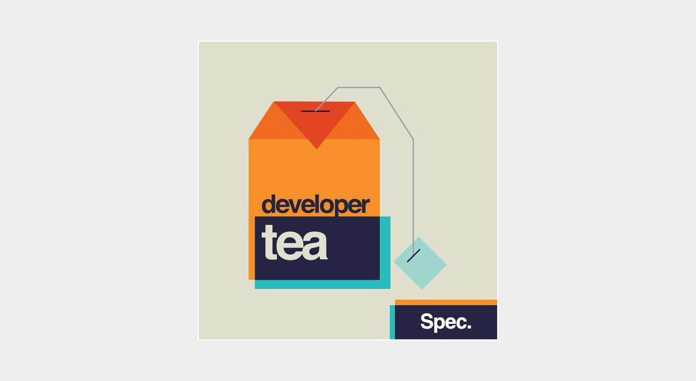
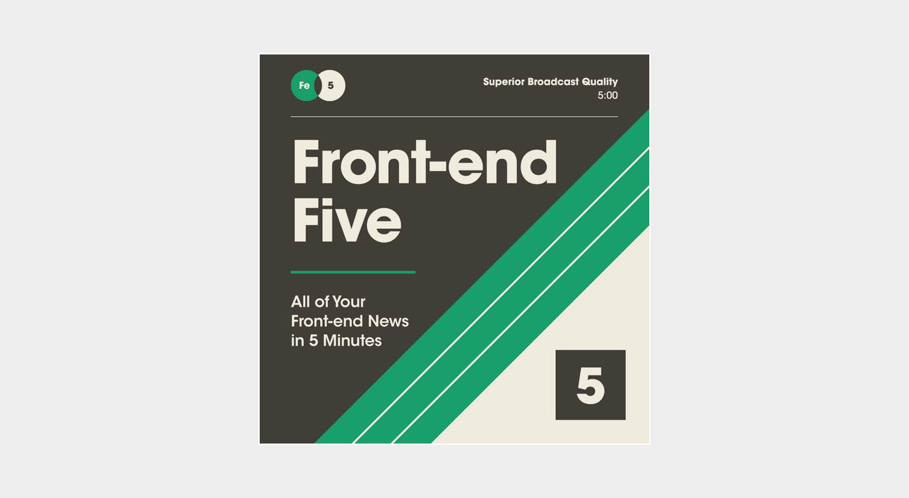
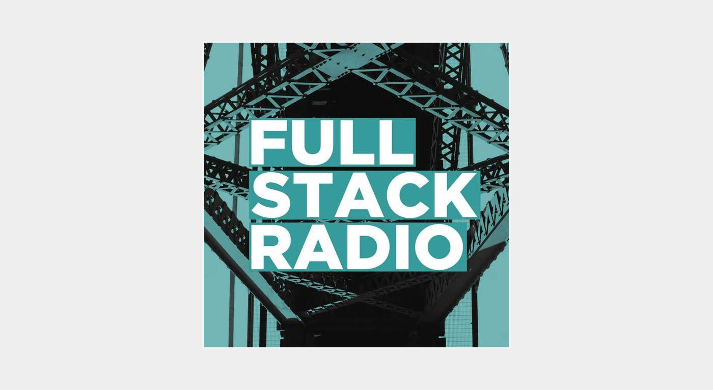
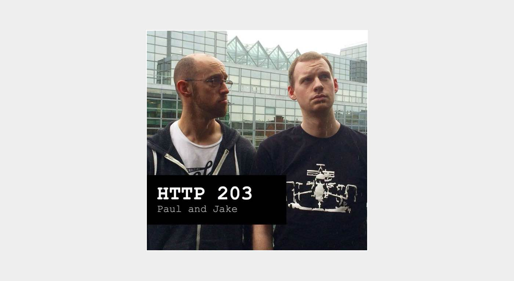
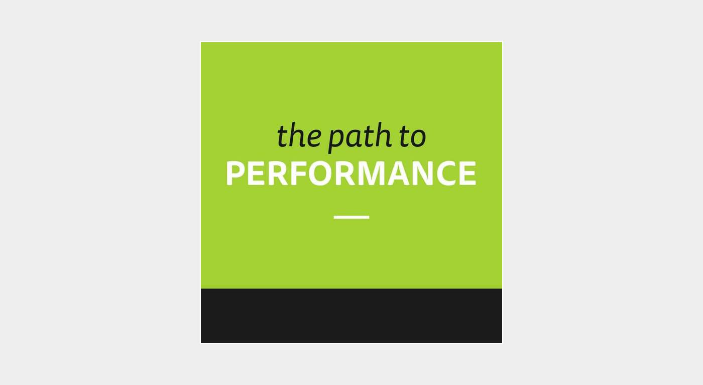
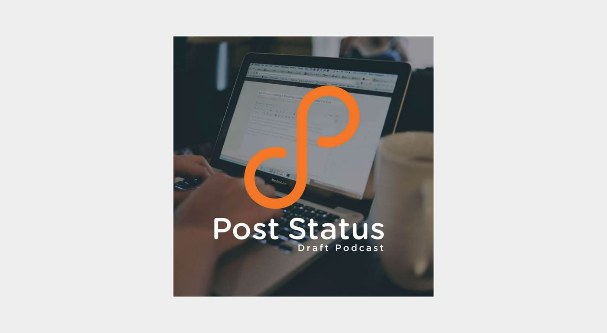
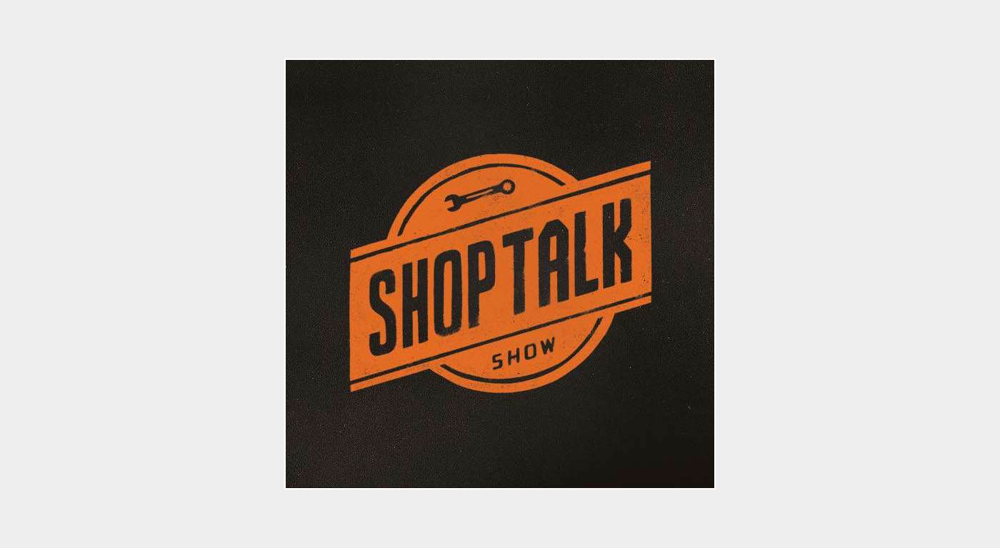
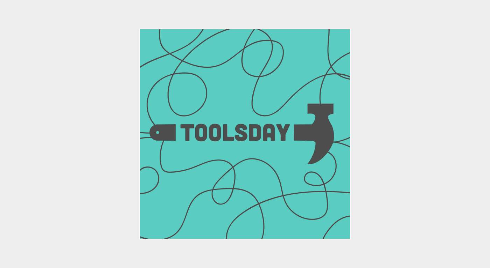

I found it very difficult to keep a balance between coding and following up all the new technologies, trends, libraries, frameworks and tools that keep appearing. The day just isn’t long enough! It is all too easy to fall into a [“State of Constant Alert”](https://developertea.com/episodes/17907) by trying to follow all of this stuff. [Tim Kadlec](https://twitter.com/tkadlec) summed it up in one of his recently published articles [“The Fallacy of Keeping Up”](https://timkadlec.com/2015/09/the-fallacy-of-keeping-up/). Fortunately our community is full of amazing people who are recording a great podcasts.

My experience with podcasts isn’t very extensive but the only advice that I can give you is to use an app to follow all the upcoming episodes of your favourite podcasts. I used iTunes on my Mac and the Podcast app on iPhone for many months and that was a terrible choice. Apple just neglected these apps so much. Recently I discovered the free [Overcast](https://overcast.fm) which has a beautiful mobile app. Just create an account to sync your episodes between devices (you don’t have to worry about spam, it is really for sync purposes), and enjoy your super podcasting setup. If you have any recommendations about apps that you use, please let me know in the comments section below. If you would like to share with me a list of your favourite podcasts — please don’t be shy! Now let me share with you few of my favourite ones.

## 5 Minutes of JavaScript

[https://fivejs.codeschool.com/](https://fivejs.codeschool.com/)

Sponsored by [CodeSchool](https://www.codeschool.com/), released every Thursday, quick and snappy podcast about recent news from the JavaScript world.

## Developer Tea

[https://developertea.com/](https://developertea.com/)

It is one of the most popular podcasts in our industry. [Jonathan Cutrell](https://twitter.com/JCutrell) is doing an amazing job by serving us 10(ish) minutes of podcasts several times a week. The spectrum of topics is very wide, from general lifestyle advice to detailed interviews with the most influential people from the web community.

## Front-end Five

[https://frontendfive.codeschool.com/](https://frontendfive.codeschool.com/)

Another podcast sponsored by [CodeSchool](https://www.codeschool.com/) that takes a very similar form to “5 Minutes of JavaScript”. This one is more general and is not only about JavaScript. New episode of this podcast will appear in your app every Tuesday.

## Full Stack Radio

[http://www.fullstackradio.com/](http://www.fullstackradio.com/)

[Adam Wathan](https://twitter.com/adamwathan) is doing a superb job by running this podcast. Every episode is about half an hour in length and he interviews some super clever dudes. I’m certain that you will find it very inspiring.

## HTTP 203

[https://developers.google.com/web/shows/http203/](https://developers.google.com/web/shows/http203/)

Two Googlers, [Paul Lewis](https://twitter.com/aerotwist) & [Jake Archibald](https://twitter.com/jaffathecake) are so funny. These are quick-sure episodes with lots of humour and tons of good opinions shared by two really good developers.

## The Path to Performance

[http://pathtoperf.com/](http://pathtoperf.com/)

This is a 100% performance-focused podcast by [Katie Kovalcin](https://twitter.com/katiekovalcin) and [Tim Kadlec](https://twitter.com/tkadlec). The episodes are quite lengthy and usually contain interviews with some website speed-freaks! This is definitely one of my favourite podcasts.

## Draft WordPress Podcast

[https://poststatus.com/category/draft/](https://poststatus.com/category/draft/)

Wordpress podcasts recorded by guys from [Post Status](https://poststatus.com/). Lots of good tips from WP developers and good interviews with theme and plugin creators. This one isn’t quick though.

## Shop Talk Show

[http://shoptalkshow.com/](http://shoptalkshow.com/)

My number one podcast! Full of great humour, and practical knowledge by the great [Chris Coyier](https://twitter.com/chriscoyier) and [Dave Rupert](https://twitter.com/davatron5000). Interviews are the main focus of the episodes, but recently we had a chance to listen to live portions recorded at conferences or group debates about a controversial subject. You won’t be bored with this one!

## Toolsday

[http://toolsday.io/](http://toolsday.io/)

This is a new podcast on my list but I can recommend it enough. Hosted by the super positive [Una Kravets](https://twitter.com/una) and [Chris Dhanaraj](https://twitter.com/chrisdhanaraj). It contains about 20 minutes of chat about things like task runners, learning resources, module loaders and much much more.
