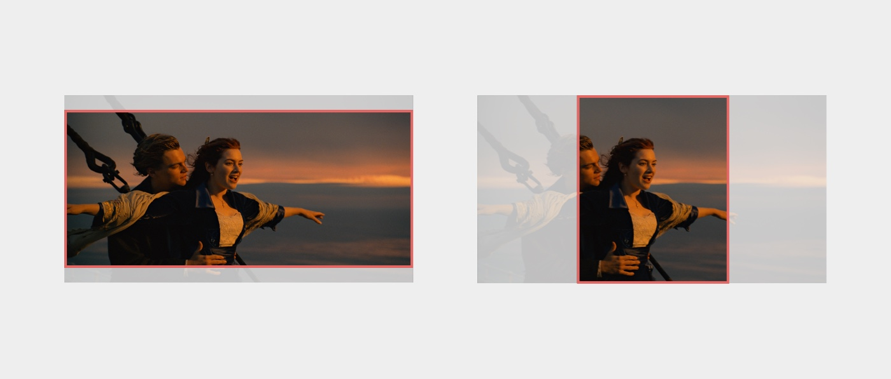
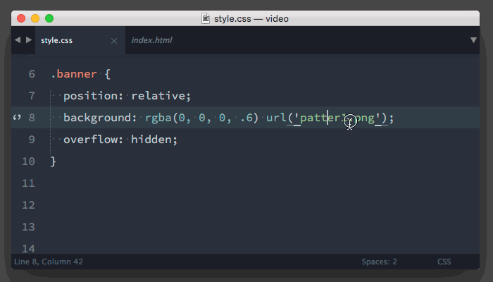

We love videos! It’s a pleasure for our eyes to see a little bit of modern looking movement on a website. Unfortunately our browser doesn’t love videos like we do. Good performance isn’t a friend with videos neither. I have come across many websites with autoplayed videos hosted on Vimeo or youtube that use crazy amount of bandwidth. Some minimal looking websites with full HD video in the background even triggered the fans on my laptop. I believe that there is nothing wrong with using a looped video as a background, as long as it is done correctly. Have a look at [Squarespace](http://www.squarespace.com/), [This Also](http://thisalso.com/) or [Big Cartel](https://www.bigcartel.com/) to name few — it looks nice.

HTML5 introduced the [video](https://developer.mozilla.org/en-US/docs/Web/HTML/Element/video) tag and list of settings which we can control via [attributes](https://developer.mozilla.org/en-US/docs/Web/HTML/Element/video#Attributes) or via [JavaScript media events](https://developer.mozilla.org/en-US/docs/Web/Guide/Events/Media_events). Browser support is really great — luckily I don't have to target IE8 anymore. If you need to, I'm really sorry but this tutorial won't cover any fallback. We are going to create a section and with small positioning trick apply a background video that will always cover the entire space of this section. Essentially it behaves exactly the same as `background-size: cover;` in CSS. If you still don't get it, have a look at the picture below. Kate, I love you!



## Let’s have a word about videos & performance

It’s worth mentioning that if performance is something that you would like to improve, you should leave this article now. Companies like [PayPal](https://www.paypal.com) or [The Royal Albert Hall](http://www.royalalberthall.com/) prioritised speed over visual experiences and recently removed videos from their websites. You need to know what the main aim of your project is and bare in mind the cost that the video comes with.

## Markup and CSS

Less talk more action.

```html
<div class="banner">
  <video autoplay loop muted class="banner__video" poster="video.jpg">
    <source src="video.webm" type="video/webm">
    <source src="video.mp4" type="video/mp4">
  </video>
</div>
```

That’s all we need. As you can see I have added some attributes to `video` tag. Hopefully `autoplay`, `loop` and `muted` don’t need any explanation. `poster` includes a path to the image that will be displayed on the mobile devices. When the video isn’t ready or it’s paused, you browser will show this poster instead. It is a good practice to create a poster from the first frame of your video.

Multiply `source` element is needed to provide a cross browser experience. If you need to support old Firefox browsers you need to add ogg format as well. You can generate all those formats with tools like [Miro Converter](http://www.mirovideoconverter.com/) or my favourite online [HTML5 Video Converter](https://html5backgroundvideos.com/converter/). Please control the size of your files. It is a difficult task to find a compromise between length, quality and file size. I always try to compress my videos to something between 500kb - 1000kb, and avoid videos longer than 10 - 15 seconds. [HandBrake](https://handbrake.fr/) is open source video transcoder that can help you with compression.

```css
.banner {
  position: relative;
  overflow: hidden;
}

.banner__video {
  position: absolute;
  top: 50%;
  left: 50%;
  width: auto;
  min-width: 100%;
  height: auto;
  min-height: 100%;
  transform: translateX(-50%) translateY(-50%);
  z-index: -1;
}
```

This is the trick. Position everything on centre, add minimum width and height to fill the space of the parent div, hide everything that is outside of the box, and place the video behind the content of the parent.

We made it, it works fine but that doesn’t mean it can’t be improved. Let’s have a look at few more tricks that can enhance this effect and the user experience.

## Video poster on iOS

Mobile browsers are very clever and they ignore `autoplay` attribute to save valuable bandwidth. All Android devices will display the poster image but iOS devices will display huge play button in the middle of a player. It sucks.


We definitely don’t want to keep it like that. A few lines of JavaScript comes in help here. Essentially we need to grab the value of the poster attribute and apply it as a background-image of the parent element. Additionally we need to add a correct background-size and background-position to this div and hide video tag. Done!

```js
var banner = document.querySelector('.banner');
var bannerVideo = document.querySelector('.banner__video');

if (/iPad|iPhone|iPod/.test(navigator.platform)) {
  banner.style.backgroundImage = 'url("' + bannerVideo.poster + '")';
  banner.style.backgroundSize = 'cover';
  banner.style.backgroundPosition = 'center';
  bannerVideo.style.display = 'none';
}
```

## A little bit of make up

If we cannot provide high quality video, we need to find a way to mask artifacts. We need to create a small pattern and then overlay it over the video by adding a `background-image` on the parent element. These files are normally very small so we can easily convert them to base64 data to save server requests (it doesn't really matter in age of HTTP2). If you use Emmet in Sublime Text or Atom, you can use a shortcut `Shift + Ctrl + D`.



[Paternity](http://www.patternify.com/) is a super cool tool that you can use to quickly generate base64 patters. It takes few seconds to create one and get a code to paste straight into your project. I created few ready to copy/paste examples for you.

<p data-height="250" data-theme-id="14885" data-slug-hash="JGjLeM" data-default-tab="result" data-user="pawelgrzybek" class='codepen'>See the Pen <a href='https://codepen.io/pawelgrzybek/pen/JGjLeM/'>JGjLeM</a> by Pawel Grzybek (<a href='https://codepen.io/pawelgrzybek'>@pawelgrzybek</a>) on <a href='http://codepen.io'>CodePen</a>.</p>
<script async src="//assets.codepen.io/assets/embed/ei.js"></script>

## Final result

Hopefully you found it useful. If you have any advice on how can I improve my technique, please let me know in the comments below. If you liked it, please [follow me on twitter](https://twitter.com/pawelgrzybek) to don’t miss future articles on my blog.

<p data-height="410" data-theme-id="14885" data-slug-hash="WrNpJj" data-default-tab="result" data-user="pawelgrzybek" class='codepen'>See the Pen <a href='https://codepen.io/pawelgrzybek/pen/WrNpJj/'>Background video test</a> by Pawel Grzybek (<a href='https://codepen.io/pawelgrzybek'>@pawelgrzybek</a>) on <a href='http://codepen.io'>CodePen</a>.</p>
<script async src="//assets.codepen.io/assets/embed/ei.js"></script>
