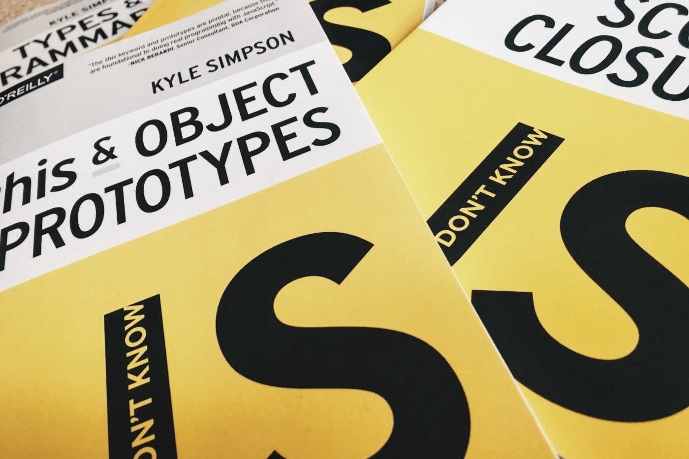
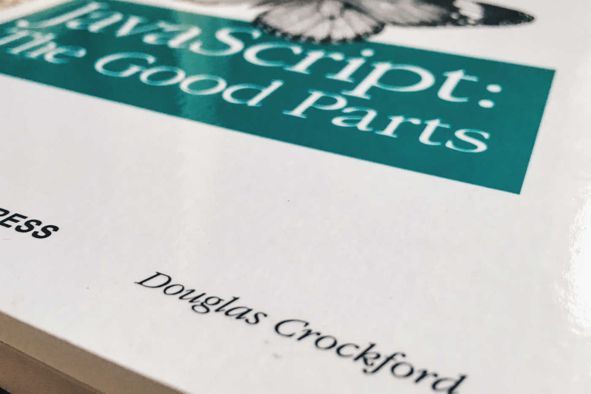

A few weeks ago at the annual keynote “The State of World” Matt Mullenweg (creator of Wordpress) [gave us a homework](https://youtu.be/KrZx4IY1IgU). The task sounds simple “Learn JavaScript, Deeply”. The choice of helpful articles online is almost endless but which should you pick to start your journey? In this post, I’ll be sharing a list of resources that helped me get my head around JS.

## You Don't Know JS (book series)

If I could only pick one, I’d definitely recommend the series of books by [Kyle Simpson](https://twitter.com/getify) titled [“YDKJS: You Don't Know JS”](https://github.com/getify/You-Dont-Know-JS). I’ve read them all yet and I'm still coming back to particular chapters quite often. The language of these books is very easy to understand and digest. Definitely my number one recommendation! Thank you Kyle for the effort and expertise that you put into the series!

## Frontend Masters

If you prefer to watch than read, [Frontend Masters](https://frontendmasters.com) is a great place to start. It’s a collection of videos recorded during lessons made by JavaScript gurus. Tutors include the legendary [Douglas Crockford](http://www.crockford.com/) (he is much better with Javascript than design of his website may suggest!), mentioned above [Kyle Simpson](https://twitter.com/getify) or [Jafar Husain](https://twitter.com/jhusain) from Netflix. The monthly subscription for these videos costs only $39, but for first month you only have to pay half. If you’re still not convinced, have a look at list of [https://frontendmasters.com/customers-love-frontend-masters/](testimonials on the website).

## Egghead.io

[Egghead](https://egghead.io/) is another great resource if you prefer watching over reading. Whilst you can pay for monthly subscription, you can also watch tons of amazing resources completely free. The majority of courses on Egghead are JavaScript related. It’s full of resources for beginners, more experienced users and people keen to learn popular frameworks like Angular or React.js.

## JavaScript: The Good Parts by Douglas Crockford

[JavaScript: The Good Parts by Douglas Crockford](http://www.amazon.co.uk/Books-JavaScript-Good-Parts-Douglas-Crockford/dp/0596517742) is a ‘must-have’ for any JavaScript developer. It’s a slim but concise and opinionated book about the best parts of the language. Although Douglas Crockford may be a controversial author within the community, he’s made so many good things for JS community that we should to thankful for. I should state that this book is not for beginners, as it requires at last a basic understanding of the syntax to get the most from it. Again - must have!

## YouTube & Twitter

Luckily many JavaScript developers are generous with their time and knowledge which they share on Twitter and YouTube. Find your mentors and follow them. My only advice here is not to follow everyone — following everybody is like following no-one. If I had to pick a single Twitter or YouTube account that is worth to following, that would be a new live broadcast podcast called [JavaScript Air](https://www.youtube.com/channel/UCJYTMGbtBliMSG8gadRHK2Q) which is hosted by the super-active and follow-worthy [Kent C. Dodds](https://twitter.com/kentcdodds).

## Console in your browser

Theory without practice is pointless. Every single snippet of code that you come across, you should type in your browser’s console and experiment with. This reminder is on the beginning of every single programming book, every video and I’m repeating it again! Practice is a best teacher. Type your code!

Please, use comments below to share with me your helpers, blogs, books, articles, YouTube channels… Happy learning guys :-)
