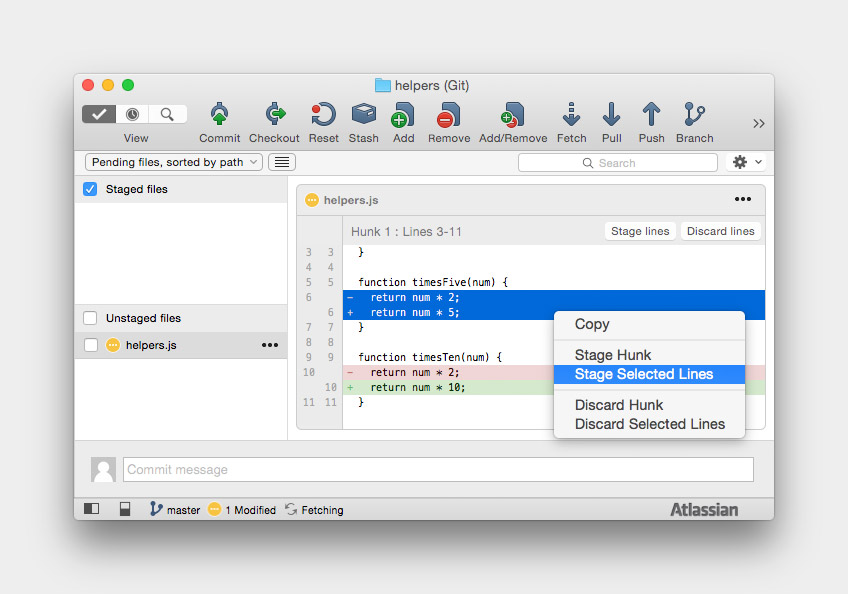
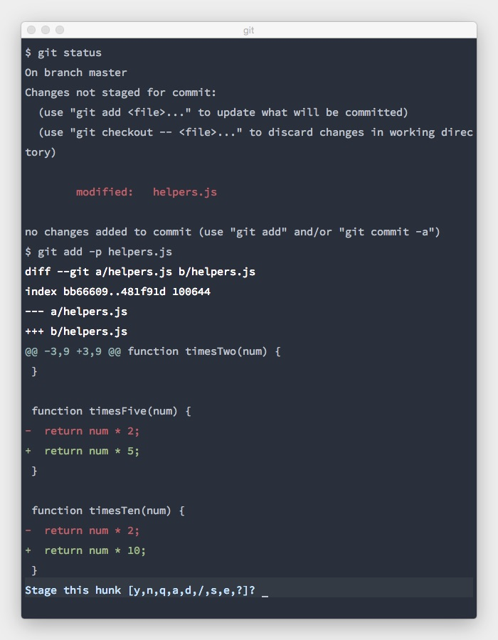
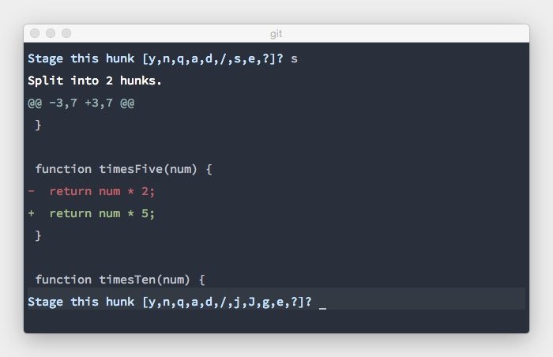
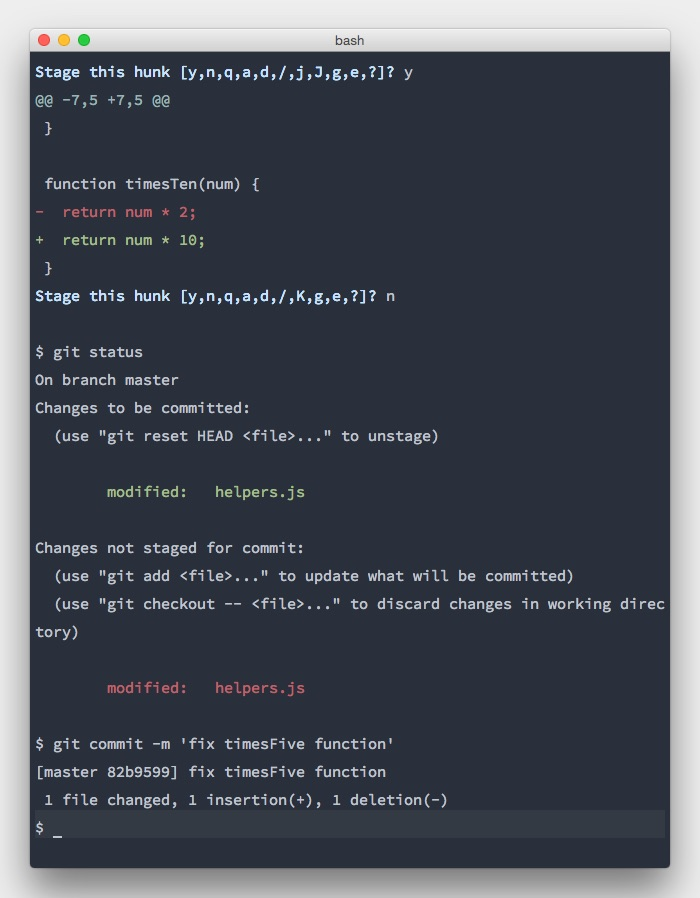

The command line is my preferred way of using git. My code editor (Sublime Text) and command line app (iTerm 2) is everything that I need. Although I have some minor experience with GUI tools, I just don't need them. A third opened app next to the two previously mentioned isn't needed. The only feature that I missed from tools like Tower 2 or SourceTree was the ability to stage small hunks of code from the same file independently and create separate commits from them. Happy days! [Wes Bos](https://twitter.com/wesbos) published a fantastic [collection of git tips and tricks](http://wesbos.com/git-hot-tips/) a few days ago, and one of them is the feature that I was always missing. Less talking, more coding!

Let's say we have a file `helpers.js` full of helper functions (for brevity we'll keep this example simple). This file is already committed, and we spot some obvious flaws in our functions. Try to figure it out by yourself :)

```js
function timesTwo(num) {
  return num * 2;
}

function timesFive(num) {
  return num * 2;
}

function timesTen(num) {
  return num * 2;
}
```

Let's fix it...

```js
function timesTwo(num) {
  return num * 2;
}

function timesFive(num) {
  return num * 5;
}

function timesTen(num) {
  return num * 10;
}

```

That's better! Now, we would like to store these changes as two separate commits (one per function). This is how to do it in SourceTree.



Time for the command line. The well known command `git add` with less well known flag `-p` (patch) comes in handy now. Let's do it!

```
git add -p helpers.js
```



Wow, git what do you want from me now?! Let me help you!

- `y` - stage this hunk
- `n` - do not stage this hunk
- `q` - quit; do not stage this hunk nor any of the remaining ones
- `a` - stage this hunk and all later hunks in the file
- `d` - do not stage this hunk nor any of the later hunks in the file
- `/` - search for a hunk matching the given regex
- `s` - split the current hunk into smaller hunks
- `e` - manually edit the current hunk
- `?` - print help

In our case, git made the suggestion for us to keep the two functions as one piece of code ready to stage. This isn't what we want to do. We need to split the current hunk into smaller hunks by typing `s`.



Much better. Accept by pressing `y` followed by `n` to skip the next hunk and commit the change on the first function.



Now you are ready to follow the process yourself with the remaining functions. Hopefully this has helped you out.
