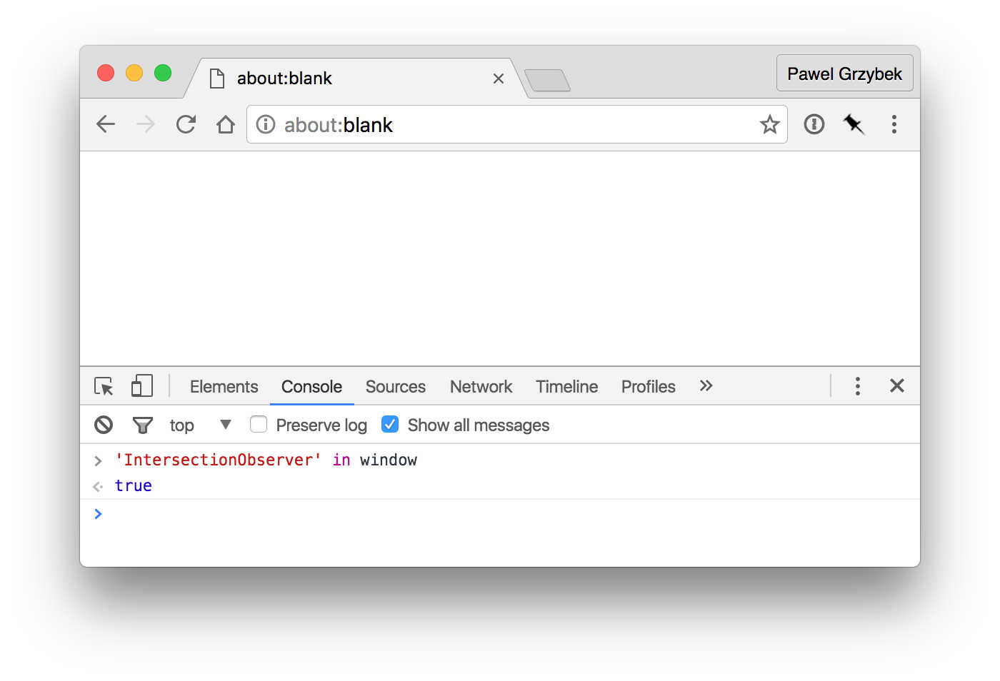

Detecting which elements are visible within the current viewport's boundaries has always been a tricky and expensive task in terms of performance. Lazy loaded images on Medium.com, infinite scrolling pictures of vegan food on Pinterest or animated images on every f*****g Tumblr theme are just a few examples where this functionality can be found in abundance. [The reporting of ad "visibility"](https://www.iab.com/viewability-has-arrived-what-you-need-to-know-to-see-through-this-sea-change/) for monetizing purpose is another important use case. There's good news on the horizon though! The web platform doesn't have to struggle to do all these things manually anymore — [`The Intersection Observer API`](https://www.w3.org/TR/intersection-observer/) just landed in [Chromium 51](https://blog.chromium.org/2016/05/new-apis-to-help-developers-improve.html). It allows us to do these things with ease, reduce CPU usage, increase battery life and eliminate rendering junk.

Bare in mind that we are talking about a really new API. At the moment of writing this article the [browser support](https://www.chromestatus.com/feature/5695342691483648) is restricted to Google Chrome 51 and Opera 38. If you want to play around with it in older browsers give some thanks to [Surma](https://twitter.com/dassurma) for this great [polyfill](https://github.com/surma-dump/IntersectionObserver/blob/polyfill/polyfill/intersectionobserver-polyfill.js).



## How to use Intersection Observer API

You don't have to declare a listener that on every single scroll event triggers some crazy `getBoundingClientRect()` calculations anymore. The new API is much nicer to use and read. Simply create a new instance of `IntersectionObserver` that takes two arguments — a callback function and an optional `options` object. Trigger the `observe` method and pass in the element that should be watched. When the element enters or exits the viewport, the callback function will be fired.

```js
var watchMe = new IntersectionObserver(callback, options);
watchMe.observe(elm);
```

By default, the callback function will be fired whenever an element appears and leaves the viewport. The function returns an array of [`IntersectionObserverEntry`](https://www.w3.org/TR/intersection-observer/#intersection-observer-entry) objects and each of them contains properties about each element that has been shown on the viewport (`boundingClientRect`, `intersectionRatio`, `intersectionRect`, `rootBounds`, `target` and `time`).

The second parameter (`options`) allows you to specify some settings by passing the [`IntersectionObserverInit`](https://www.w3.org/TR/intersection-observer/#intersection-observer-init) object. You can change the context (`root`) that defaults to `null` which is document’s viewport, the amount of margin from the context's boundaries (`rootMargin`) with a default value `0px`, and finally an array of `threshold` which is a list of thresholds at which to trigger the callback.

If you need to observe more than one element, simply call the `observe` method multiple times.

## Demo time

Have you ever heard this quote by Stephen R. Covey from "The 7 Habits of Highly Effective People"?

> To learn and not to do is really not to learn. To know and not to do is really not to know.

Demo time! I have created a list of paragraphs. Initially all of them are scaled down and see through. When a paragraph passes the viewport's edge by half of it's height (`threshold: [0.5]`) then it animates to its regular size and full opacity. Maybe it's not especially creative, but it does the job and allows you to copy/paste my code or extend it to make some super funky stuff :-)

```js
// the callback function that will be fired
// when the element apears in the viewport
function onEntry(entry) {
  entry.forEach((change) => {
    change.target.classList.add('visible');
  });
}

// list of options
let options = {
  threshold: [0.5]
};

// instantiate a new Intersection Observer
let observer = new IntersectionObserver(onEntry, options);

// list of paragraphs
let elements = document.querySelectorAll('p');

// loop through all elements
// pass each element to observe method
// ES2015 for-of loop can traverse through DOM Elements
for (let elm of elements) {
  observer.observe(elm);
}
```

<p data-height="400" data-theme-id="dark" data-slug-hash="YWqWXJ" data-default-tab="result" data-user="pawelgrzybek" data-embed-version="2" data-preview="true" class="codepen">See the Pen <a href="https://codepen.io/pawelgrzybek/pen/YWqWXJ/">Intersection Observer API explained</a> by Pawel Grzybek (<a href="https://codepen.io/pawelgrzybek">@pawelgrzybek</a>) on <a href="http://codepen.io">CodePen</a>.</p>
<script async src="//assets.codepen.io/assets/embed/ei.js"></script>

Hopefully this has helped you out. Don't be shy and please share your experiments with using the Intersection Observer API. Any question? Please use the comments section below. If you liked this article please don't hesitate to use the share button. Thanks!
