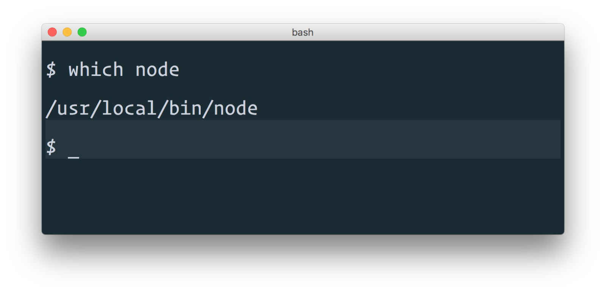
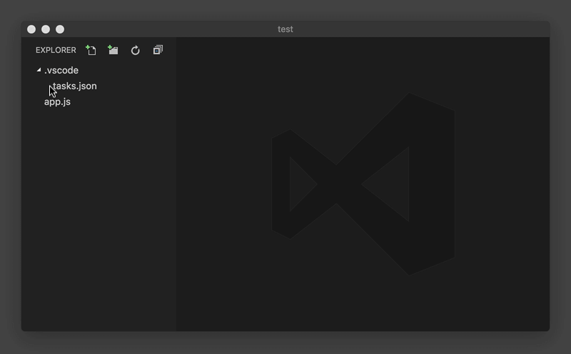

Some time ago I published an article about the [JavaScript console in Sublime Text](https://pawelgrzybek.com/javascript-console-in-sublime-text/). It's turned out to be one of the most popular articles on this website. As I recently changed my code editor from [Sublime Text](https://www.sublimetext.com/) to [VSCode](https://code.visualstudio.com/) I found a solution to replicate this functionality.

Similar to [Build Systems](http://docs.sublimetext.info/en/latest/reference/build_systems.html) in Sublime Text, Visual Studio Code comes with [Tasks](https://code.visualstudio.com/docs/editor/tasks) that allows us to pass a file to an external program without manually switching between the code editor and the Terminal. This is essentially all that we need to do — pass a currently active file to a JavaScript interpreter ([Node](https://nodejs.org/en/) in this case - so make sure it is installed on your computer).

## Create JavaScript / Node task in VSCode

A VSCode Task is a set of instructions in a JSON file that resides in our projects file. Unfortunately at this moment it isn't possible to create globally available tasks — they need to be added per project. The good news is that the development of VSCode is rapid so we may see global tasks appear very soon as [I'm not the only one](https://github.com/Microsoft/vscode/issues/1435) who wants this feature. To create a Task hit `cmd + shift + p` on Mac, `ctrl + shift + p` on Windows / Linux or simply `F1` on any platform to show the Command Palette, type "Tasks: Configure Task" then "Create tasks.json file from template" and choose "Others" from the list. Time to configure the task.

```json
{
  "version": "2.0.0",
  "tasks": [
    {
      "label": "Show in console",
      "type": "shell",
      "osx": {
        "command": "/usr/local/bin/node ${file}"
      },
      "linux": {
        "command": "/usr/bin/node ${file}"
      },
      "windows": {
        "command": "C:\\Program Files\\nodejs\\node.exe ${file}"
      },
      "group": {
        "kind": "build",
        "isDefault": true
      }
    }
  ]
}
```

OK, so what is going on here? When we run a task called "Show in console" this will run a shell command that takes our currently opened file as an argument preceded by the path to our node executable. To make things even easier the `group.kind` property lets us run this task via `shift + cmd + b` keyboard shortcut.

In most cases the "node" in `command` property does the job instead of passing a full path. I found this method more reliable though. The path can vary depending on operating system, version and installation method. Update `command` according to the output of `which node`. On Windows the equivalent command is `where node`.



Time for the fun bit! Create an amazing script and enjoy the instant output in your code editor by pressing `shift + cmd + b` or by running the "Show in console" task from the Command Palette. Hopefully this helped you out. Stay curious and build amazing things!


