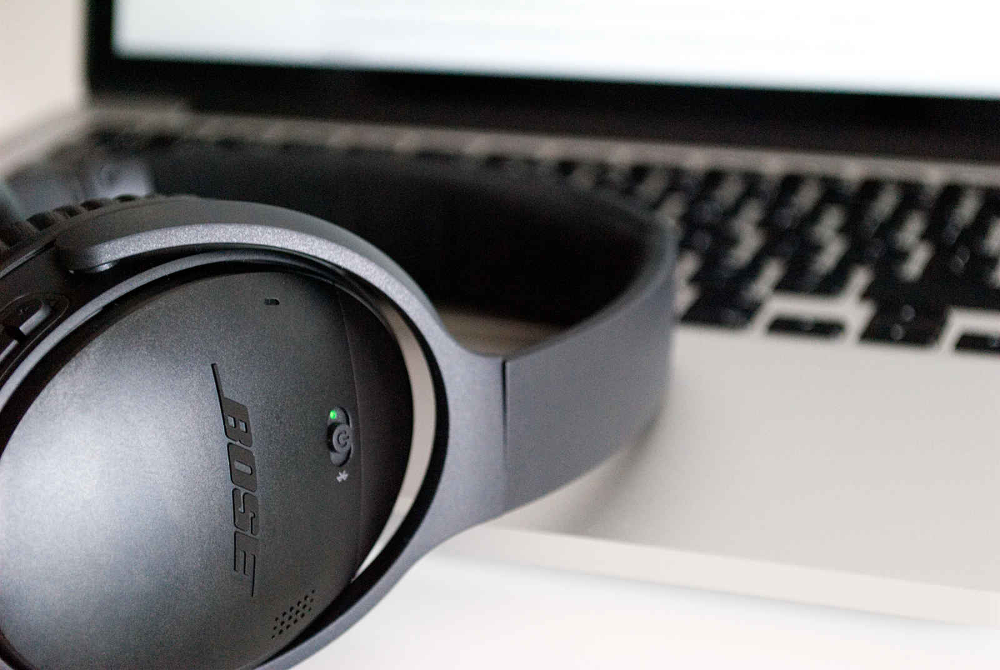
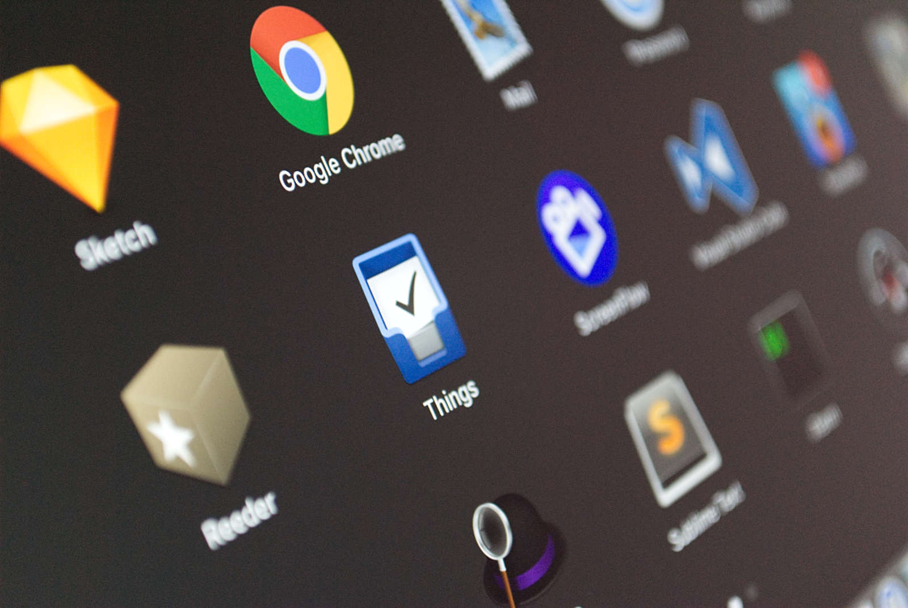
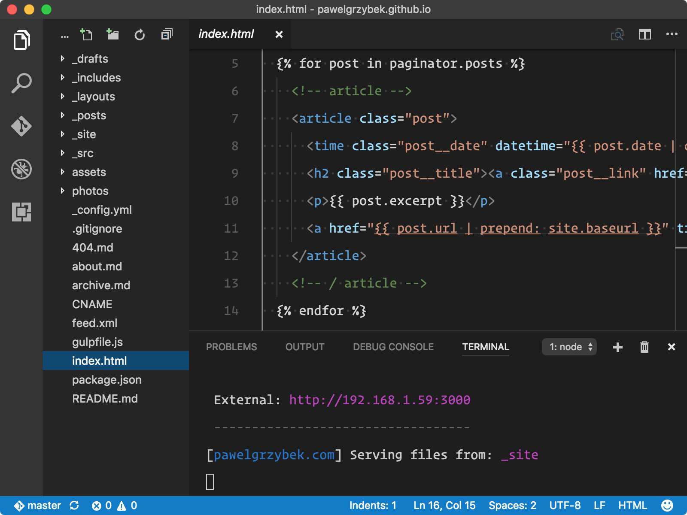
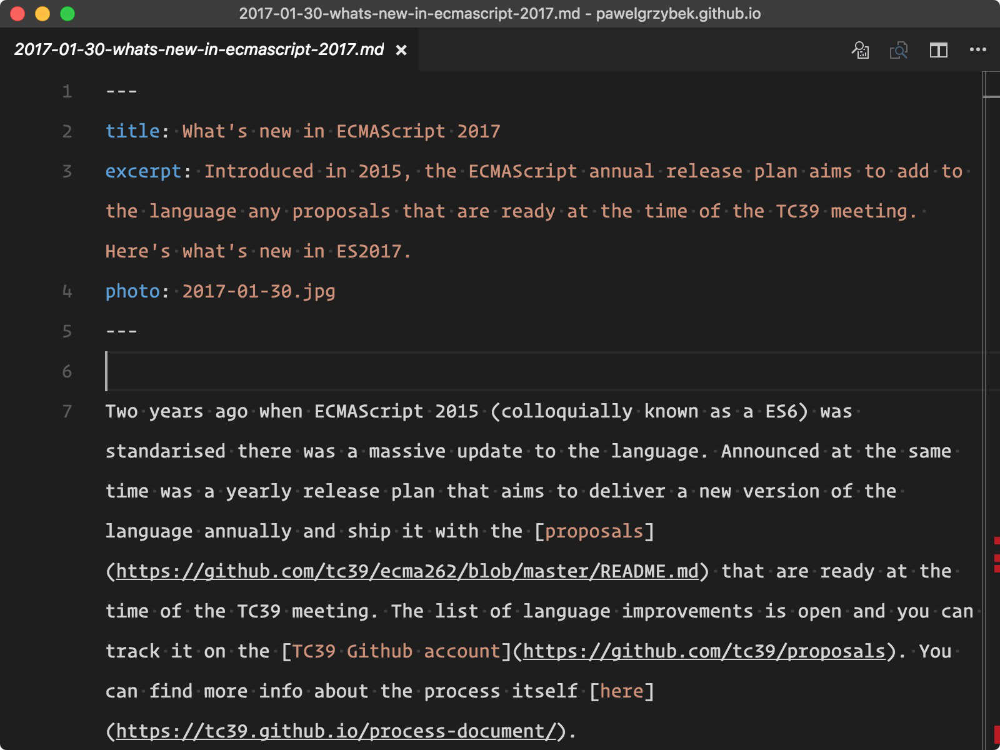

Programming isn't the only thing that I read about although that's what I mainly write about and very rarely broach other subjects. You definitely won't find any gluten-free vegan cake recipes here, but there is a good chance that I can share with you a few words about some software or hardware. I [did it before](https://pawelgrzybek.com/my-web-development-setup/) about two years ago so I think it's just about the right time to write an update. Some things have changed, some things have been replaced but overall everything has been simplified and minimised. I always enjoy these kind of reads so I thought you may like to find out more about my equipment.

1. [Hardware](#hardware)
3. [Software](#software)
4. [Web Services](#web-services)

## Hardware

Mattias P Johansson, one of my favourite developers that I highly recommend you to follow on [Twitter](https://twitter.com/mpjme) and [Youtube](https://www.youtube.com/channel/UCO1cgjhGzsSYb1rsB4bFe4Q), made a [whole video](https://youtu.be/hlYiWznhhzw) about minimalism. Let me quote my favourite part…

> Everything that you acquire, carries a little bit of tiny work that you have to do with it.

A few years ago I was focused on owning things: the latest devices, top spec computers, expensive cameras etc. It took me a while to realise that I'm much happier without it. Reducing the maintenance cost and time that I had to spend with all those things gave me that extra bit of time that I can use to do other things like riding my bike, listening good music or hanging out with my friends. Following this principle my hardware setup hasn't grow at all — the opposite in fact. Essentially I don't have (and don't want to have) things that I don't need. Let's check what's inside my bag.

### Macbook Pro with Retina display (Early 2015)

It is a top spec MacBook Pro with a 13 inch screen from early 2015 (3.1GHz Dual-core Intel Core i7, 16GB 1866MHz LPDDR3 SDRAM, Intel Iris Graphics 6100 and 128GB PCIe-based Flash Storage). Of course when I saw a [new MacBook Pro](http://www.apple.com/macbook-pro/) with a Touch Bar I was tempted for a little while but… I really like my actual Esc button, I don't need more powerful components and definitely don't want to spend £2500 on something that I don't need (yet). I have an Apple care with extended warranty plan till mid 2018 — the sexy body on each new MacBook won't convince me to throw a small fortune in Tim Cook's pocket any earlier than that. Overall I'm very happy with this computer - I don't even use the power that its inner-components have. It has a solid day's battery life, is portable enough to always keep in my rucksack, it still looks sexy and works great with my other devices — it's all I need.

### iPhone 7 Plus 32GB

I bought my first iPhone in 2010. Since then I haven't used devices from different manufacturers because this one just works. No surprises here - the 32GB version of the iPhone 7 Plus resides in my pocket. It is extremely stable, comfortable to use and it has one feature that makes me love this device — the camera! Sometimes it is just hard to believe that something that small can produce such insanely good quality pictures. There's no rose without a thorn though. I'm getting increasingly jealous about the really cool features that users of the latest Android smartphones have access to. [The (Not So) Secret Powers Of The Mobile Browser](https://www.smashingmagazine.com/2016/12/the-not-so-secret-powers-of-the-mobile-browser/) by [Stéphanie Walter](https://twitter.com/WalterStephanie/) is a great article in Smashing Magazine that walks us through the cool modern features of mobile browsers. Cool, but even though I'm ultra excited about it doesn't mean that I can try any of them so… Apple, please — catch up! We (developers) need Service Workers, we want to make progressive web apps, we want to play around with the payment or bluetooth interface as Googlers do. I won't use an Android device for convenience reasons only but I may buy one of those fancy Pixel XL's to mess around with VR and the other cool stuff that Stéphanie wrote about. Apple, please…

### Bose QC35

This year another cool gadget joined a list of things that I'm not going out without in my bag. The [Bose QuietComfort 35](https://www.bose.co.uk/en_gb/products/headphones/over_ear_headphones/quietcomfort-35-wireless.html) wireless headphones is probably the best spent £329.95 in my whole life. When I'm coding or writing the importance of isolation from the outside world and being alone with my own thoughts is immensely important. I doubted the sound quality of wireless, non-physical connectivity before I got them. Things have changed and I won't go back to having a cable — no chance. It has some occasional bluetooth connectivity quirks and the battery doesn't last forever but overall I'm very happy and I can't imagine a single day of productive work without it. A lightweight construction, robust build and incredible sound quality is what I expected from a product in this price range and I'm not disappointed at all. Do you want to test them before placing an order? Grab a beer and pop in my friend.

- - -

## Software

Following the same principle as the hardware, I use much less software on my devices. Compared to [the same list](https://pawelgrzybek.com/my-web-development-setup/) that I made few years ago, some of the little toys have been replaced with more holistic productivity solutions, some stayed as they were and lots of stuff just disappeared. Let's check what's on my hard drive.

### Google Chrome

There must be a reason why this app has kept it's status of [the most popular web browser](http://gs.statcounter.com/) for so many years. No surprises here — Google Chrome is probably the most frequently used app on my computer. Even setting aside the seamless bookmarks, plugins and settings synchronization, this browser has one big advantage over it's competitors — dev tools. The number of helpful panels for web developers is the main reason why I use it. A fantastic team of engineers who are constantly working hard to make it better surprise me every time they announce a new version. React Developer Tools, Vue.js devtools, uBlock Origin, Pinboard Tools, 1Password and JSON Formatter are the only extensions that I have added to it.

### Visual Studio Code

As a huge fan and long term [Sublime Text](https://www.sublimetext.com/) user, creator of a few plugins and active supporter of it's development, switching to a different code editor would be the last thing I would have expected a little while ago. However, in the meantime Microsoft produced two things that front-end developers should know about: [TypeScript](https://www.typescriptlang.org/) and [Visual Studio Code](https://code.visualstudio.com/). Typescript is fantastic, but do you know what I like even more? Yes, Visual Studio Code! Open-source, written entirely with web technologies like HTML, CSS and JavaScript wrapped into a multi-platform desktop app with Electron. It is lightweight, fast, beautiful and extremely powerful. Compared to ST where the learning curve and configuration means it takes some time to fully embrace it's potential, VSCode gives you a top-notch user experience out of the box. The community already loves using and improving it — just have a look at any of the monthly updates and the change log is full of new features. The integrated command line saves me so much time instead of jumping back and forth between editor and iTerm. The integrated git client allows me to commit the progress of my work, fetch changes from my remote branch or push its current state in a fraction of a second. Built in IntelliSense it makes my life a whole lot easier — method definitions, parameter info, auto-completion. When the IDE-ish look of it distracts me I can switch to the minimal Zen mode with a single shortcut. I can really wax lyrical about it but there is no point, just download it, use it and love it as I do. If you are looking for helpful tips for a smooth transition from Sublime Text to Microsoft's product, check a few of my recent articles about [config files](https://pawelgrzybek.com/sync-vscode-settings-and-snippets-via-dotfiles-on-github/) and [custom tasks](https://pawelgrzybek.com/using-the-javascript-console-in-visual-studio-code/). You can be assured that I'm going to be writing more about it here.

### Sketch & Affinity Photo

I'm not a designer and I don't use graphic applications as often as I use my code editor. I just need a reliable tool to make a simple logo for my tiny open source projects, quickly smash together a prototype for a client or crop an image of my cat to upload to Facebook. Sketch is probably the best UI design tool that I have ever worked with — not a surprise as the [2016 Web Design Trend Report](https://avocode.com/design-report-2016/) clearly shows that Sketch is not a niche application anymore. I love the intuitive workflow, the performance, iCloud integration, resizing options that are not available in other tools and of course the plugins API that opens up a wide range of new features.

[Affinity Photo](https://affinity.serif.com/en-gb/photo/) is my Photoshop replacement. Okay so maybe it isn't as powerful, it doesn't have video editing options (why would you need that in PHOTOshop anyway?!) and maybe there aren't as many Youtube tutorials as there are for Photoshop but it still does the job really well. A recent update to [version 1.5](https://affinity.serif.com/en-gb/photo/new-features/) brought the app a decent bunch of features that means this app genuinely competes with Adobe Photoshop. It's no surprise that this app won the [Best Imaging Software Award in 2016](https://affinity.serif.com/blog/affinity-photo-wins-best-imaging-software-award/). I published ["I won't miss you Adobe"](https://pawelgrzybek.com/i-wont-miss-you-adobe/) two years ago and nothing has really changed since.

### Alfred

As a long term Alfred user I embraced it's true power only recently. On first glance it looks like the default Spotlight app but when you dig deeper it can be one of the best productivity friends in your life. It's power allowed me to delete so many little apps like [CopyLess](https://copyless.net/) and [Divvy](http://mizage.com/divvy/). Apart from features like custom web search, a snippets manager and the multi clipboard it does one more thing that provides almost endless possibilities — [workflows](https://www.alfredapp.com/workflows/). Recently I created a few workflows that were adopted really well in the community: [Div — a simple Alfred window manager](https://pawelgrzybek.com/div-simple-alfred-windows-manager/), [Github Search](http://www.packal.org/workflow/github-search) and a handy [npm search](http://www.packal.org/workflow/alfred-npm-search). If you are one of those who like to automate repetitive tasks, this is the tool for you. The basic version is free of charge but the real power comes with [Powerpack](https://www.alfredapp.com/powerpack/) that costs the same as about three pints of beer.

### Tweetbot

I'm addicted of Twitter — I literally read every single tweet. The web client is getting better with every update, but in my opinion it is not the most convenient way to consume your feed. Tweetbot by [Tapbots](https://tapbots.com/) is an app that I found very useful by giving me features that I don't have from the official app. The [Desktop version](https://tapbots.com/tweetbot/mac/) and [iOS one](https://tapbots.com/tweetbot/) is the perfect combination because it comes with a timeline sync —  I never miss a single tweet. Mute filters are great for hiding football crap and Rihanna's videos from my feed. The easy shortcut to send items to "read later" makes it my app of choice and is something that I use a lot. On top of that, this app just looks beautiful. It's not cheap though — wait for a sale that happens occasionally and you won't regret it.

### Reeder

I've used this app since it first came out. I tested other RSS readers in the meantime but I haven't found one that is as good as my favourite [Reeder](http://reederapp.com/) by Silvio Rizzi. It's beautiful, full of useful gestures that makes it feel as if it's one of the core mac OS / iOS apps, fast and reliable. If you are old-school like myself and still believe in power of RSS then give this one a try. In combination with a free Feedly account it serves me with fresh content everyday.

### 1password

Probably the first piece of software that I install on my devices whenever I get new one. It holds all of my passwords and private data under one single password or touch or my thumb on iOS. I know that many other password managers exist and I haven't tried them because this one suits my needs perfectly. The Google Chrome extension gives me access to all my super complicated passwords straight from window of my browser. It syncs really well between my devices via iCloud. If you are concerned about keeping encrypted data in the cloud you can always sync it via wifi and stay away from remote servers. The number of [happy 1Password users](https://1password.com/love-from-customers/) doesn't suprise me because I'm one of them.

### Things

I'm not a productivity ninja but I use a kind of "to do" methodology because I easily forget about stuff. [Things](https://culturedcode.com/) is really cool for this! If perfectly fits into GTD (get things done) methodology workflow, offers a dedicated cloud sync and looks beautiful on both iPhone and mac OS. Repetitive tasks, project management and events scheduling is something that sets it apart from default reminder apps.

### ScreenFlow

Do you record screen-casts? Do you need a basic video editing app? Animated gifs are cool, aren't they? This is the app for you. Every single video that I post on Twitter / Facebook, animated gif, screen-cast, "how to do" video for a client I record via [ScreenFlow](http://www.telestream.net/screenflow/). It is not cheap but worth the money. The very intuitive interface requires almost no learning curve, it has great integration with all possible media formats, tons of shortcuts, configurations options, an amazing library of video tutorials and so many more cool things make it the best screen-cast app ever.

### Mail App

I do receive emails mainly from Ebay, Amazon, PayPal, Discogs and occasionally from my mom. Default Mail App is everything that I need.

- - -

## Web services

The web is powerful enough to work as a great environment to handle powerful and useful web apps. There are plenty of great tools but I use only a few of them. I'm not going to go through obvious things like mail providers or contacts / calendars sync services. Just specific tools for specific tasks.

### Pinboard

Some time ago I published a [whole article](https://pawelgrzybek.com/bookmarking-with-pinboard/) about [Pinboard](https://pinboard.in/) created by Maciej Cegłowski. In my opinion this is the best place to bookmark links, opened browser tabs, tweets and articles to read later. The design isn't catchy, it costs a bit of money and it isn't the first bookmarking service that pops out on Google results but it comes with other benefits — usability and performance. The great tagging system, handy browser extensions, and an advanced API that allows other apps to connect with it are my main reasons for using it and not looking elsewhere.

### Feedly

Yeah I know, RSS is dead, blah, blah, blah… Nope! I love RSS and it is still my main source of web info. Since the early days of Google Reader I've used this technology and it doesn't slow down. Nowadays I use Feedly to fetch feeds from my favourite websites. To consume them I use mentioned above Reeder. The free version is absolutely enough if you need just an aggregator.

### Codepen

This is one of the very few web services that I pay money for and I absolutely don't regret it. I use [Codepen](http://codepen.io/) every single day to smash some quick front-end experiment, to check possibilities of my stupid ideas and for…

### CrossBrowserTesting.com

Cross browser testing! It was always a pain. Without paying for an expensive service like BrowserStack you are basically screwed. However, good news is coming! As I'm a CodePen Pro user I have access to test all of my experiments with [CrossBrowserTesting.com](https://app.crossbrowsertesting.com/) totally for free. That's amazing, isn't it? Its helped me a lot to make a comprehensive tests of one of my recent libraries [Siema](https://pawelgrzybek.github.io/siema/) and it serves me well every single day. It works like a charm, it is quick and gives me an access to hundreds of browsers across many operating systems. Love it!

### Apple Music

On the other side of my room I have around 500 or so vinyl records categorised into a few categories: polish jazz, polish rap, jazz, rap, funk, compilations, singles, 45s. I love music and I love it not only at home, but I love it when I work, when I run or when I cook. It would be difficult to grab a [Technics SL-1200](https://en.wikipedia.org/wiki/Technics_SL-1200) for an evening run however. Apple Music is my service of choice. I don't want to go in depth why I chose this one over another one. I tried it, it works great, it doesn't cost fortune and doesn't require additional software apart from the one that already resides on my mac.

- - -

Of course that's not everything that I use on a daily basis but I didn't want to write a mile-long article. Let me list few cool ones but not worth to spent a paragraph on them:

- [Timex Weekender T2N746](https://www.amazon.co.uk/d/Womens-Watches/Timex-Unisex-T2N746-Quartz-Analogue-Display-Multicolour/B0078QHI86/ref=sr_1_12?ie=UTF8&qid=1487930930&sr=8-12&keywords=timex+weekender)
- [Subrosa Letum 2011](https://static.evanscycles.com/production/bikes/road-bikes/product-image/969-638/subrosa-letum-fixed-2011-single-speed-bike-EV136031-9999-1.jpg)
- [Victorinox Spartan Swiss Army Knife](https://www.amazon.co.uk/Victorinox-Spartan-Swiss-Army-Knife-x/dp/B0001P15CG/ref=sr_1_11?ie=UTF8&qid=1487931219&sr=8-11&keywords=Victorinox+pocket+knife)
- [Terre d'Hermès](http://uk.hermes.com/perfumes/men/terre-d-hermes.html)
- [North Face Vault Black](https://www.thenorthface.co.uk/shop/en-gb/tnf-gb/women%26-39%3Bs-vault-backpack-CHJ1?variationId=SRS)

 Damn, this has turned out to be much longer than I initially planned. Sorry if you got bored! If you have published an article or video about your setup, please send me a link. I'm sure I will revisit this again at some point in the future.

Until next time, stay safe :-*
