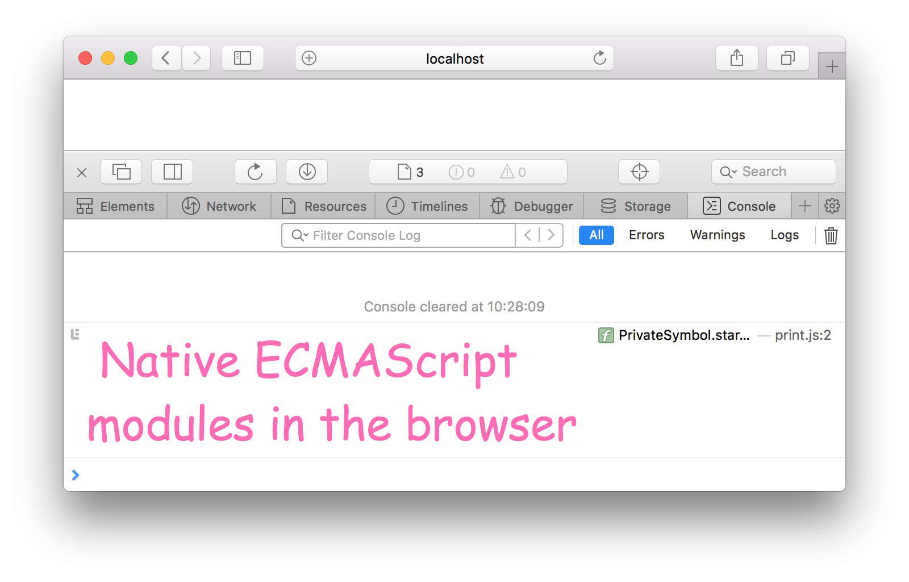
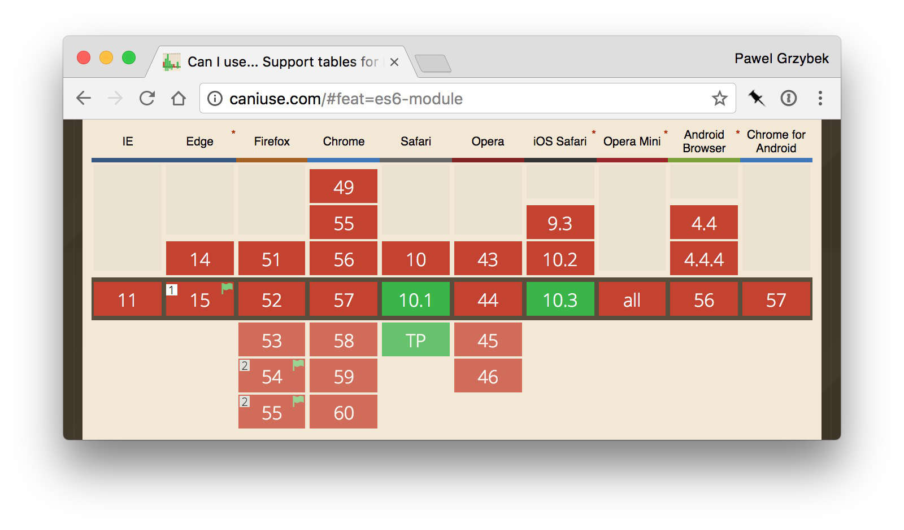
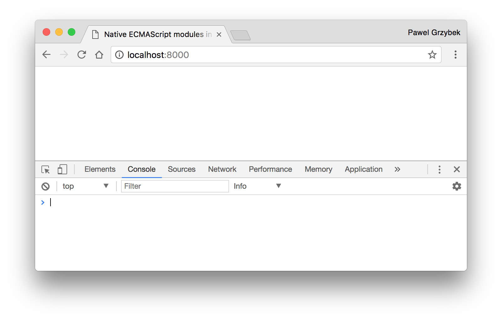
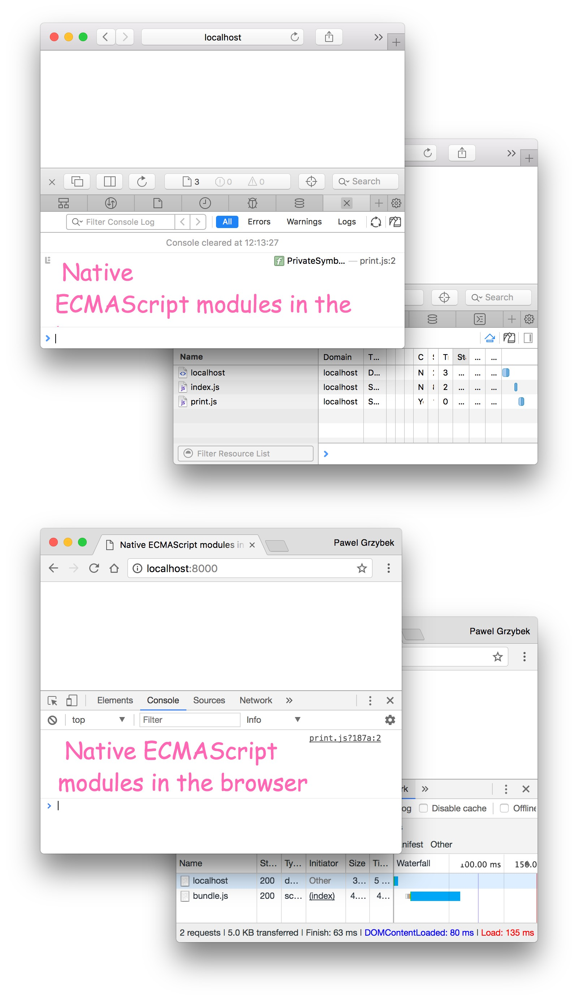

Three things that I wish I could ditch from my everyday front-end workflow: CSS preprocessors, JavaScript transpilers and module bundlers. Let me elaborate…

I love Sass but wouldn't it be cool to have its power built into CSS? The good news is native [custom properties](https://pawelgrzybek.com/css-custom-properties-explained/) are much more powerful than statically declared ones from Sass. Mixins are amazing — unfortunately the [`@apply` rule](https://pawelgrzybek.com/css-mixins-with-apply-rule/) has been [abandoned by the spec creator](http://www.xanthir.com/b4o00) but I'm sure we will get some decent replacement at some point. [The vendor prefixes imbroglio](https://www.chromium.org/blink#vendor-prefixes) is over and will never come back. With all those goodies I would say that the first of my dreams is fulfilled.

When [Babel](https://babeljs.io/) came around it was like living in the future. We were able to use modern features that browsers didn't support at the time. Things have changed though. Nowadays, browsers have really [strong support](https://kangax.github.io/compat-table/es6/) for present-day ingredients. Have a look at your Gulp build task or Webpack config — there's a good chance that you don't need to transpile your code anymore. The second item in my wish list has become a reality.

[Safari 10.1](https://developer.apple.com/library/content/releasenotes/General/WhatsNewInSafari/Articles/Safari_10_1.html) brings me hope that one day I will check the box next to the last item that I would like to forget — module bundlers.



## JavaScript modules recap

Before 2015 JavaScript didn't have a native way of working with modular codebases. For years web developers managed to find a number of ways to implement it: splitting the codebase into separated files and scopes, using [AMD (Asynchronous module definition)](https://en.wikipedia.org/wiki/Asynchronous_module_definition) with file loaders like [RequireJS](http://requirejs.org/) or making the Node-style [CommonJS](https://en.wikipedia.org/wiki/CommonJS) work in the browser via libraries like [Browserify](http://browserify.org/).

Finalised in June 2015 the spec for the [6th edition](http://www.ecma-international.org/ecma-262/6.0/) of JavaScript changed things a lot. One of the many amazing things that it brought was a native way of working with modules. It turned out that it was [immensely hard](https://blog.whatwg.org/js-modules) to implement on the web platform — so module bundlers like [Webpack](https://webpack.js.org/) came into the game. They allowed us to write code in a modern way and spit out a bundled script understandable by the browser.

[Safari 10.1](https://developer.apple.com/library/content/releasenotes/General/WhatsNewInSafari/Articles/Safari_10_1.html) is the first browser that has received [100% complete coverage for ECMAScript 2015 features](https://kangax.github.io/compat-table/es6/#safari10_1). Really great work Apple ([Service Workers](https://jakearchibald.github.io/isserviceworkerready/) next please). It means that it is the first browser that allows us to use native modules. Another implementation landed on Google Chrome 61, Firefox 54 – behind the `dom.moduleScripts.enabled` setting in `about:config` and Edge 16. Let's have a look at the nitty-gritty.

## Working with modules in the browser

If you have ever used `import` and `export` in your project, migrating this concept to a client won't be a challenging task. If you have never worked with these concepts before, give [this chapter](http://exploringjs.com/es6/ch_modules.html) of Dr. Axel Rauschmayer's book a quick read.

Nothing works better than a practical example. Let's create a script that prints a stylish log message into the console. Let's split it out into two files — `index.js` as an entry point and `print.js` that holds a reusable print function (module). It goes something like this (sorry for the [issue](https://github.com/jneen/rouge/issues/432) with ES2015 syntax highlighting).

```js
// index.js

import print from './print.js';
print('Native ECMAScript modules in the browser');
```

```js
// print.js

export default message => {
  console.log(
    `%c ${message}`,
    `
    color: hotpink;
    font-family: Comic Sans MS;
    font-size: 1.5rem;
    `
  );
};
```

In the world of module bundlers we need to run this set of files through it to get a bundled file that contains our script and some boilerplate on top of it. Then we have to smash a `script` tag with a `src` attribute that points to this file and voilà — it works. Now let's forget about bundling for a sec and take advantage of a browser that can finally resolve all dependencies for us. This is how to do it baby…

```html
<script src="./index.js" type="module"></script>
```

Yes the essence lies here — `type="module"`. According [to the spec](https://html.spec.whatwg.org/multipage/scripting.html#script-type-module-example-1) these few characters tell the browser that it can be used to include external module scripts. This is exactly what we need! Pay attention to the `import` path inside the `index.js` file — it needs to be a concrete path to an imported file (including the extension). Let's open it in the browser (more about the support later on).



The browser managed to resolve the dependency of the `print.js` file. No Webpack magic here! Beautiful, isn't it?

## But my browser doesn't… Yes it does!

A quick word about support of native modules across the browsers and some possible solutions. At the time of writing this article it's looking like this:

- Chrome Canary 61
- Firefox 54 – behind the `dom.moduleScripts.enabled` setting in `about:config`
- Edge 16
- Safari — hell yeah!



It doesn't look very promising and is definitely not ready to use in production. There is a hope though! Let's have a look at what the console of any browser that lacks native module support shows when I open our pretty print example.



So what happened here? NOTHING! Absolutely nothing. Because Google Chrome doesn't support JavaScript modules it totally ignores it. You probably know where I'm going with this.

```html
<script src="./index.js" type="module"></script>
<script src="./bundle.js" nomodule></script>
```

Yes! When modules are not supported natively let's use something that definitely works. As a fallback script let's use an output file from our module bundler of choice. It works perfectly well now in any browser that doesn't have a clue how to handle JavaScript modules. Make sure that you are not duplicating the same functionality for browsers that do support it — it is exactly for this reason the [`nomodule`](https://html.spec.whatwg.org/multipage/scripting.html#attr-script-nomodule) attribute has been recently added to the spec. Let's have a look at the results in Safari and Google Chrome (or any other browser that doesn't support modules) now…



## Last word about JavaScript modules

That's it. I hope that you are as equally excited about native modules as I am. I would like to leave you here with two conclusions.

The last few years introduced many tools and added massive complexity to front-end development. The rapid change of the JavaScript workflow constantly attracts new developers and scares others. Module bundling is one of those things that adds gigantic confusion — hopefully in this post I have demonstrated to you that it won't last forever. Things just became much simpler.

The thing that I love about the web is its unpredictability and active transformation. One day, something becomes much simpler and the next day a new idea comes in to confuse our brains even more. I can't wait to see what the future has to offer…
