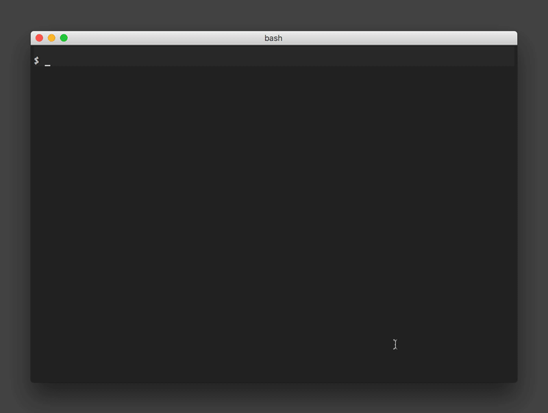
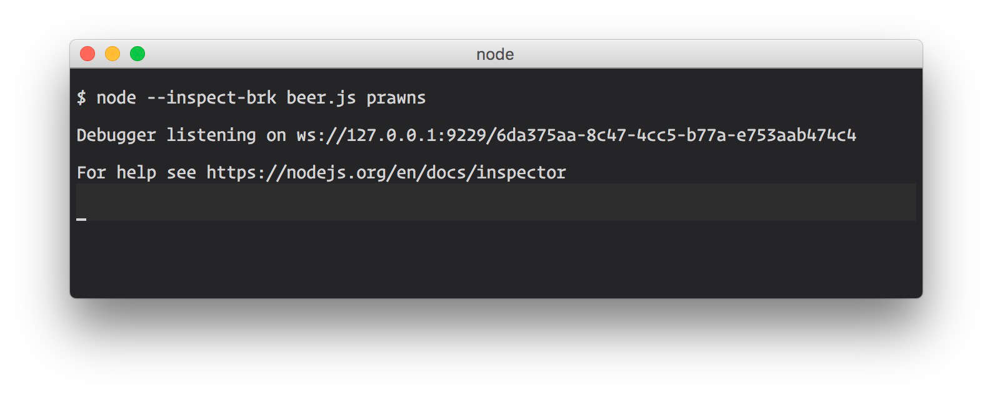
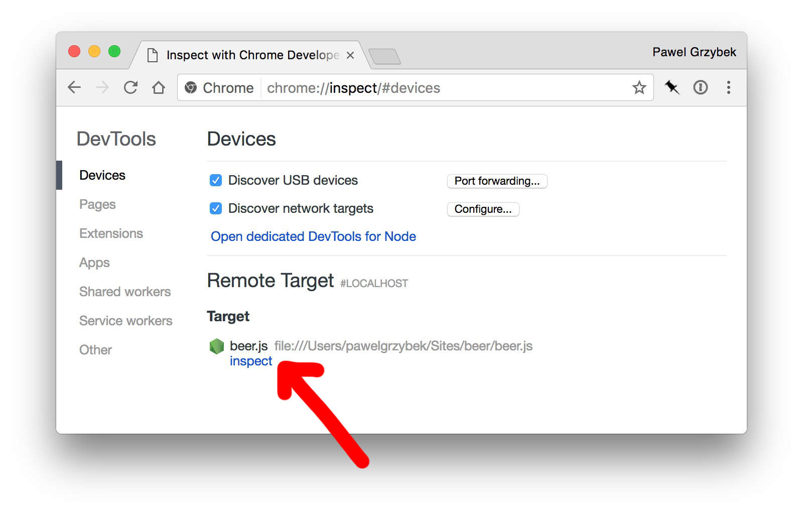
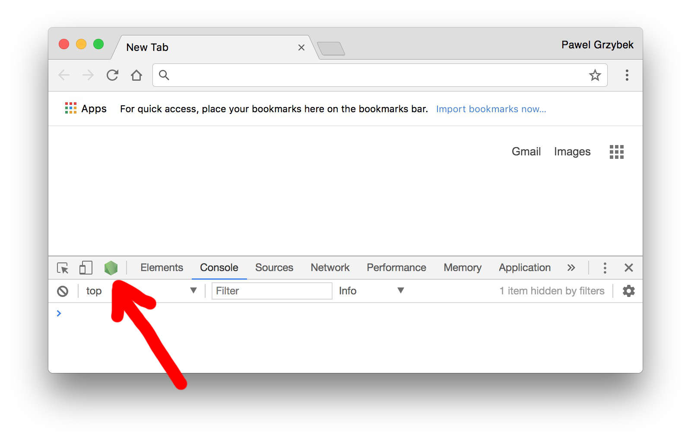
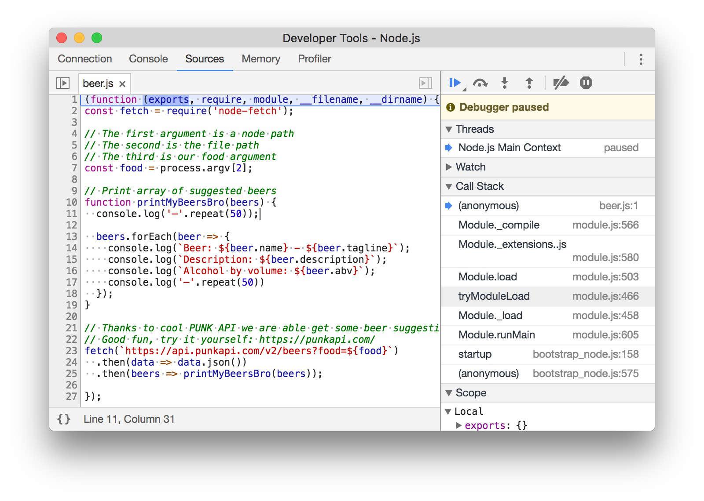

Hi! To debug Node.js in Chrome you need:

- [Node (v6.3.0+ required)](https://nodejs.org/)
- [Chrome (v55+ required)](https://www.google.com/chrome/)

Surprised? We need some playground script as well. Let's build something extremely useful. How many times have you had a great idea for what to cook for dinner, but struggled to decide what to drink with it? This simple script will give you suggestions for the best beer to drink with your meal based on your food input. Thanks to the great [Punk API](https://punkapi.com/) by [Sam Mason de Caires](https://twitter.com/samjbmason).

I really fancy some prawns today. Let's run our script...

```bash
node beer.js prawns
```



```js
// Node version of fetch, needs to be downloaded from npm or yarn
const fetch = require('node-fetch');

// The first argument is a node path
// The second is the file path
// The third is our food argument
const food = process.argv[2];

// Print array of suggested beers
function printMyBeersBro(beers) {
  console.log('—'.repeat(50));

  beers.forEach(beer => {
    console.log(`Beer: ${beer.name} - ${beer.tagline}`);
    console.log(`Description: ${beer.description}`);
    console.log(`Alcohol by volume: ${beer.abv}`);
    console.log('—'.repeat(50))
  });
}

// Thanks to the cool PUNK API we are able get some beer suggestions
// It's good fun - try it yourself: https://punkapi.com/
fetch(`https://api.punkapi.com/v2/beers?food=${food}`)
  .then(data => data.json())
  .then(beers => printMyBeersBro(beers));
```

## Run Node.js script in Google Chrome dev tools

Google Chrome allows us to debug the Node.js application in exactly the same manner as we use it with front-end code. Now let's run our script with an extra flag. All the options are well explained in the [Node.js documentation](https://nodejs.org/en/docs/inspector/#command-line-options).

```bash
node --inspect-brk beer.js prawns
```



At the moment the debugger is running and is stopped before the user's code parsing begins. To access the debugger we have a few options.

1. Go to `chrome://inspect` and click "inspect" under the process.
2. Click the small Node.js dedicated icon (this option is available on Google Chrome Canary at the time of writing this article).







That's it for today. Hope you find this quick tip useful. I really fancy prawns now.
