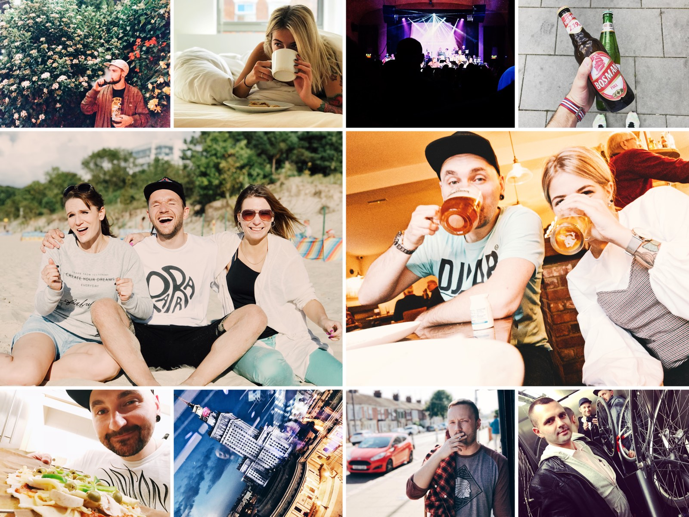

Once in a while I make an exception and use this blog to write some personal thoughts instead of trying to be a web geek. A year ago I published ["A look back at 2016"](https://pawelgrzybek.com/a-look-back-at-2016/) and now it is time to do the annual update. There are plenty of achievements that I would love to brag about and even more goals that I want to commit myself to next year. 

## Professional

Being a part of a well-established company is a great opportunity to gain new experience and learn a lot, but I never thought that working for [Engine Creative](https://www.enginecreative.co.uk/) would give me so much. For the first time in my life I built a web app using [Vue.js](https://vuejs.org/), I learnt the basics of [Laravel](https://laravel.com/), created a VR experience using [A-Frame](https://aframe.io), made an AR thing using [Wikitude](https://www.wikitude.com/) and went through my first steps to becoming a game developer using [Unity](https://unity3d.com/). I embraced the basics of C# and paradigms related with its ecosystem. Having previous experience with [React](https://reactjs.org/) gave me a great starting point in building my first cross-browser mobile app using [React Native](https://facebook.github.io/react-native/). Thanks a ton Engine Creative!

My open source contribution exploded in 2017. [Siema](https://pawelgrzybek.github.io/siema/) — a lightweight and simple carousel in pure JavaScript that I released about a year ago just hit [1800 stars on Github](https://github.com/pawelgrzybek/siema)! [Snippet generator](https://pawelgrzybek.com/snippet-generator/) that I initially built just for myself as a tiny day-to-day helper turned out to be well adopted and  used by developers around the world. It has featured in top industry websites and has been recommended in multiple podcasts and tutorials. With around 15000 downloads my very own [Bimbo Theme](https://marketplace.visualstudio.com/items?itemName=pawelgrzybek.bimbo-theme) for Visual Studio Code received some amazing feedback from users with visual impairments! It is such a cool feeling to know that it has helped thousands of people in resolving their everyday problems using open source.

Another reason for feeling proud is the website that you are on now. The number of unique visitors to this website went totally crazy. I'm really happy about some of the discussions that took place beneath some of my articles. It motivates me to keep writing good stuff for my readers. Thank you all.

However there is no rose without a thorn — I had a few professional downfalls too. I experienced my first burnout and a strong experience of 'imposter syndrome'. It happened in parallel with some big personal changes. Luckily I managed to give myself a little bit of time off and everything is back to normal. I realised that not every single tweet about a new JavaScript framework is worth of my attention. Not every single plugin needs to be added to my tool-chain, nor that every Medium article must be read. I'm back, I'm productive and happy.

## Personal

It's been a crazy time in my personal life! Lots of finished chapters just to begin a whole new book! The first months of the year were a nightmare! By the end of the year — I have never been happier in my whole life. Yes! I'm a truly happy man!

I would like to introduce you to Zuzia. The most beautiful human being — inside and out. I'm a lucky man because she has decided to share her life with me and it's probably the best thing that has ever happened to me. She is full of an incredible amount of passion and talent. She is caring, thoughtful, inspiring and on top of it — an incredibly beautiful woman! Thank you Zuzia :-*

One of my biggest achievements was a big drop in weight. Exactly a year ago when I visited my parents over Christmas I was 10 kilograms (1.6 stone) heavier than I currently am. This is a huge difference. Physically I feel much better than ever before. I'm able to run a decent distance and cycle like never before. The [Keto diet](https://www.reddit.com/r/keto/wiki/faq) is not the best fit for all obese people, but I'm extremely glad that I managed to apply its rules to my daily routine and even start enjoying it.

Another big realisation — my hidden passion for photography is slowly coming out of the shadows and I'm really pumped about taking more and more cool looking photos. Recently I invested in a really great [Sony A7R III](https://www.sony.co.uk/electronics/interchangeable-lens-cameras/ilce-7rm3) and a couple of still lenses ([85mm 1.4 G](https://www.sony.co.uk/electronics/camera-lenses/sel85f14gm) and [35mm 2.8](https://www.sony.co.uk/electronics/camera-lenses/sel35f28z) by Carl Zeiss). Photography is one of the most relaxing pursuits for my brain. I'm really glad that I've found it again.

There was another incredibly big personal accomplishment this year — balance. I found a balance between my professional and my personal life. Balance between the things that I need and the things that would be nice to have. Balance between fast food and healthy quality food. Balance between having a crazy party and time spent with my girlfriend and best friends and a bottle of wine. It sounds trivial but actually it has made a big difference to my professional and personal sides.

## In 2018 I will…

This post would be a bit lacking without some commitment to the goals that I'm planning for next year. I won't slow down that's for sure. I'm more than happy to list below a few of the things that are on my roadmap, but some of the more personal ones I'll share with you at the right time.

- learn a new programming language — C++ or Go
- move out to Birmingham and move my career forward
- Visit Sri Lanka
- take more photos

Thank you all for reading. I wish you all wonderful 2018!
