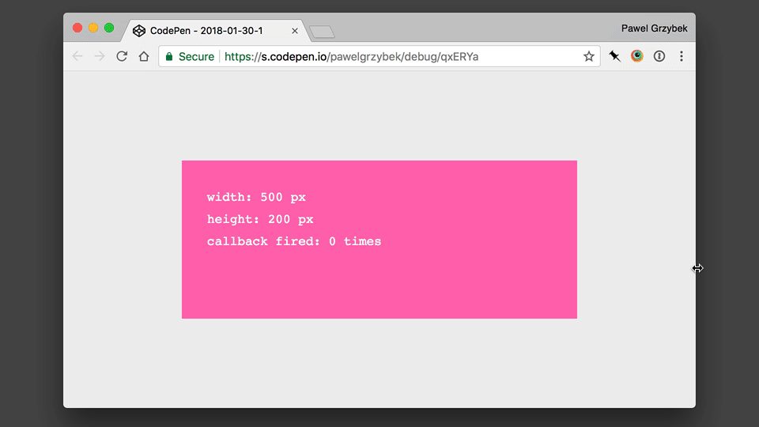
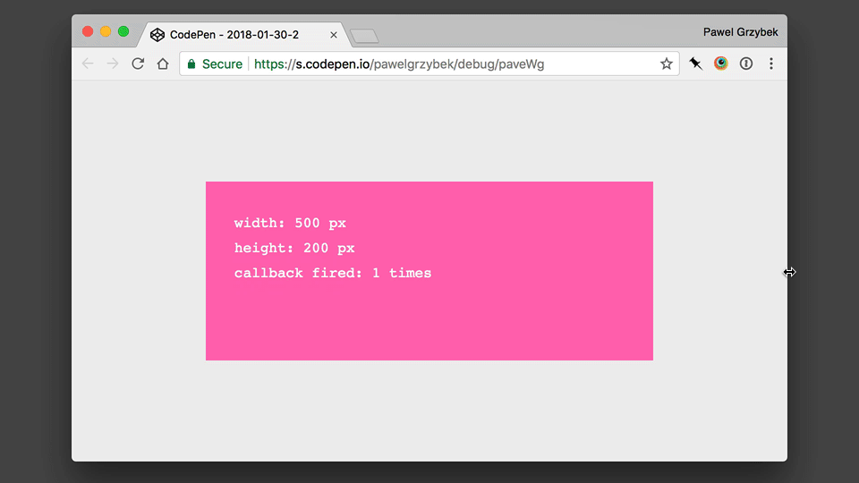
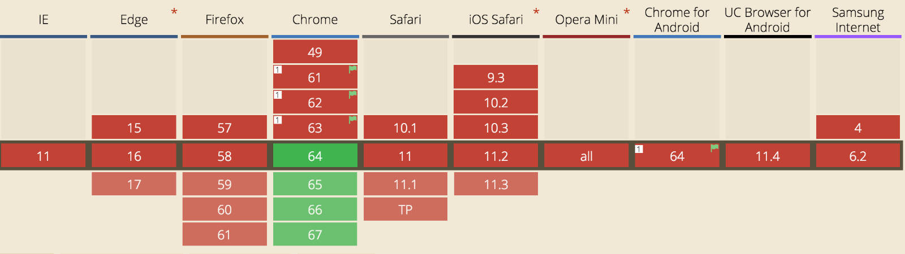

How many times have you attached a `resize` listener to the `window` object just to track a single DOM element? I have done it many times simply because I've had no other choice. There is an issue though — `scroll` and `resize` events are performance bottlenecks. Nowadays, the `scroll` event can be replaced with the [Intersection Observer that I explained](https://pawelgrzybek.com/the-intersection-observer-api-explained/) before. There's now hope for the `resize` event — [Resize Observer](https://wicg.github.io/ResizeObserver/).

## I don't care about window resize

What's the big deal with `windw.onresize` then? Essentially you have to trigger a callback every single time the size of the window changes — it doesn't necessarily mean that the element of interest changes its dimensions. This is a performance heavy event because it fires frequently and blocks a thread preventing the buttery smooth flow of our website.
Look at [this CodePen](https://codepen.io/pawelgrzybek/pen/qxERYa) to understand the issue (open and resize the window size).

```js
// define a callback
function callback() {
  // something cool here
}

// add resize listener to window object
window.addEventListener('resize', callback)
```

<p data-height="320" data-theme-id="light" data-slug-hash="qxERYa" data-default-tab="result" data-user="pawelgrzybek" data-embed-version="2" data-pen-title="2018-01-30-1" class="codepen">See the Pen <a href="https://codepen.io/pawelgrzybek/pen/qxERYa/">2018-01-30-1</a> by Pawel Grzybek (<a href="https://codepen.io/pawelgrzybek">@pawelgrzybek</a>) on <a href="https://codepen.io">CodePen</a>.</p>
<script async src="https://production-assets.codepen.io/assets/embed/ei.js"></script>



Can you see the issue? We're trying to update the size of the box but the callback fires when the window changes its dimensions, not the box that we care about.

## Fire a callback only when you need it — thanks to the Resize Observer

Similarly to [the previously explained Intersection Observer](https://pawelgrzybek.com/the-intersection-observer-api-explained/) the API of the Resize Observer is very simple. You have to instantiate a new `ResizeObserver` object with a callback function in a constructor. Look at the example now (open it in a new window and play around with its size). Can you see the difference? Pay attention to when and how often the callback is triggered.

```js
// define a callback
function callback() {
  // something cool here
}

// instantiate new observer
const myObserver = new ResizeObserver(callback);

// Observe one or multiple elements
myObserver.observe(someElement);
```

<p data-height="320" data-theme-id="light" data-slug-hash="paveWg" data-default-tab="result" data-user="pawelgrzybek" data-embed-version="2" data-pen-title="2018-01-30-2" class="codepen">See the Pen <a href="https://codepen.io/pawelgrzybek/pen/paveWg/">2018-01-30-2</a> by Pawel Grzybek (<a href="https://codepen.io/pawelgrzybek">@pawelgrzybek</a>) on <a href="https://codepen.io">CodePen</a>.</p>
<script async src="https://production-assets.codepen.io/assets/embed/ei.js"></script>



## Yes, you can use it now

Although the Resize Observer is supported only in Google Chrome 64+ and it is not fully polyfillable, there is a simple way to check if the browser supports it or not. If it does — take advantage of it. If it doesn't `window.onresize` will serve us as well as it has for all these years.

```js
if ('ResizeObserver' in window) {
  // new ResizeObserver( callback );
}
else {
  // window.addEventListener('resize', callback)
}
```



## Helpful resources

- [Resize Observer 1 specification](https://wicg.github.io/ResizeObserver/)
- [ResizeObserver explainer document](https://github.com/WICG/ResizeObserver/blob/master/explainer.md)
- [ResizeObserver: It’s Like document.onresize for Elements by Surma](https://developers.google.com/web/updates/2016/10/resizeobserver)
