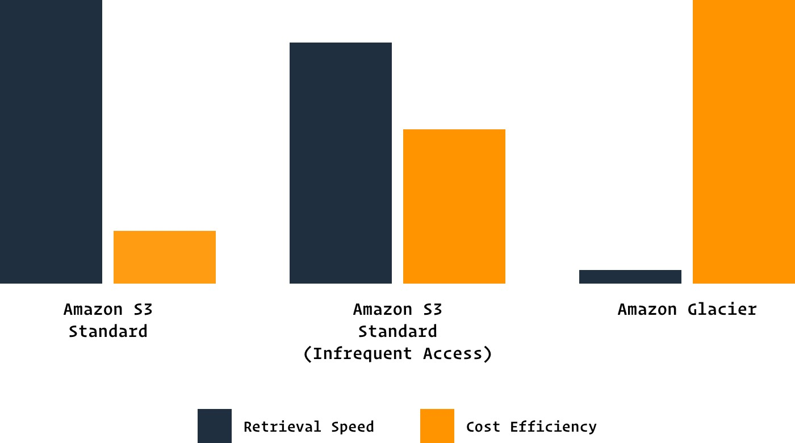
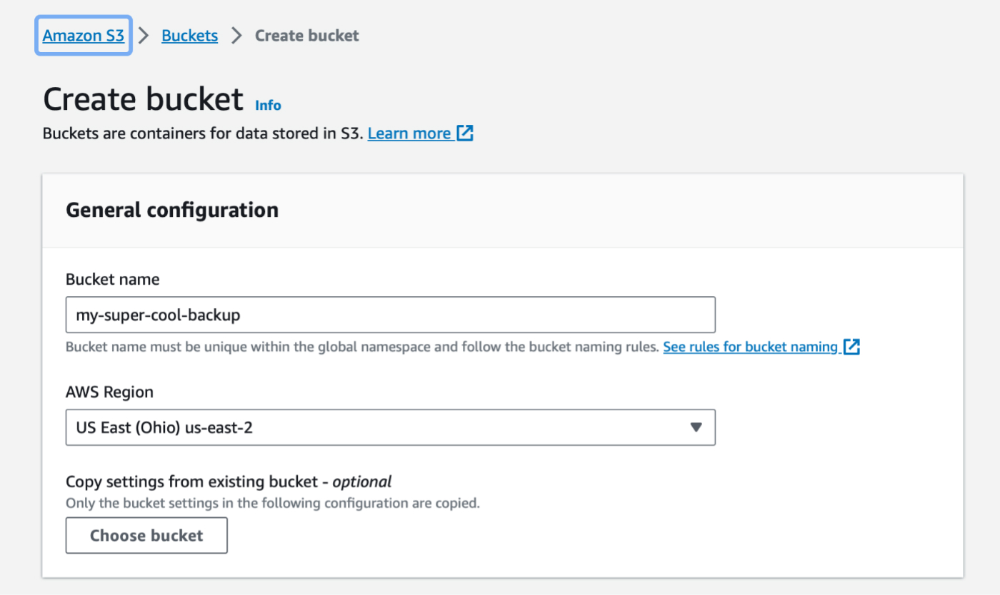
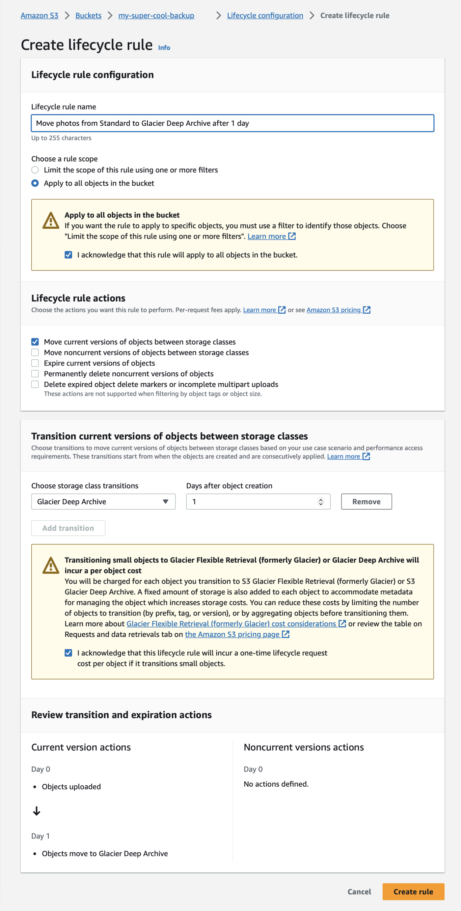
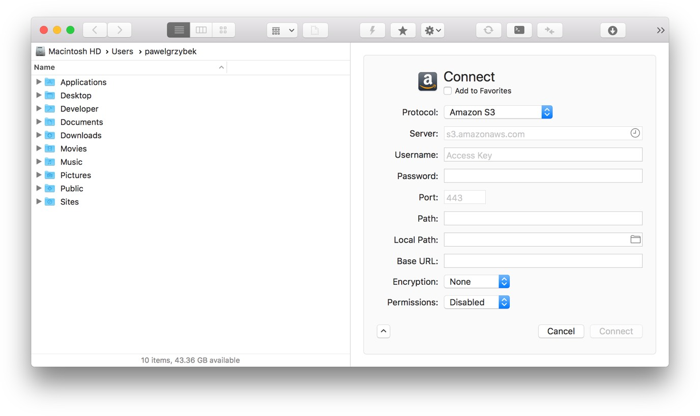

Far, far away, someone, somewhere said:

> "There are two kinds of people, those who back up their data and those who have never lost all their data."

Luckily for me, I have never been a victim of a situation where I lost all of my data simply because I do backups regularly. I never do a full backup of my machine though. I can download an operating system in a few minutes, restore my system preferences with a [single click](https://github.com/pawelgrzybek/dotfiles), install all my frequently used apps using a single command, pull all of my projects from [GitHub](https://github.com/) and listen to music on my [Technics SL-1200](/music) or stream it from Apple Music. The only thing that I keep backed up is my photo collection.

## My backup strategy in a nutshell

Since May 2007, I have kept all of my photos in a well-organized collection, ordered chronologically by year and by session/event. I maintain the same habit for all of my pictures taken on my iPhone as well. It's not an enormous amount of data (around 200GB), but the sentimental value it holds is immense.

No matter what, I always store this collection on two physical devices. It can be my computer's hard drive, an external flash disk, NAS server or a RAID array. Currently I use two totally average external [hard drives by Segate](https://www.amazon.co.uk/Seagate-Portable-External-Creative-Photography/dp/B00FP50LH2). I am the happy owner of a superb [Sony α7R III](https://www.sony.co.uk/electronics/interchangeable-lens-cameras/ilce-7rm3) that shoots 80 megabyte ARW files. Taking that into consideration I've realised that I may run out of storage on these hard drives very quickly, but for now they do the job.

However, things happen! Disks fail, people rob, rivers flood, comets fall. In case any of that occurs, I need one more copy in the cloud. I have tested multiple solutions and services over the past few years, and finally, I feel that I have found something that is going to stick around. Although making a backup to a local hard drive is fairly easy and straightforward, cloud backups are way more complicated. Luckily, I am here to help you out.

## What I consider to be a good cloud backup and things that I don't care about

There are plenty of services that offer cloud storage for amateur and professional photographers. [Dropbox](https://dropbox.com), [Google Drive](https://www.google.com/drive/), [Box](https://www.box.com/), [OneDrive](https://onedrive.live.com/) or [Backblaze](https://www.backblaze.com/) just to name a few.

There are a few key things that I need to get out of my cloud backup solution: security first! There is a reasonable chance that my collection will grow over time, so auto-scaling and unlimited storage resources are another must-have. New services show up and vanish often, and I am really not interested in investing my time in solutions that may not be around tomorrow. Also, price is an obvious factor, of course.

The providers listed above usually offer tons of things that I simply don't care about. I don't need a fancy app with tons of bells and whistles. I don't need constant live sync and seamless integration with my OS. It is a last resort backup—the file structure is probably never going to change. I will just add more stuff over time.

I am here today not to compare the available options or convince you to use one over the other. I spent years looking for a solution that suits my needs, and I would like to share it with you.

## Say hello to AWS Simple Storage Service (S3)

[AWS (Amazon Web Services)](https://aws.amazon.com/) is a platform that offers a number of things that your business or you, as an individual, may need. From computational power, through to database storage, content delivery networks to machine learning and IoT (Internet of things) related products. A storage solution is one of the many services that AWS has to offer. It is well established and proven by the mile-long [list of clients](https://aws.amazon.com/solutions/case-studies/all/) like: Adobe, AirBnb, Netflix, NASA, SoundCloud, Canon, GoPro… The list goes on and on.

You may have heard the opinion that AWS is complicated to use. In reality, it is indeed complex, but being in a band doesn't require playing all the instruments—just mastering a single one. Storage is what we need.

AWS has a variety of storage solutions in its product list. From basic options like [Amazon Simple Storage Service (S3)](https://aws.amazon.com/s3/) to the [AWS Snowmobile](https://aws.amazon.com/snowmobile/) – a 45-foot long shipping container pulled by a truck for transferring extremely large amounts of data (up to 100PB). What we require is a data bucket stored in an S3 bucket and its smooth transition to the [Glacier](https://aws.amazon.com/glacier/) class using lifecycle policies. Allow me to explain.

### What is S3 and how it works

Amazon S3 is a simple storage solution that offers a range of classes designed for specific use cases. For frequently used general storage, use [S3 Standard](https://aws.amazon.com/s3/storage-classes/#General_Purpose). [Infrequent Access](https://aws.amazon.com/s3/storage-classes/#Infrequent_Access) works best for files that you don't have to access very often but still need to keep accessible whenever you need them. For archiving purposes, [Glacier Deep Archive](https://aws.amazon.com/s3/storage-classes/#Archive) is the best option. Each of these categories comes with pros and cons, and each of them suits different needs. The main differences between them are [price](https://aws.amazon.com/s3/pricing/) and waiting time to access objects (photos in our case). For those who are curious, I would direct you to Marc Trimuschats' presentation from the AWS Summit 2017, [Deep Dive on Object Storage](https://youtu.be/bfDpK45Faa0), which tells you everything you need to know.

Essentially, files stored in the hot storage (S3 Standard) are accessible immediately but they will cost you a fortune ($0.021-0.023 / GB). Cold storage (Glacier Deep Archive) on the other hand is extremely cheap ($0.00099 per GB) but a file restoration can take from 1 minute up to 12 hours. You will be charged for each GB retrieved from the cold storage cluster too. The pricing may vary a bit depending on the region of your S3 "bucket".

Privacy of files is something that we can easily control with S3. If you want to make a file public or private, no more than a single click is needed. Lifecycle policies help us to create a set of rules that invisibly migrate files between storage classes. I utilised the power of this feature to migrate all the files imported to the Standard bucket to Glacier the next day.

### How to

I mentioned before that AWS is complicated to use, but I hope that this step-by-step guide can make things easier for you. The S3 storage may actually be one of the easiest-to-use services from the humongous number of products in the AWS portfolio.

Start with [creating a free AWS account](https://portal.aws.amazon.com/billing/signup). This process requires you to add a credit card to your account and authorize it through a phone call you will receive from Amazon's bot. It is worth mentioning that you are eligible to use the [Free Tier](https://aws.amazon.com/free/), which gives you access to a snippet of AWS features completely for free. You can end this process here, but I would strongly suggest looking at the [IAM (Identity and Access Management) best practices](https://docs.aws.amazon.com/IAM/latest/UserGuide/best-practices.html). Personally, I use my "root" account only for billing purposes and user management. For using AWS services, I created an IAM user with sufficient permissions for my everyday tasks—security first. Read more about the recommended way of using the AWS platform in the [AWS Identity and Access Management Documentation](https://aws.amazon.com/documentation/iam/). The [Getting Started with Amazon Web Services](https://youtu.be/1Eh1uxLyXJ8) webinar is another helpful resource to start with.

> "When you first create an AWS account, you begin with a single sign-in identity that has complete access to all AWS services and resources in the account. This identity is called the AWS account root user and is accessed by signing in with the email address and password that you used to create the account. We strongly recommend that you do not use the root user for your everyday tasks, even the administrative ones. Instead, adhere to the best practice of using the root user only to create your first IAM user. Then securely lock away the root user credentials and use them to perform only a few account and service management tasks."

Our account is ready to use and now secure. It is time to create the first storage "bucket" under the S3 section. Use a unique name for your bucket and choose a location. Do not make my mistake and pick the region that is the cheapest, not the closest to you. Make a wise decision at this point because you won't be able to change those details later on. After choosing a name and region, keep the remaining settings as they are by default and click the "Create bucket" button.

Now we need to configure lifecycle policies to automatically migrate files from the Standard storage class to Glacier Deep Archive. Ideally, the transition should happen as soon as possible. To set it up that way, click on the name of the bucket created in the previous step and navigate to Lifecycle rules under the Management tab. Click the "Create lifecycle rule" button to define a new rule. Add a meaningful name to your rule and navigate further to the Transitions section. For the current version of your files, create a rule that moves the file to Glacier after one day. We don't need to tweak settings for the previous versions because we didn't enable file versioning in the first place (you don't need that for backups). Click next to the Expiration tab just to keep it as it is (we really don't want our files to be removed) and proceed to the next tab — Review. Make sure that you are happy with all the settings in the last step and save the rule. We are done!

### GUI or not

Although the S3 web interface is very user-friendly and fast, you may be interested in using a GUI (graphical user interface) tool to send files to your bucket. Luckily, there are a lot of tools out there that let you access your Simple Storage Service easily. As a macOS user, my personal preference is [ForkLift 3](https://binarynights.com/). [Transmit 5](https://panic.com/transmit/) is another app for the Apple system that has garnered a great reputation. Maybe [Cyberduck](https://cyberduck.io/)? [FileZilla Pro](https://filezillapro.com/ftp/mac/) and [S3 Browser](http://s3browser.com/) could be good options for Windows users. Play around with the available options and let me know about your preferred way to interact with S3 objects.

## Happy backing up

I am very happy with this solution, and it works well for me. I managed to reduce the cost of my digital backups from £8 per month to less than £1. I have a reliable and secure copy of my files, and a great system in place that hopefully will serve me for the long term. Let me know about your backup strategy in the comments below. If you have any questions or need further clarification on anything in this post, I am always eager to help. Happy backing up!


One 27 March 2019, [Amazon announced a Glacier Deep Archive](https://aws.amazon.com/blogs/aws/new-amazon-s3-storage-class-glacier-deep-archive/) which is even more cost effective storage class that perfectly suits my needs.

