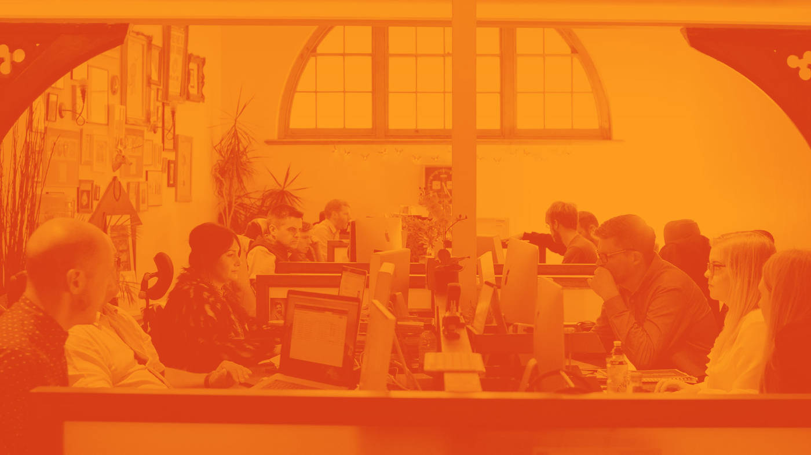
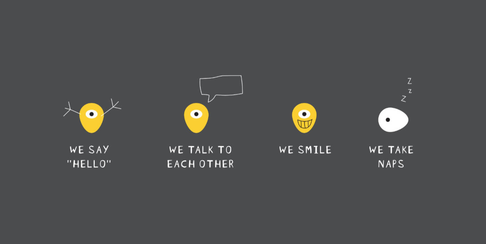

Two years ago I was really lucky that I joined the team at [Engine Creative](https://www.enginecreative.co.uk/). They are a bunch of creative, smart and inspiring people motivated to deliver top quality work to an endless list of clients. During my time at Engine Creative I had the pleasure of working on multiple projects that nearly melted my brain, whilst exploring a hell of a lot of bleeding edge technologies. I would like to thank everyone there for my time working with you and wish you all the best in the future!

Time moves on, my perception about life has taken shape and my list of priorities have changed order. The amount of time, passion and dedication that I put into software development drove me to a change bigger than I expected. I would like to proudly announce that…

## I'm joining Mindera

Founded in 2014 [Mindera](https://mindera.com/) is a Porto (Portugal) based company that has expanded and opened offices in Leicester (UK), Chennai (India) and San Diego (US). They say "hello", they talk to each other, they smile, [they take naps](http://tinyurl.com/zc599tr). Am I not a perfect fit?

I am really excited about becoming a part of this enormously talented team and looking forward to building the world's best piece of software! 
