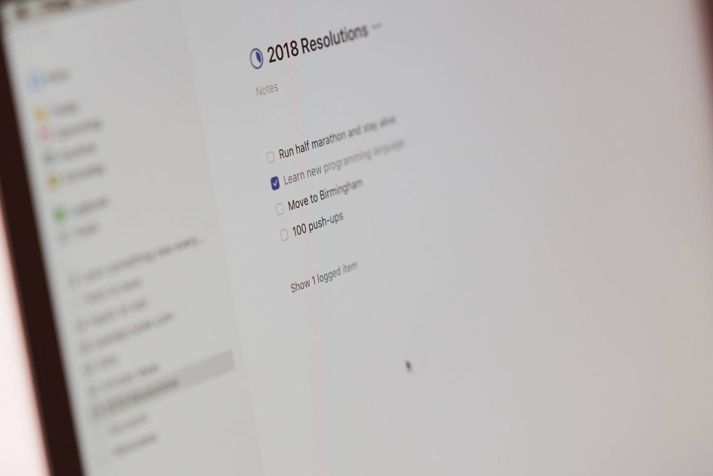
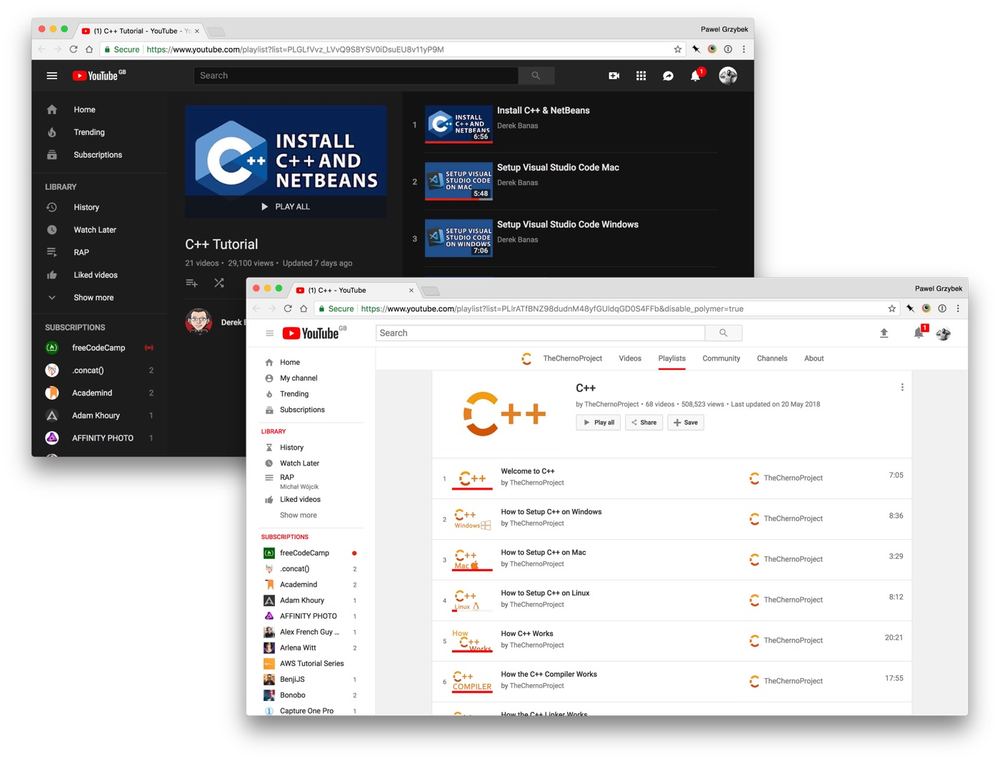

At the end of 2017 I committed myself to [learning a new programming language as one of my resolutions for 2018](https://pawelgrzybek.com/a-look-back-at-2017/#in-2018-i-will). I've spent the last few months jumping between client projects written mainly in JavaScript and learning C++ in my own time. I am still nowhere near proficient at it, but it is a great time to share with you a few of my conclusions.

## New perspective

JavaScript, being a very forgiving language appears to be an attractive choice for new programmers. It works the same on every single browser (I mean the core concepts, not the API implementations so spare your evil comments please) and the same applies to the server world using [Node.js](https://nodejs.org/). To spin a script you don't need much more apart from the application that you already have — a browser. You can use a browser's built-in console, a simple text editor like [Visual Studio Code](https://code.visualstudio.com/) or full-blown IDE (integrated development environment) like [WebStorm](https://www.jetbrains.com/webstorm/) — the tool doesn't matter — the interpreted nature of this language enables you to view feedback at runtime with no required configuration whatsoever.

C++ on the other hand requires you to do some solid homework before you launch your first line of code. Having a good IDE helps a ton. [Visual Studio](https://www.visualstudio.com/) by Microsoft, the superb [CLion](https://www.jetbrains.com/clion/) by JetBrains or [Xcode](https://developer.apple.com/xcode/) are great choices to consider. The compiled nature of this language will require you to brush up on some basic knowledge about memory allocation and the architecture that you are working on and building for.

## Learning C++ makes you a better JavaScript developer

One of the plethora use cases of [low-level programming languages](https://en.wikipedia.org/wiki/Low-level_programming_language) like C++ is building other programming languages. Yes, you guessed it — JavaScript is written in C++. To be precise, the engines that drive the most popular JavaScript engines ([V8](https://developers.google.com/v8/) within Google Chrome and Node, [Chakra](https://github.com/Microsoft/ChakraCore) for Microsoft and [SpiderMonkey](https://developer.mozilla.org/en-US/docs/Mozilla/Projects/SpiderMonkey) for Mozilla products) are mainly compiled from a C++ code base. [MDN Web Docs](https://developer.mozilla.org/) is a fantastic resource and I use it all the time but sometimes it is not enough. I cannot describe how cool it is to read V8's source code and actually understand what is going on.

Having exposure to a strongly-typed programming language (one that requires data type declaration) and a basic understanding of memory management makes you think about your script in a totally different way. Despite the fact that JavaScript engines are doing tons of optimisations for you, you can avoid performance pitfalls by writing an API that skips unnecessary steps at runtime. [Mathias Bynens from V8 team](https://twitter.com/mathias) recently gave a fantastic talk on this subject — [V8 internals for JavaScript developers](https://youtu.be/m9cTaYI95Zc).



## Leaving JavaScript fatigue behind

I bet that a new JavaScript framework will land on GitHub before you reach the end of this article. But I just learnt React. Damn! My [Pinboard reading list](https://pinboard.in/howto/#saving) is full of JS related articles, tweets, conference talks and tutorials on YouTube! There is no way that I will keep up with this endless dungeon of JavaScript resources.

Actually there is a way to get out of JS fatigue! Forget about your current stack and let yourself soak in a new skill (C++ in my case). Don't get me wrong, I still learn new JavaScript stuff on daily basis but only when I really need it. I ignore tweets about new libraries and frameworks, tutorials on Youtube and Medium articles. Ironically — accordingly to section above — doing so makes you a better JavaScript developer anyway.

## Helpful resources

For me the most efficient way of learning is watching videos with a great balance between theoretical definitions and practical examples. It took me quite a while to find some great resources about C++ and after a few months I'm ready to share with you my top ones!

The [C++ playlist](https://www.youtube.com/playlist?list=PLlrATfBNZ98dudnM48yfGUldqGD0S4FFb) by [Yan Chernikov](https://twitter.com/thecherno) is one of the best resources that I've found. It has a good balance between theory and practice, it keeps an optimal pace and is interspersed with a great sense of humour that makes it a perfect stating point for C++ newcomers. The [C++ playlist by Derek Banas](https://www.youtube.com/playlist?list=PLGLfVvz_LVvQ9S8YSV0iDsuEU8v11yP9M) is another one that is a little less energetic but filled with great theoretical explanations.

Whenever I struggle with a particular subject I dig into [The C++ Programming Language (4th Edition) by Bjarne Stroustrup](http://www.stroustrup.com/4th.html). This publication is written in an academic manner by the author of the C++ language. Reading verbose tomes like this one is not my preferred way of learning, but it is worth keeping on the shelf.

## More, more, more…

I am certain that between purely frontend oriented articles you will find some low-level related content on this website soon. I highly encourage you to learn a new programming language — I found the experience really exciting. If you have some similar experiences, please share your journey in the comment section below. Do you know any resources that can help me on my journey? Please share it by all means. Thanks a lot for reading and keep on hacking!

