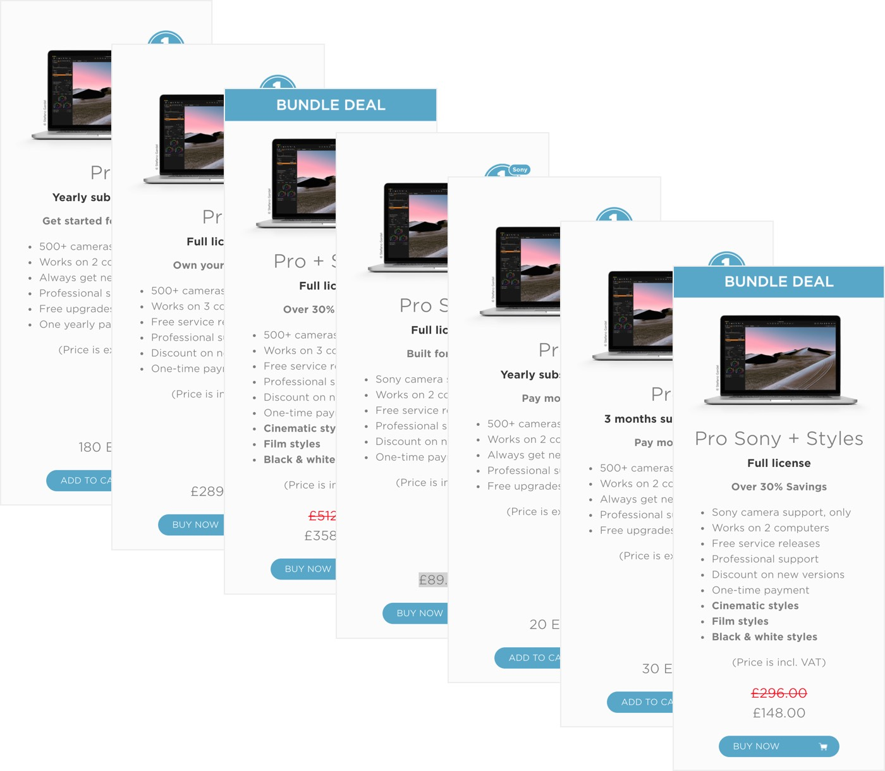
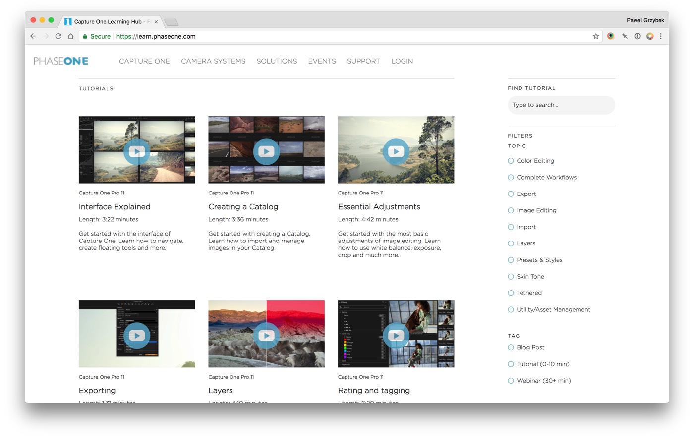
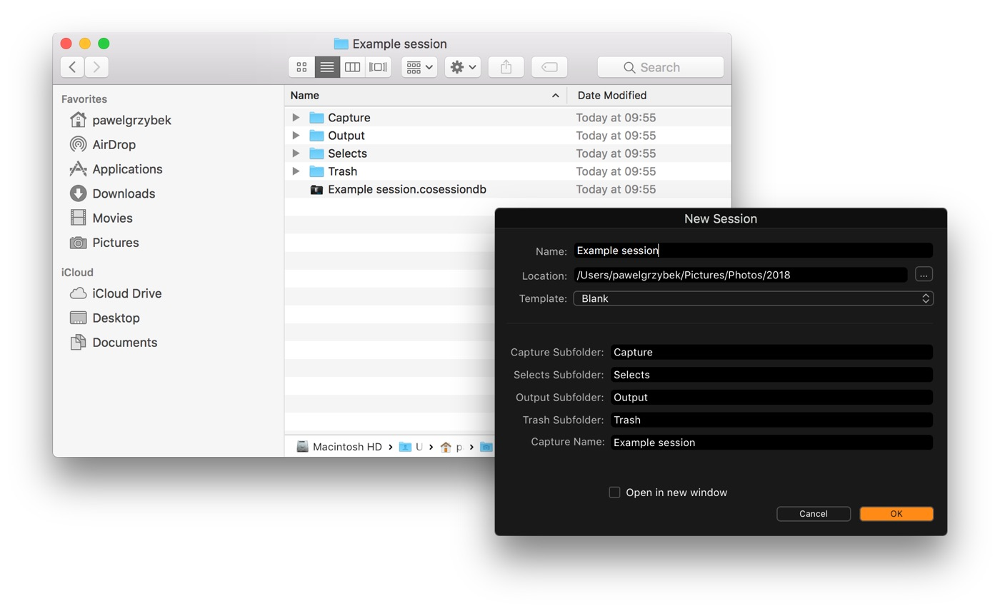
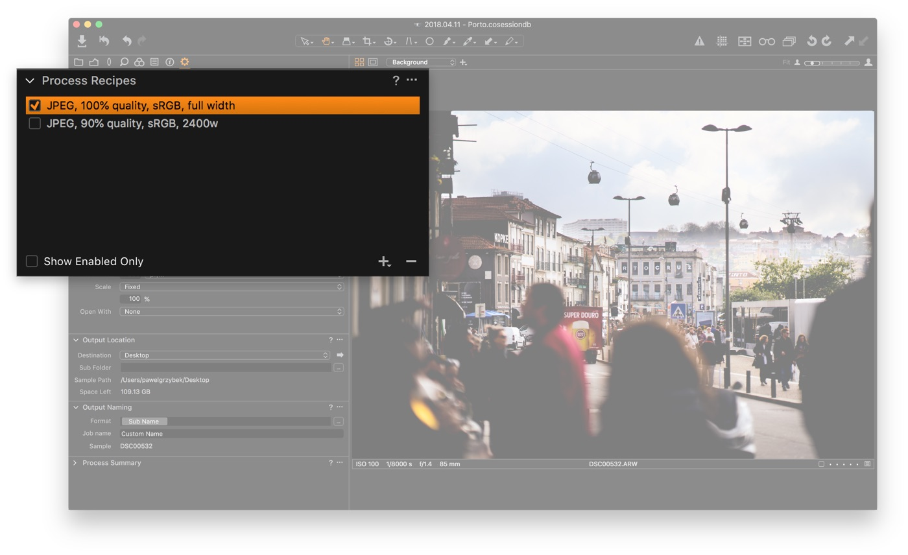
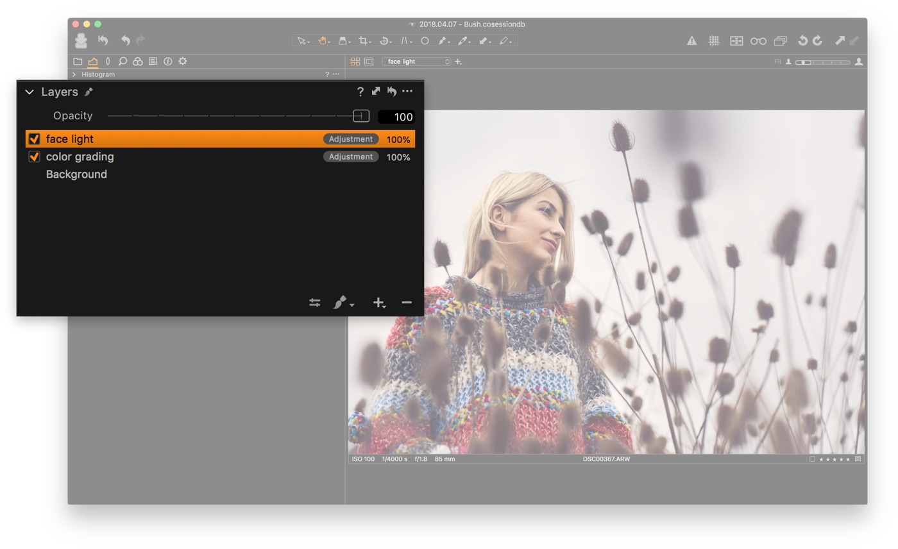

From Monday to Friday I am a Senior Front-end Developer at [Mindera](https://mindera.com/) but come the weekend, I turn into a hobbyist photographer. After shooting analog using a Hasselblad 500C/M for years I recently became the happy owner of a [Sony α7R III](https://www.sony.co.uk/electronics/interchangeable-lens-cameras/ilce-7rm3). As far as shooting goes on an advanced camera like this it is pure pleasure. To take a good picture you need to have a good eye — this applies to both analog and digital worlds. The differences start after pressing the shutter button when instead of going to the darkroom, everything goes to software.

Having had some minor experience with Adobe Camera RAW many years ago, it was a fascinating moment when I had to embrace the world of digital photography in 2018. There are tons of software applications available on the market: [Adobe Lightroom](https://www.adobe.com/uk/products/photoshop-lightroom.html), [DxO PhotoLab](https://www.dxo.com/us/photography/photo-software/dxo-photolab) or [Luminar](https://skylum.com/luminar) to name a few big players. All of them are superb but there is always something that I dislike about each one: the pricing model, the performance, a missing feature, lack of camera support etc. There is one that does everything right though.

## Capture One Pro by Phase One

[Capture One](https://www.phaseone.com/en/Products/Software/Capture-One-Pro/Highlights.aspx) is designed by the Copenhagen (Denmark) based team of people from Phase One — the field leader when it comes to medium format digital photography systems. Years of creating the best photography hardware gave this bunch of people the foundation on which to extend their prowess by offering a piece of powerful and precise software. Let me share with you a few reasons why I decided to invest my time and money in their product.

### Price

[Capture One Express](https://www.phaseone.com/en/Products/Software/Capture-One-Pro/Sony-Pro.aspx) is the free version of the software for Sony camera owners. For the majority of users it will be more than enough but to get access to the more powerful features I upgraded to [version Pro](https://www.phaseone.com/en/Products/Software/Capture-One-Pro/Features.aspx). There are multiple options in terms of pricing — I ended up buying the full license for Sony cameras for only £89. Unfortunately this attractive price applies only to the version for Sony cameras. Another good reason to go with mirrorless Sony? Hahaha!

### Learning resources

A piece of software with this level of complexity always presents a learning curve — Capture One Pro is no different. [Learning hub](https://learn.phaseone.com/) contains a comprehensive list of learning resources for beginners, intermediate and advanced users. The method of app exploration that I like the most are the [webinars hosted by David Grover](https://www.youtube.com/playlist?list=PLBZS3EGK3tQ9eNptYkVQlh9hTZ6d-rNOU). These lengthy screencasts are just the perfect combination of comprehensive explainers and practical implementation.

### Sessions

Having disorganised files all over the place is not the best way to keep your collection neat. Having them all in one single catalogue (Lightroom style) doesn't suit my workflow either. I just want to have a separate event or trip in an encapsulated folder. The new way of organising files announced in Capture One 10 called "Sessions" is exactly what I'm after. With this workflow, every single session becomes well structured and portable in a folder that contains all of my images and adjustments. It perfectly fits into [my Amazon S3 photo backup solution](https://pawelgrzybek.com/my-amazon-s3-photo-backup-solution/). [There is a webinar](https://youtu.be/NdsMo0mKgy4) that thoroughly explains the use case for sessions.

### Customisation

Despite the user interface looking a little bit outdated at first glance, this is probably the most customizable piece of software on my hard drive. You can truly make it yours. The default layout puts everything in a well-thought-out order that works well for me. Following the tabs from left to right, from import to export you have access to hundreds of little adjustments. A little bit of practice and a few keyboard shortcuts built into your muscle memory lets you forget about the tool and stay focused on what matters — the photography.

### Performance

I am not running the most expensive, latest iMac Pro with a superb powerful GPU and gazillions of RAM. I am on a three year old MacBook Pro 15 with 16GB of RAM and Intel Iris Pro 1536MB and this application flies! It requires a few seconds of indexing on the initial setup but then my workflow is buttery smooth. I was pretty happy with the performance of version 10, but this is significantly improved in the latest release.

### Process recipes

One for print, another version for my website and of course one to land on Instagram. Literally three clicks! Process recipes are very customisable, easy to use, intuitive to create and ready to exchange between devices. Literally no other app does it right — Capture One nailed it.

### Layers

You can add up to 16 layers, control their opacity and add literally everything on them (apart from black & white adjustments and spot removal). The concept of layers is nothing new in graphic design software, but it opens a new level of flexibility in the world of RAW processors. Find out more about [working with layers](https://youtu.be/2WHpVfgC5Qc) in this webinar.

### Advanced Color Editor & Skin Tone 

The simplicity of using the advanced color editor and skin tone tool in Capture One Pro makes these two features amongst my favourite parts of this software. To achieve similar results in a tool like Photoshop, you need to have lots of color theory knowledge and probably be crazy good at math. Find out more about this in another great webinar by David — [The Color Editor Master Class](https://youtu.be/ZlBLEXe4rPA).

## Give it a go!

There is more to it, but I've tried hard to pick my favourite parts of the app without making this article miles long. I cannot wait for new releases and new feature announcements. I would like to have a tiny UI update to make it look a bit more like 2018. The history panel (in the style of Luminar 2018) would be a nice feature to have. Also I would like to see a more intuitive way to preview before and after changes (I know about clicking the reset button and holding the option key, but a dedicated button would be very appreciated).

This isn't a sponsored post whatsoever and I don't work for Capture One (but I would love to though!). I just really love this software and I wanted to share with you my experience with it. I am very curious about your opinions, favourite parts, and other software that you use. Let me know in the comments section below. For now, keep taking new photos and see you soon.
