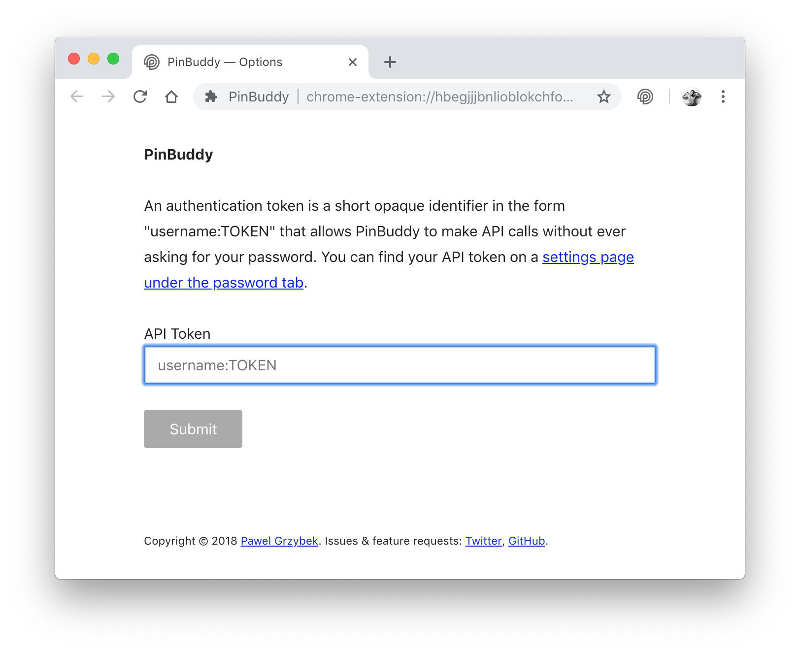
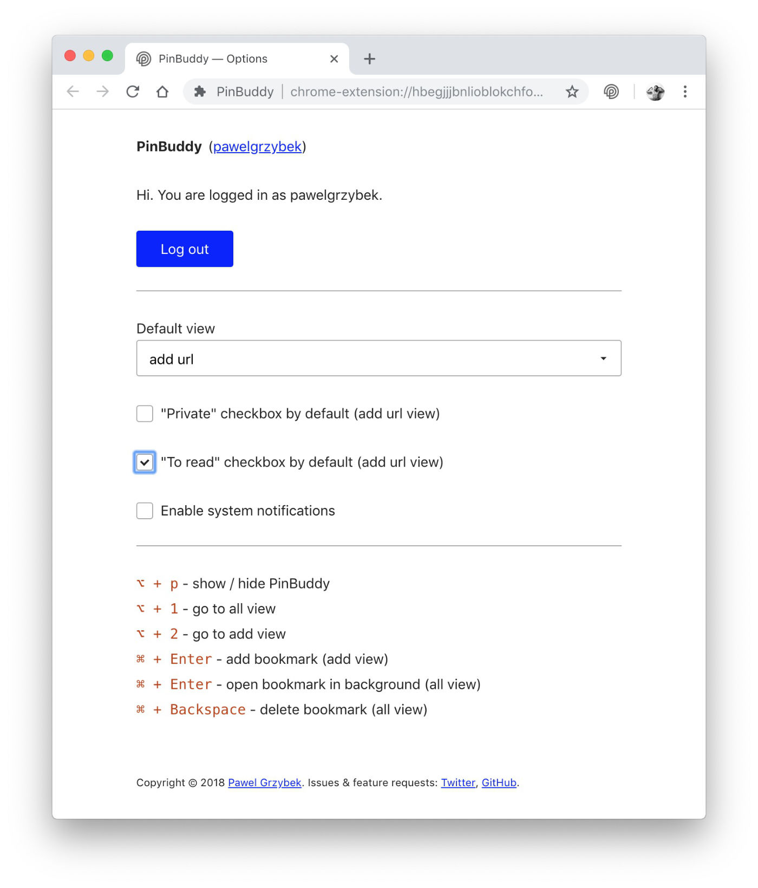
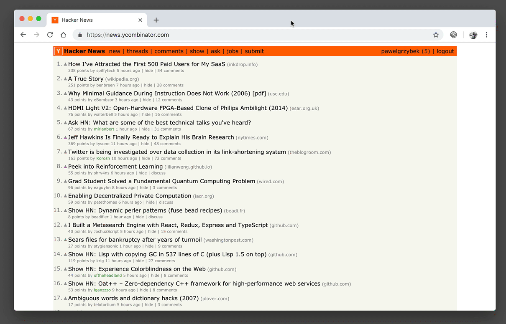
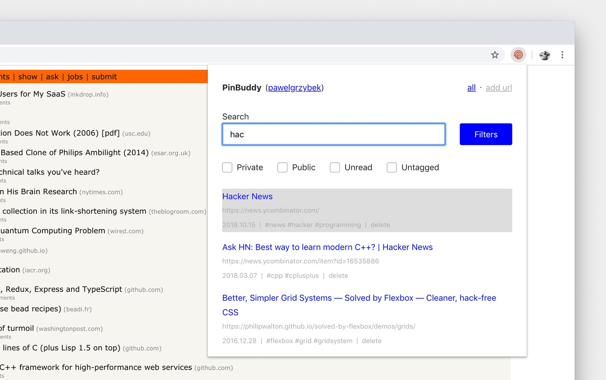
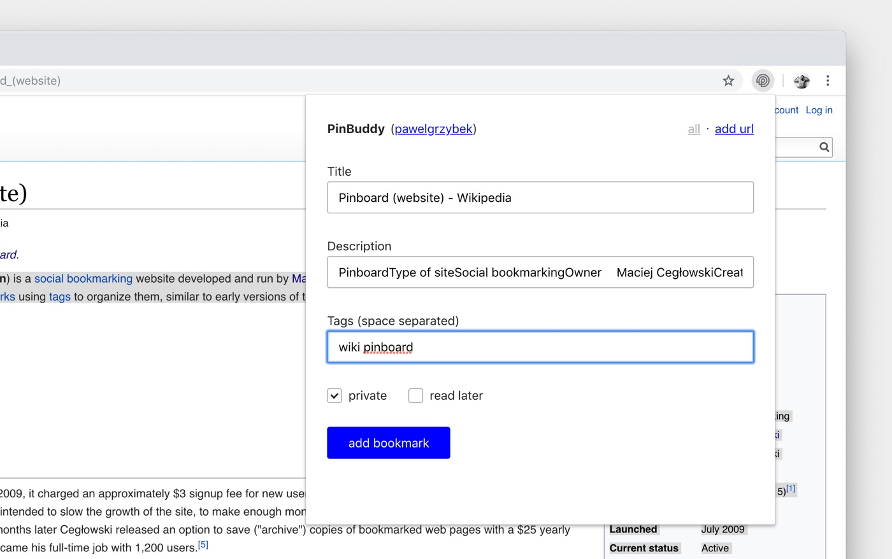
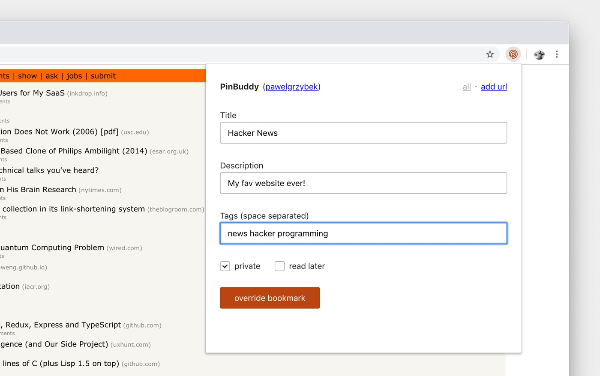

The internet is full of useful things that are worth revisiting in the future. Bookmarking them all in a browser built-in feature is an option but it quickly becomes unmanageable after a while. A myriad of bookmarking services have been born to solve this issue and my favourite amongst them is [Pinboard](http://pinboard.in) built by Maciej Cegłowski. Maybe it isn't the prettiest website around neither is the API the cleanest and most intuitive but it definitely comes with one big advantage — it works.

> There is absolutely nothing interesting about the Pinboard architecture or implementation; I consider that a feature!

After a few years of working with Pinboard, my collection has grown a lot, getting bigger day by day while I visit resources I don't want to lose. Adding new and browsing existing internet resources is what bookmarking services should do effectively — unfortunately, I identified some Pinboard issues regarding user interface usability. There are few browser plugins that make your life easier but they all seemed to steer away from solving these issues.

I had a few technologies I wanted to play with and I knew a little bit of HTML, CSS, and JavaScript too — which is all you need to build a browser extension. So I built…

## PinBuddy — Browse your Pinboard bookmarks and add new ones with ease

[PinBuddy](https://chrome.google.com/webstore/detail/pinbuddy/ppokjacfheflhaojmndcblibahmopkfl) is a simple Google Chrome toolbar extension that helps me to browse, filter and add new URLs to the service in no time. It is fully keyboard accessible, configurable and comes with a plain design well-known from Pinboard website. Let me go through a few aspects of this tool in more details.

### API token to authenticate

PinBuddy never asks you for your personal authentication credentials — it uses a dedicated API token to authenticate that you are you. You can find your personal token on the [setting page under the password tab](https://pinboard.in/settings/password). This short identifier can be invalidated and regenerated on user request at any time.

### Configurable

Options page allows you to log out and configure a few very useful settings that may boost your productivity. Decide whether the "browsing" or "adding a new bookmark" should be your main screen, whether "private" or "read later" should be checked by default when you add a new resource or toggle system notifications for successfully saved or deleted links.

### Keyboard accessible

I am a keyboard shortcut geek and I use them all the time. Luckily PinBoard allows you to browse and add new URLs without ever leaving your keyboard.

- `⌥ + p` - show / hide PinBuddy
- `⌥ + 1` - go to all view
- `⌥ + 2` - go to add view
- `⌘ + Enter` / `Ctrl + Enter` - add bookmark (add view)
- `⌘ + Enter` / `Ctrl + Enter` - open bookmark in background (all view)
- `⌘ + Backspace` / `Ctrl + Backspace` - delete bookmark (all view)

### Browsing bookmarks

Search for a keyword in title, filter private, public, untagged or unread. Delete or open in a background via single clicks — you can do it.

### Adding bookmarks

Adding a page could not be easier. The title is prefilled based on the website's `<title/>` tag which normally works for me but feel free to edit it — it is just a helpful feature of PinBuddy. The long description is optional and can be fetched based on user cursor selection. Handy, isn't it? Tags are probably the field you will edit the most. Hit the "add bookmark" button or simply `⌘ + Enter` / `Ctrl + Enter` when you are ready to add it to your collection.

### Highlight already bookmarked URLs

In a maze of resources on the internet, it is easy to add something that is already in your collection. PinBuddy helps you with that by highlighting an icon and prefilling form inputs with details that you previously used to identify this URL

## Help me to improve PinBuddy, please

PinBuddy is an ongoing project and I am planning to add new features based on users requests. I already received a support of multiple people that I would love to thank you for so much.

- Thanks to [Miłosz Kaniuk](https://www.behance.net/miloszkanibf79) for great logo and UI / UX recommendations
- Thanks to [Gregory Assasie](https://twitter.com/gregory_jarvez) for dev tips
- Thanks to [Zuzanna Rupińska](https://www.instagram.com/zuzanna.rupinska/) for brewing a coffee for me during development :-\*
- Thanks to [Lionel Foucambert](https://github.com/LionelFW) for the French translation
- Thanks to [Christian](https://github.com/chmartinez) for the Spanish translation
- Thanks to [Fredrika](https://github.com/femtioelva) for the Swedish translation
- Thanks to [David Hölkeskamp](https://github.com/dhkamp) for the German translation
- Thanks to [Bublik](https://github.com/Bigbublik) for the Russian translation
- Thanks to [Frode Grimstad Bang](https://www.frodebang.com/) for the Norwegian translation
- Thanks to [Kostas Liberopoulos](https://github.com/KostasLib) for the Greek translation
- Thanks to [Igor Guastalla](https://github.com/guastallaigor) for the Brazilian translation
- Thanks to [Oskari Holopainen](https://github.com/Ikaros1510) for the Finnish translation
- Thanks to [Cristian Bell](https://github.com/cristianbell) for the Romanian translation
- Thanks to [Xavier Marquès](https://github.com/wolframtheta) and [oriolhub](https://github.com/oriolhub) for the Catalan translation
- Thanks to [Tom Veldman](https://github.com/progBorg) for the Dutch translation
- Thanks to [Ana Gilda Rodrigues](https://github.com/AnaGilda) for the Portuguese translation
- Thanks to [Nikita Rudenko](https://github.com/nick-rudenko) for the Ukrainian translation
- Thanks to [Yotam Salmon](https://github.com/yotam180) for the Hebrew translation
- Thanks to [murat emir cabaroğlu](https://github.com/mrTmr12) for the Turkish translation
- Thanks to [Jovan Ferryal E. F.](https://wecreative.co.id/) for the Indonesian translation
- Thanks to [Aleš Jiránek](https://github.com/AlesJiranek) for the Czech translation
- Thanks to [Po Chun, Lu](https://github.com/Sirius207) for the traditional Chinese translation
- Potentially you…

If your native language isn't supported — your merge request will be appreciated. All user suggestions, bug reports, and feature requests are more than welcome. Hit me up on [Twitter](https://twitter.com/pawelgrzybek) or open an issue on [PinBuddy GitHub repository](https://github.com/pawelgrzybek/PinBuddy).

[Download PinBuddy from Chrome Web Store](https://chrome.google.com/webstore/detail/pinbuddy/ppokjacfheflhaojmndcblibahmopkfl) today and let me know what you think. Enjoy!
