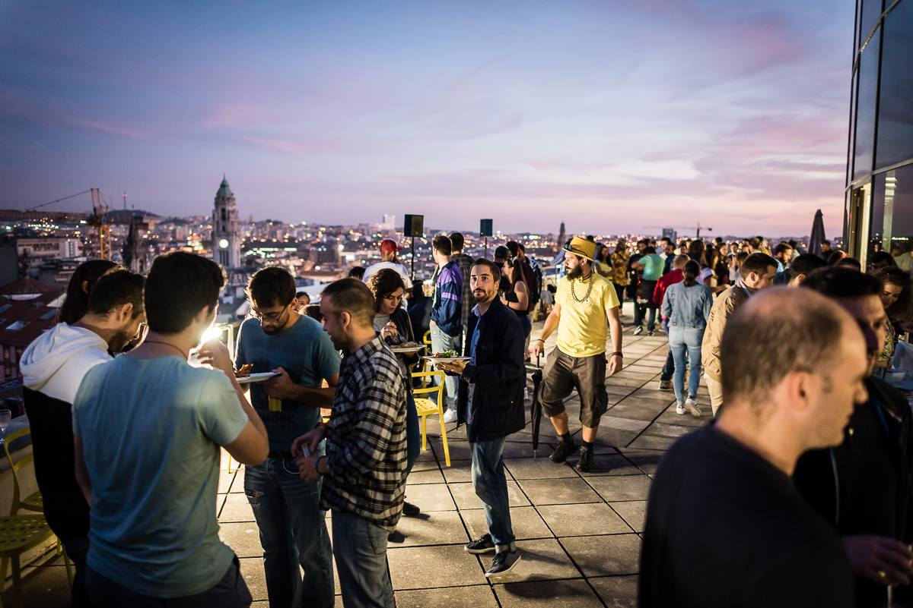
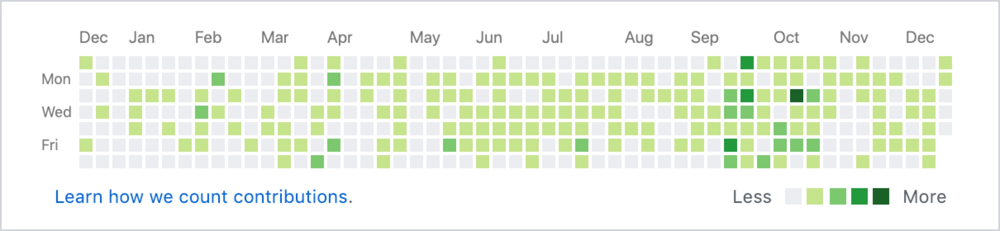
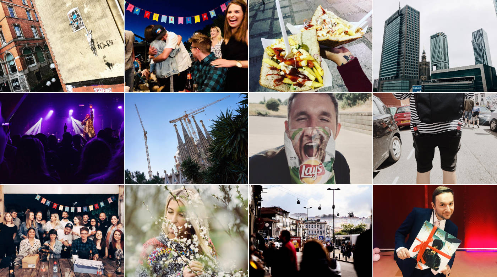

This isn't a post about a JavaScript — not about programming at all, in fact. Nor about photography, or graphic design either. Today is the day for a special post to recap my achievements and fails from the past year and reveal some plans for the next one. I've been cultivating this ritual for a few years now (["A look back at 2016"](https://pawelgrzybek.com/a-look-back-at-2016/) and ["A look back at 2017"](https://pawelgrzybek.com/a-look-back-at-2017/)) and couldn't let this tradition pass so here I am with this year's update.

## Professional

I spent nearly two years with smart and inspiring people at [Engine Creative](https://www.enginecreative.co.uk/). The natural need to progress drove me to leave the business and not long after that I joined [Mindera](https://mindera.com/) as a Senior Front End Developer. Meeting this bunch of extremely talented and passionate people makes me think that it was the best thing that happened to me this year. I revealed a few more secrets about this change in the post ["Thanks for everything Engine Creative! Hi Mindera!"](https://pawelgrzybek.com/thanks-for-everything-engine-creative-hi-mindera/) published in May this year.

Just by looking at [my GitHub contributions graph](https://github.com/pawelgrzybek) I can see that it was my most hard-working year ever. It doesn't feel like it, but I contributed 70% more than the year before. I published nearly 30 articles on my personal website this year, released [PinBuddy — Google Chrome extension for Pinboard](https://pawelgrzybek.com/i-built-a-thing-pinbuddy/) and actively continued supporting my open source software that helps thousands of people around the world everyday.

One of the most mature professional achievements of this year is a new ability I learned: how to chill out. I've accepted the fact that I will never catch every new, fascinating news items on Twitter. I won't get the chance to use all the hot frameworks from the top of Hacker News and there is no chance I'll attend all the cool conferences around the world. It's an oxymoron to say but I am very aware that I am doing more by doing less.

## Personal

Yes! I'm a truly happy man! I said that a year ago and I cannot be happier that nothing changed in this aspect. I still share my life with the most beautiful person inside and out on this planet. I've visited a few cool places, I've eaten a few amazing meals and bought myself a few cool gadgets.

I don't live in Northampton anymore and I'm very happy to tell you that I can't wait to have a coffee or a beer with you in Leicester. Although the convenience of living a few minutes away from my office is awesome, the thing that I am the most excited about is the change. New places to explore and people to meet!

I am very happy that my passion for photography has been reborn. There is nothing more relaxing for me than sipping a great coffee and messing around with my favourite [Capture One Pro](https://pawelgrzybek.com/capture-one-pro-the-best-parts/) and raw files taken on my mirrorless Sony camera. You can occasionally see some of my snaps on my [Instagram](https://www.instagram.com/pawelgrzybek/).

## Plans for 2019

Professionally — I am not planning to slow down. I am committing myself to building great open-source software, write articles that help people solve programming challenges and being involved in the process of making the web a better place. There is a plan to release something bigger in a few months time — it will be a subscription-based (very cheap) little SaaS (Software as a Service) product. I can't tell you more just now but be assured it will be very cool.

Looking at the personal aspects of my life there is a thing that I am truly unhappy about and this is my biggest challenge in the upcoming months. I am not feeling happy on my own body. My weight is like a little roller coaster, and consequently so is my mental comfort. I am definitely missing some regular activity that could help my body to recover its shape and my brain to not let me down for no particular reason. I want my six-pack back.

Most importantly, this time next year I would like to confirm again that I am truly happy man. I wish that both myself and my family stay healthy with wide smiles across our faces. There is one more thing, but let me keep that to myself for now and share with you this particular life achievement at the right moment.

Thank you for reading my friend. I wish you a fantastic 2019!
