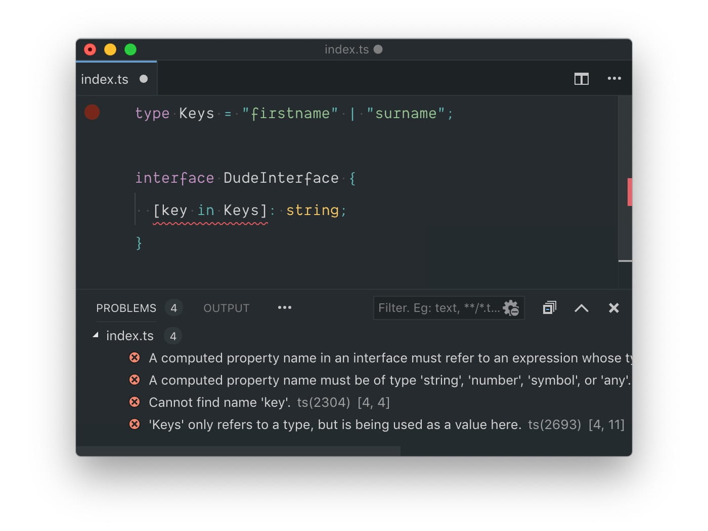
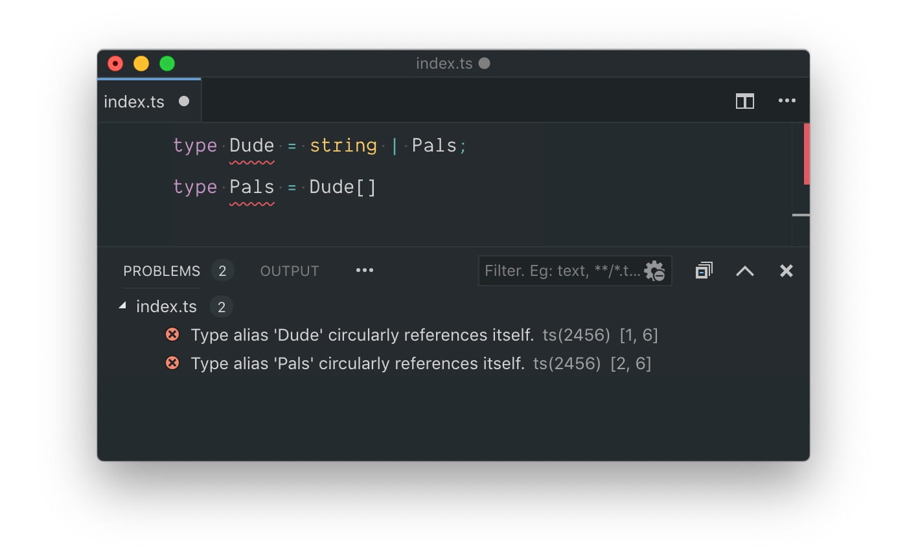

I'm not an expert in the field of TypeScript by any means but I have worked with it every single day for the last few months and I am really enjoying the ride. Beneath its straight-forward set of features there are some confusing concepts as well. Should it be an `interface` or a `type` alias? This is a question asked a lot by newcomers.

```ts
interface DudeInterface {
  name: string;
  age: number;
}

const pawel: DudeInterface = {
  name: "Pawel",
  age: 31
};
```

```ts
type DudeType = {
  name: string,
  age: number
};

const pawel: DudeType = {
  name: "Pawel",
  age: 31
};
```

Both methods are correct to describe a structure of an object but which one should we use? As always — it depends. Let me compare and contrast them.

## Misleading section of the official TypeScript Handbook

The ["Interfaces vs. Type Aliases"](http://www.typescriptlang.org/docs/handbook/advanced-types.html#interfaces-vs-type-aliases) section of the official TypeScript Handbook explains the characteristics and differences between both of them.

1. Interfaces create a new name, type aliases don’t
2. Type aliases cannot be extended or implemented from

Since [June 2016](https://github.com/microsoft/TypeScript-Handbook/commit/939650d392f389090b663bc5117234cfda5d4812) when this part of the documentation was last updated, TypeScript has had a major version bump and lots of functionality has changed. Unfortunately none of these points are true anymore. It is a great time to update this obsolete part of the documentation. I will try to do a better job at explaining the difference. Hopefully the TypeScript Handbook will be updated eventually, then I will get rid of this section of the article.


Microsoft actively works on [a brand new TypeScript Handbook](https://microsoft.github.io/TypeScript-New-Handbook/everything/#interface-vs-alias) that does a much better job at explaining the subject. It is a work in progress and we don't know the date when it is going to replace the current Handbook.


## Interfaces are restricted to an object type

Interface declarations can exclusively represent the shape of an object-like data structures. Type alias declarations can create a name for all kind of types including primitives (`undefined`, `null`, `boolean`, `string` and `number`), union, and intersection types. In a way, this difference makes the `type` more flexible. In theory every type declaration that you can express with an `interface`, you can recreate using a `type` alias. Lets have a look at an example that can be represented using a `type` alias but is beyond the power of an `interface`.

```ts
type info = string | { name: string };
```

## You can merge interfaces but not types

Multiple declarations with the same name are valid only when used with `interface`. Doing so doesn't override previous one but produces a merged result containing members from all declarations.

```ts
interface DudeInterface {
  name: string;
}

interface DudeInterface {
  age: number;
}

const pawel: DudeInterface = {
  name: "Pawel Grzybek",
  age: 31
};
```

Attempting to merge `type`s results in a `Duplicate identifier` compiler error.


## Type aliases can use computed properties

The `in` keyword can be used to iterate over all of the items in an union of keys. We can use this feature to programmatically generate [mapped types](https://www.typescriptlang.org/docs/handbook/advanced-types.html#mapped-types). Have a look at this example using `type` aliases.

```ts
type Keys = "firstname" | "surname"

type DudeType = {
  [key in Keys]: string
}

const test: DudeType = {
  firstname: "Pawel",
  surname: "Grzybek"
}
```

Unfortunately we cannot take advantage of computed properties in an `interface` declaration.



## ~~Deferred type resolution of interfaces vs. eager type aliases~~


This is no longer truth. Since I wrote this article, TypeScript behavior changed slightly and now the resolution of both (types and interfaces) happens in the same phase. Looks like both of them are deferred so the example from the image below is now perfectly valid TypeScript code.


~~Another difference is when a type is resolved by the compiler. Resolution of an `interface` is deferred, means that you can use them to recursively chain types. Resolution of `type` aliases is eager and compiler goes crazy when you try to resolve recursively nested types. Look!~~

```ts
type Dude = string | Pals;
interface Pals extends Array<Dude> {}
```

~~We are allowed to do it, because type of `interface`s is deferred. Equivalent with `type` alias results with `Type alias circularly references itself` compiler error.~~



## Be consistent

Just because in many situations you can use either of them, it doesn't mean you should use them interchangeably. As an active open source contributor I see some advantages of using `interface` for authoring a public API and I tend to use it more often. The `type` alias is irreplaceable in some circumstances mentioned in this article. Most importantly — keep it consistent. Hopefully this article helped you out.
