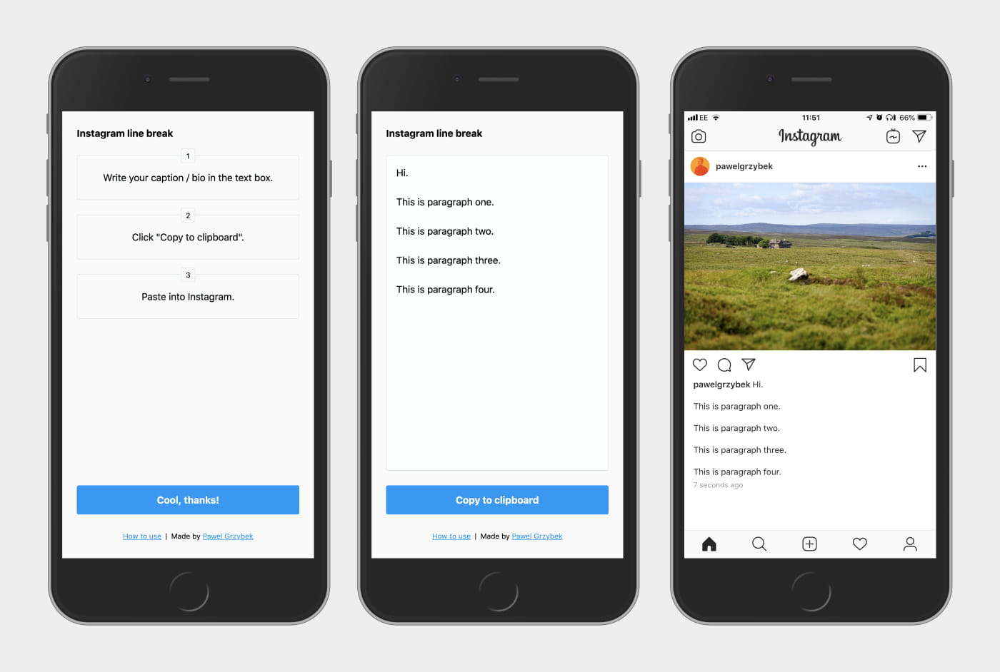

It was a great day cycling around Peak District with my friends. I came back home very keen to share on Instagram a few pictures that I took that day. I prepared a few really cool pictures but I really struggled to add a description in a format that I wanted it to be. Turns out that Instagram doesn't want you to insert line breaks between caption paragraphs (apparently the same restriction applies to bio). "There must be a way to do it" I thought, and two hours later I came out with…

## Instagram line break

Using [Instagram line break](https://instagram-line-break.app/) is as simple as:

1. Write your caption / bio in the text box.
2. Click "Copy to clipboard".
3. Paste into Instagram.

If you add it to your home-screen, you should get a native app experience — thanks to PWA (Progressive Web App). No need to download anything from Google Play / AppStore. As always, [the source code of this little project](https://github.com/pawelgrzybek/instagram-line-break.app) is open sourced on Github. Thanks for help [Pedro](https://www.instagram.com/fidalgodev/) and [Dan](https://twitter.com/danjordan). Enjoy :-*
