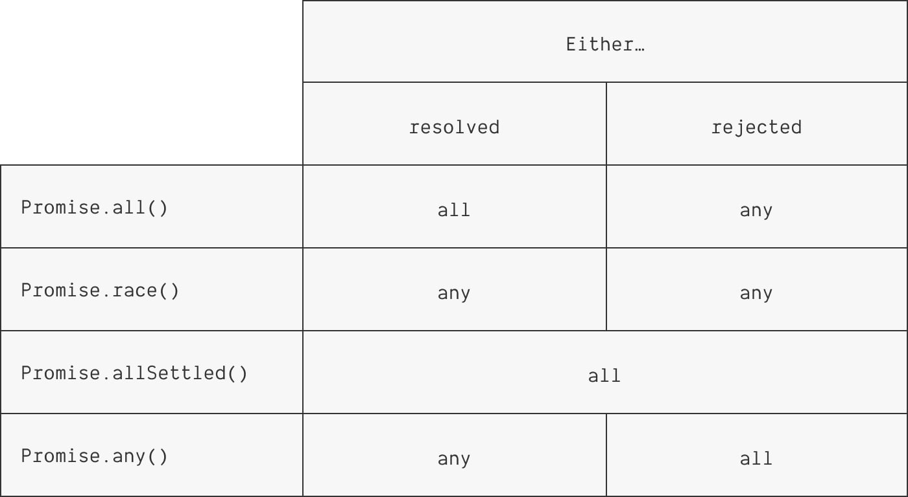

[Promises added to ECMAScript 2015 specification](https://www.ecma-international.org/ecma-262/6.0/#sec-promise-objects) gave us a new way of dealing with deferred computations. In ["From callback hell
through promises to
async functions"](https://pawelgrzybek.com/from-a-callback-hell-through-promises-to-async-functions/) I explained the differences between the common methods of dealing with asynchronous code. Today I would like to go through `Promise` [combinators](https://wiki.haskell.org/Combinator_pattern) — static methods that take compound promises as an argument.


## Prerequisite — basic promise states and methods

The `then`, `catch`, `finally`, `resolve` and `reject` methods should already feel comfortable by now but just in case you need a refresher, let's have a quick glance at this simple example.

```js
fetch("https://api.github.com/users/pawelgrzybek")
  .then(data => data.json())
  .then(dataJSON => console.log(dataJSON))
  .catch(error => console.error(error))
  .finally(() => console.log("Finally resolved / rejected! Uff!"));
```

Promise object like this can live in [four distinguished states](https://www.ecma-international.org/ecma-262/6.0/#sec-promise-objects):

- "pending" - still waiting
- "fulfilled" - promise succeeded
- "rejected" - promise failed
- "settled" - succeeded or failed

To orchestrate its lifecycle, promises are using a few methods from it's prototype:

- `then` - adds callback to fulfilled promise
- `catch` - adds callback to rejected promise
- `finally` - adds callback to settled promise

Of course all of these are much more complicated, but to comfortably grasp the concepts explained in the rest of this article this should be more than enough.

## Four combinators

The `Promise.all` and `Promise.race` are part of a JavaScript since 2015. In 2020 `Promise.allSettled` joins the gang. `Promise.any` is nearly there (TBC).

- `Promise.all` - ES 2015
- `Promise.race` - ES 2015
- `Promise.allSettled` - ES 2020 ([proposal](https://github.com/tc39/proposal-promise-allSettled))
- `Promise.any` - TBC ([proposal](https://github.com/tc39/proposal-promise-any))

### Promise.all()

Use `Promise.all` when you want to check whether all promises fulfilled or if one of them rejected.

```js
Promise.all([
  fetch("https://api.github.com/users/pawelgrzybek").then(data => data.json()),
  fetch("https://api.github.com/users/gabriel403").then(data => data.json())
])
  .then(data =>
    console.log(`Cool dudes are: ${data.map(dude => dude.name).join(" and ")}`)
  )
  .catch(error => console.error(error));
```

### Promise.race()

Use `Promise.race` when you want to handle the first fulfilled promise or if one of them rejected.

```js
Promise.race([
  fetch("https://api.github.com/users/pawelgrzybek").then(data => data.json()),
  fetch("https://api.github.com/users/danjordan").then(data => data.json())
])
  .then(data => console.log(`The winner is: ${data.name}`))
  .catch(error => console.error(error));
```

### Promise.allSettled()

Use `Promise.allSettled` when you want to handle when all promises are settled regardless of the result (fulfilled or rejected). Look ma, no catch!

```js
Promise.allSettled([
  fetch("https://api.github.com/users/pawelgrzybek").then(data => data.json()),
  fetch("https://api.github.com/users/danjordan").then(data => data.json())
])
  .then(result => console.log(`All settled`));
```

### Promise.any()

Use `Promise.any` when you want to handle the first promise that fulfills. In contrast to `Promise.race` it doesn't reject when one of the promises fail.

```js
Promise.any([
  fetch("https://api.github.com/users/pawelgrzybek").then(data => data.json()),
  fetch("https://api.github.com/users/gabriel403").then(data => data.json())
])
  .then(result => console.log(`Cool dude is: ${result.name}`))
  .catch(error => console.error(error));
```

## To recapitulate

Hopefully this article helped you out. This should help pull it all together for you.


