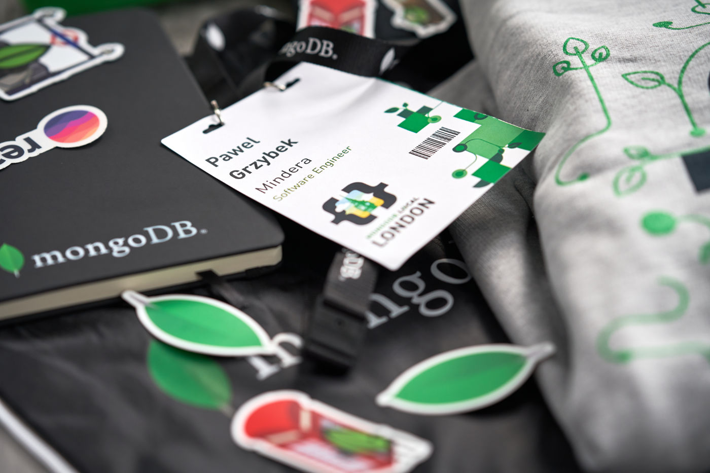

Thanks to my good friend [Pedro Fidalgo](https://www.instagram.com/fidalgodev/) I had the opportunity to attend [MongoDB.local London 2019](https://www.mongodb.com/local/london). The data layer of my current side project (stay tuned because more info is coming soon) lives on [MongoDB](https://www.mongodb.com) so it would be silly not to join this one.

Having an opportunity to learn the subject from its creators is irreplaceable and this time it wasn't an exception. I came back home full of new knowledge that I am eager to translate to my codebase. Best practices in data modeling, [MongoDB Atlas](https://www.mongodb.com/cloud/atlas) full-text search, client side encryption announced in version 4.2 and and lot more.

Being quite regular attendee to technical conferences and meetups, I can say only superlatives about this event. Outstanding organization, fantastic venue, awesome swag and absolutely delish food! Positive vibe, always smiling and willing to help team members just shows that MongoDB is a great place to work and a great community to be a part of. Thanks for cool swag bag [Rebecca](https://twitter.com/BeckFastAtTiffs) :-)

Thanks to everyone for this amazing opportunity. I will see you next time.
