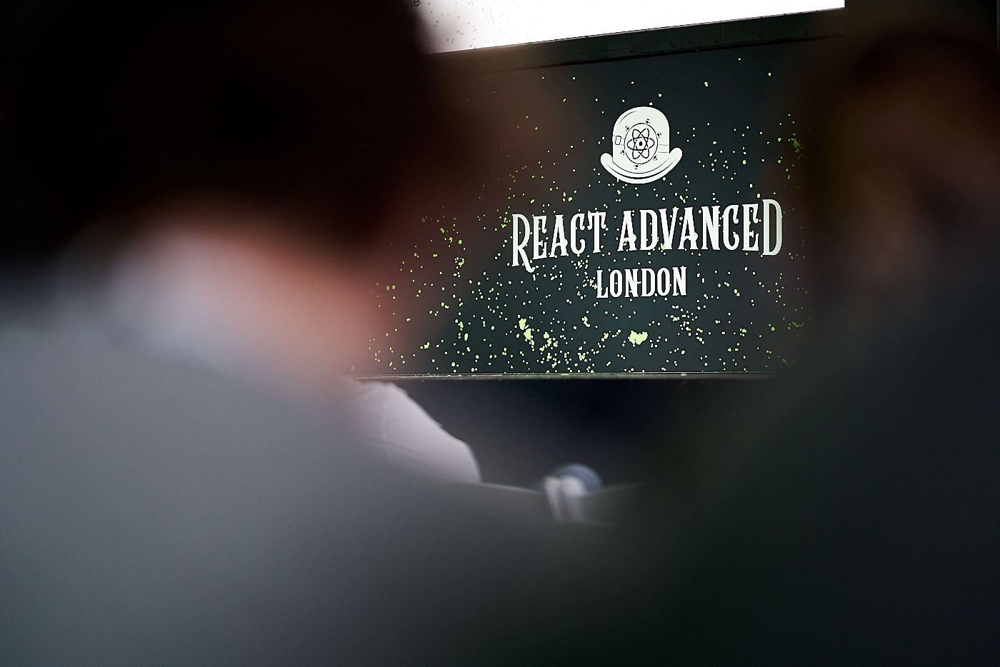

I couldn't be happier when organizers reached out to me to invite me to the [React Advanced London](https://reactadvanced.com). When it comes to frontend apps React has always been my preference for building interactive experiences. Having an opportunity to spend a day surrounded by industry leaders and creators of my favourite open-source projects is an irreplaceable experience.

Checking some React docs on a stage during a live demo and keeping it relaxed, only hilarious [Ken Wheeler](https://twitter.com/ken_wheeler) could do it. Rebuilding React with [Shawn Swyx Wang](https://twitter.com/swyx) was extremely helpful to understand frameworks internals. [Jared Palmer](https://twitter.com/jaredpalmer) announcing long-awaited [Formik 2.0](https://jaredpalmer.com/formik/) — checked!  [Nik Graf](https://twitter.com/nikgraf) shared with the audience a list of helpful recommendations about GraphQL Schemas design. [David Gomes](https://twitter.com/davidrfgomes) demystified statically typing variants of JavScript. The list goes on and on…

It was a big pleasure and I am looking forward to the next events put together by this amazing people! Possibly see you very soon in Amsterdam :-*
