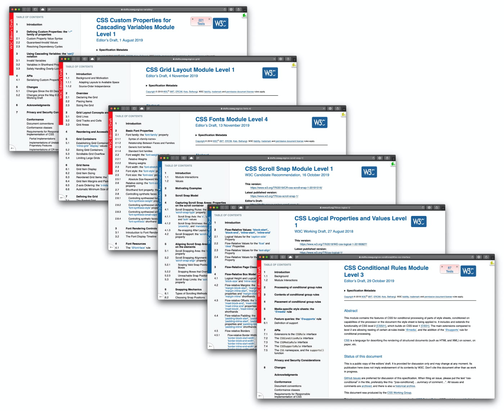

For the last few years, I have been busy exploring the world of JavaScript to the point that I neglected my passion for CSS. I am sure there are more people like me out there. I owe CSS a debt so I curated a list of recent features that you may want to know about if you didn't follow this space for a little while.



- [CSS custom properties (CSS variables)](#css-custom-properties-css-variables)
- [CSS Grid Layout](#css-grid-layout)
- [Variable fonts](#variable-fonts)
- [CSS Scroll Snap](#css-scroll-snap)
- [CSS Logical Properties and Values](#css-logical-properties-and-values)
- [Position sticky](#position-sticky)
- [Houdini](#houdini)
- [Feature query with @supports](#feature-query-with-supports)
- [Preprocessors and the CSS-in-JS drama](#preprocessors-and-the-css-in-js-drama)
- [Extra stuff](#extra-stuff)

## CSS custom properties (CSS variables)

We got used to assigning reusable values to variables using pre-processors like [Sass](https://sass-lang.com), [LESS](http://lesscss.org) and [Stylus](http://stylus-lang.com). This feature became popular to the point that [CSS Custom Properties](https://drafts.csswg.org/css-variables/) became a thing and the [browsers support](https://caniuse.com/#feat=css-variables) nowadays is satisfactory. I published ["CSS Custom Properties explained"](https://pawelgrzybek.com/css-custom-properties-explained/) around three years ago where I go in-depth about this feature and show some practical example.

```css
:root {
  --cool-color: hotpink;
}

a {
  color: var(--cool-color);
}

a:hover {
  --cool-color: lime;
}
```

<p class="codepen" data-height="300" data-theme-id="14885" data-default-tab="css,result" data-user="pawelgrzybek" data-slug-hash="JjjqENg" style="height: 300px; box-sizing: border-box; display: flex; align-items: center; justify-content: center; border: 2px solid; margin: 1em 0; padding: 1em;" data-pen-title="2019-11-27-css-custom-properties-css-variables">
  <span>See the Pen <a href="https://codepen.io/pawelgrzybek/pen/JjjqENg">
  2019-11-27-css-custom-properties-css-variables</a> by Pawel Grzybek (<a href="https://codepen.io/pawelgrzybek">@pawelgrzybek</a>)
  on <a href="https://codepen.io">CodePen</a>.</span>
</p>
<script async src="https://static.codepen.io/assets/embed/ei.js"></script>

## CSS Grid Layout

Layout is a thing that CSS has never been good at. From terrible hack using tables, neither nice use of `float`s through to more understandable `flex` layout. We finally got a legit way of doing it right — [CSS Grid Layout](https://drafts.csswg.org/css-grid/). I published ["Let's get into the basics of CSS Grid Layout Model"](https://pawelgrzybek.com/lets-get-into-the-basics-of-css-grid-layout-model/) in 2015 when this specification was slowly shaping out. Today we have a great [browser adoption for CSS Grid](https://caniuse.com/#feat=css-grid) and it gives me a wide smile on my face because I see more and more websites using it. It is close to impossible to show you a snippet that works as a holistic explainer because the specification is humongous. If you want to dip your toes into CSS Grid I cannot recommend enough ["CSS Grid" course](https://cssgrid.io) by [Wes Bos](https://twitter.com/wesbos). For people interested in the subject I recommend to follow [Rachel Andrew](https://twitter.com/rachelandrew) and [Jen Simmons](https://twitter.com/jensimmons) on Twitter. If you are after lazy copy-and-paste reference, ["A Complete Guide to Grid"](https://css-tricks.com/snippets/css/complete-guide-grid/) by [CSS Tricks](https://twitter.com/css) is everything you need. Let's have a quick look at a basic example.

```css
.wrapper {
  display: grid;
  grid-gap: 1rem;
  grid-template-columns: 2fr 1fr;
}

.header {
  grid-area: 1 / 1 / 2 / 3;
}

.main {
  grid-area: 2 / 1 / 3 / 2;
}

.sidebar {
  grid-area: 2 / 2 / 3 / 3;
}

.footer {
  grid-area: 3 / 1 / 4 / 3;
}
```

<p class="codepen" data-height="360" data-theme-id="14885" data-default-tab="css,result" data-user="pawelgrzybek" data-slug-hash="eYYagow" style="height: 360px; box-sizing: border-box; display: flex; align-items: center; justify-content: center; border: 2px solid; margin: 1em 0; padding: 1em;" data-pen-title="2019-11-27-css-grid-layout">
  <span>See the Pen <a href="https://codepen.io/pawelgrzybek/pen/eYYagow">
  2019-11-27-css-grid-layout</a> by Pawel Grzybek (<a href="https://codepen.io/pawelgrzybek">@pawelgrzybek</a>)
  on <a href="https://codepen.io">CodePen</a>.</span>
</p>
<script async src="https://static.codepen.io/assets/embed/ei.js"></script>

## Variable fonts

Since the inception of the web platform, we have been able to use a web-safe subset of font families. This became a design restriction, so we got support for custom typefaces via `@font-face` at-rule. [CSS Fonts Module Level 4](https://drafts.csswg.org/css-fonts-4/) adds a concept of Variable Fonts that puts custom fonts to the whole new level. Rather than fetching separate font file for every width, weight, or style, we get many different variations of a typeface incorporated into a single file. Performance without compromising design requirements at the same time — yes, please! To control basic typeface characteristics (weight, width, slant, italic, and optical size) we can use one of the registered axes. On top of that typographers can register custom variation axis that gives them almost infinite possibilities. [Jason Pamental](https://twitter.com/jpamental) maintains an amazing resource titled ["Variable Fonts: What web authors need to know"](https://rwt.io/typography-tips/variable-fonts-what-web-authors-need-know) which is the best guide to use Variable Fonts. Presented on CSSconf EU 2019 by the same author ["Modern Typographic Systems With Variable Fonts"](https://youtu.be/0AsAjHPupKQ) is very informative talk for sexy typography fans. Time for quick example and little interactive demo.

```css
@font-face {
  font-family: Inter;
  src: url('Inter.woff2');
}

body {
  font-family: Inter;
  font-size: calc(var(--size) * 1rem);
  line-height: 1.5;
  font-variation-settings: 'wght' 300, 'slnt' -10;
}
```

<p class="codepen" data-height="450" data-theme-id="14885" data-default-tab="result" data-user="pawelgrzybek" data-slug-hash="JjjqWJE" style="height: 450px; box-sizing: border-box; display: flex; align-items: center; justify-content: center; border: 2px solid; margin: 1em 0; padding: 1em;" data-pen-title="2019-11-27-variable-fonts">
  <span>See the Pen <a href="https://codepen.io/pawelgrzybek/pen/JjjqWJE">
  2019-11-27-variable-fonts</a> by Pawel Grzybek (<a href="https://codepen.io/pawelgrzybek">@pawelgrzybek</a>)
  on <a href="https://codepen.io">CodePen</a>.</span>
</p>
<script async src="https://static.codepen.io/assets/embed/ei.js"></script>



## CSS Scroll Snap

Historically we have been throwing tons of JavaScript on our web projects to achieve some sort of scroll snapping. You can partially blame me for that because I am the creator of one of the most popular carousel libraries out there — [Siema.js](https://github.com/pawelgrzybek/siema). Let me tell you a thing — do not use it! All the JavaScript solution come with some sort of performance and accessibility drawbacks. [CSS Scroll Snap](https://drafts.csswg.org/css-scroll-snap-1/) is a native implementation that solves a majority of carousel-obsessed designers requirements. Even if your projects requirement is outside of boundaries of [browsers support range for CSS Scroll Snap](https://caniuse.com/#feat=css-snappoints) you don't need to worry too much. It gracefully falls back to regular scroll experience without breaking your layout whatsoever. Quick demo time.

```css
.app {
  overflow-y: scroll;
  scroll-snap-type: x mandatory;
}

.app__section {
  scroll-snap-align: start;
}
```

<p class="codepen" data-height="300" data-theme-id="14885" data-default-tab="result" data-user="pawelgrzybek" data-slug-hash="RwwmxJy" style="height: 300px; box-sizing: border-box; display: flex; align-items: center; justify-content: center; border: 2px solid; margin: 1em 0; padding: 1em;" data-pen-title="2019-11-27-css-scroll-snap">
  <span>See the Pen <a href="https://codepen.io/pawelgrzybek/pen/RwwmxJy">
  2019-11-27-css-scroll-snap</a> by Pawel Grzybek (<a href="https://codepen.io/pawelgrzybek">@pawelgrzybek</a>)
  on <a href="https://codepen.io">CodePen</a>.</span>
</p>
<script async src="https://static.codepen.io/assets/embed/ei.js"></script>

## CSS Logical Properties and Values

[CSS Logical Properties and Values](https://www.w3.org/TR/css-logical-1/) enforce authors to control layout through logical, rather than physical direction and dimension mappings. It vastly improves working on projects that support multiple [writing modes](https://www.w3.org/TR/css-writing-modes-4/). For example, `border-inline-start` in `horizontal-tb` draws a border on the left-hand side of an element but for `vertical-lr` it will appear on the bottom of a node. This is a well-thought system designed with accessibility and internationalization in mind. I cannot recommend enough ["CSS Logical Properties" by Adrian Roselli](https://adrianroselli.com/2019/11/css-logical-properties.html) – easily the best resource out there. This CodePen taken from Adrian's post is a fantastic visual explainer.

<p class="codepen" data-height="700" data-theme-id="14885" data-default-tab="result" data-user="aardrian" data-slug-hash="bGGxrvM" style="height: 700px; box-sizing: border-box; display: flex; align-items: center; justify-content: center; border: 2px solid; margin: 1em 0; padding: 1em;" data-pen-title="Logical Properties Mapping">
  <span>See the Pen <a href="https://codepen.io/aardrian/pen/bGGxrvM">
  Logical Properties Mapping</a> by Adrian Roselli (<a href="https://codepen.io/aardrian">@aardrian</a>)
  on <a href="https://codepen.io">CodePen</a>.</span>
</p>
<script async src="https://static.codepen.io/assets/embed/ei.js"></script>

## Position sticky

I can't count how many approaches of building a sticky header element I came across during my career. They always relied on window sizes combined with `scroll` event. Later on, `IntersectionObserver` improved a bit — if you are not familiar with this fantastic interface, you should give my ["The Intersection Observer API explained"](https://pawelgrzybek.com/the-intersection-observer-api-explained/) a read. Wouldn't it be cool to achieve this effect using just CSS? Good news is coming — it is possible now and the [browser support for `position: sticky`](https://caniuse.com/#feat=css-sticky) is sufficient for some. Look how simple it is!

```css
section {
  position: sticky;
  top: 1rem;
}
```

<p class="codepen" data-height="320" data-theme-id="14885" data-default-tab="result" data-user="pawelgrzybek" data-slug-hash="BaagjrO" style="height: 320px; box-sizing: border-box; display: flex; align-items: center; justify-content: center; border: 2px solid; margin: 1em 0; padding: 1em;" data-pen-title="2019-11-27-position-sticky">
  <span>See the Pen <a href="https://codepen.io/pawelgrzybek/pen/BaagjrO">
  2019-11-27-position-sticky</a> by Pawel Grzybek (<a href="https://codepen.io/pawelgrzybek">@pawelgrzybek</a>)
  on <a href="https://codepen.io">CodePen</a>.</span>
</p>
<script async src="https://static.codepen.io/assets/embed/ei.js"></script>

## Houdini

This one deserves a whole separated article but briefly… [Houdini](https://drafts.css-houdini.org) is a set of low-level APIs that exposes access to CSSOM (CSS Object Model) enabling developers to extend CSS by hooking into the styling and layout process of a browser’s engine. With this set of interfaces, only two restrictions come into play: your imagination and the browser support presented on ["Is Houdini ready yet‽"](https://ishoudinireadyyet.com) by [Surma](https://twitter.com/DasSurma). To find out about the power of Houdini I highly encourage you to check ["CSS Houdini Experiments"](https://css-houdini.rocks) by [Vincent De Oliveira](https://twitter.com/iamvdo). ["CSS Houdini & The Future of Styling by Una Kravets"](https://youtu.be/GhRE3rML9t4) is great and up-to-date introduction video. I would be careful using it in production yet, but it is a space to watch.



## Feature query with @supports

If you are wondering if the browser support for features listed above is sufficient, I have something that will give you a better motivation to start using them. Native feature detection that I elaborated on in my article ["Native feature detection with CSS.supports() API"](https://pawelgrzybek.com/native-feature-detection-with-csssupports-api/) is a CSS / JS native way to check if your browser supports feature of interest. Look how cool it is!

```css
@supports (display: grid) {
  .app {
    display: grid;
    grid-template-columns: repeat(2, 1fr);
    grid-gap: 1rem;
  } 
}
```

<p class="codepen" data-height="260" data-theme-id="14885" data-default-tab="css,result" data-user="pawelgrzybek" data-slug-hash="vYYqZRN" style="height: 260px; box-sizing: border-box; display: flex; align-items: center; justify-content: center; border: 2px solid; margin: 1em 0; padding: 1em;" data-pen-title="2019-11-27-feature-query-with-supports">
  <span>See the Pen <a href="https://codepen.io/pawelgrzybek/pen/vYYqZRN">
  2019-11-27-feature-query-with-supports</a> by Pawel Grzybek (<a href="https://codepen.io/pawelgrzybek">@pawelgrzybek</a>)
  on <a href="https://codepen.io">CodePen</a>.</span>
</p>
<script async src="https://static.codepen.io/assets/embed/ei.js"></script>

## Preprocessors and the CSS-in-JS drama

I mentioned in the foreword that, I regret neglecting my passion for CSS for the last few years. The CSS-in-JS drama is a thing that I am glad I missed. My take! If you need one, [styled-components](https://github.com/styled-components/styled-components), [Emotion](https://emotion.sh/) and [css-modules](https://github.com/css-modules/css-modules) are safe bets to work with and I will pick one of these when I need it. For now, I don't need it and I am happy.

CSS preprocessors like [Sass](https://sass-lang.com), [LESS](http://lesscss.org) and [Stylus](http://stylus-lang.com) are not dead yet but slowly losing popularity simply because CSS by itself is getting much more powerful. I see a significant amount of people working with [PostCSS](https://postcss.org) that deserves to make it to this list. Probably one of the most exciting recent events from this space is the announcement of Sass modules. [Miriam Suzanne](https://css-tricks.com/author/miriam/) posted recently ["Introducing Sass Modules"](https://css-tricks.com/author/miriam/) on CSS Tricks that explains the concept (shouldn't be alien for JavaScript developers familiar with modules).

## Extra stuff

I lot more stuff could be included on this list but I didn't want to make this article miles long. I highly encourage you to follow [Mozilla Developer](https://www.youtube.com/MozillaDeveloper) where team members dig into obscure features of CSS. Another cool resource to watch to quickly catch up some freshness is a great talk by [Una Kravets](https://twitter.com/Una) and [Adam Argyle](https://twitter.com/argyleink) ["Next-generation web styling"](https://youtu.be/-oyeaIirVC0) from Chrome Dev Summit 2019.



## Keep on building beautiful things 

I hope that this list helped you out to modernize stylesheets of your current project. Let me know what is your favorite modern piece of CSS. Keep on building beautiful things and I will see you next time. Peace!
