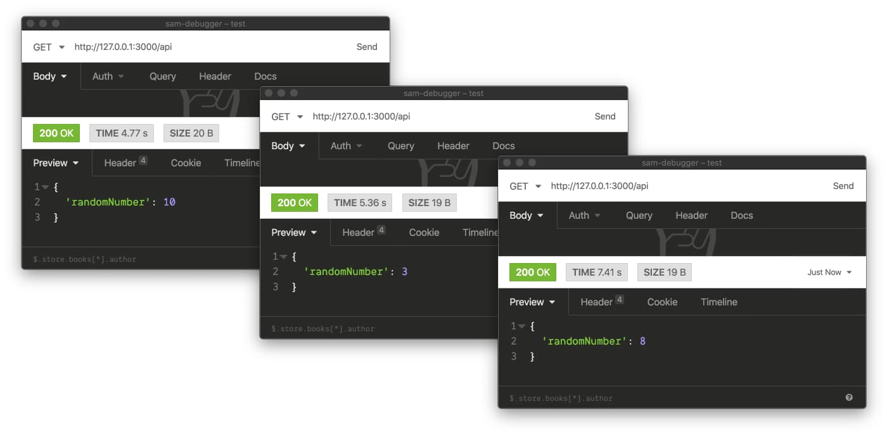
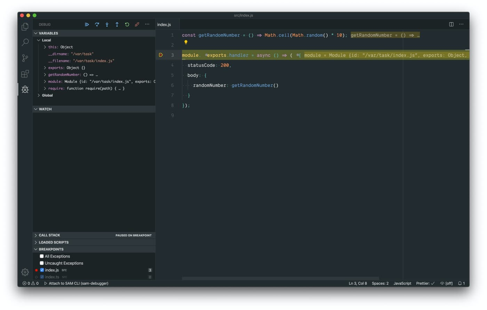
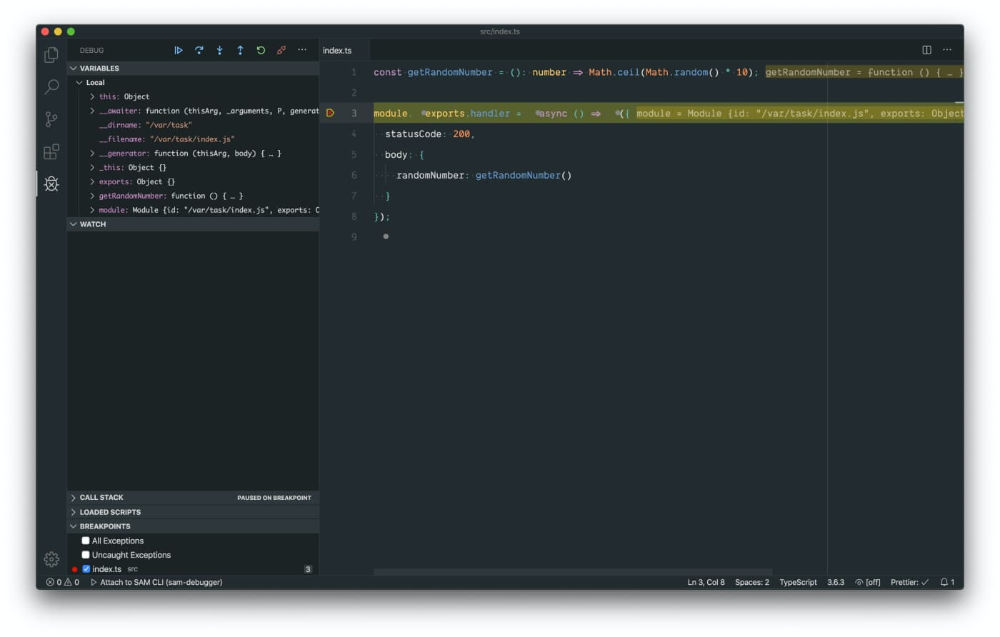

Hi! I am not going to go through the basics of debugging or AWS SAM framework. At this point you are most likely familiar with those — otherwise, you would’ve not landed on this page. I am going to share with you how to attach [Visual Studio Code](https://code.visualstudio.com) debugger to local endpoint served by [AWS SAM (Serverless Application Model)](https://aws.amazon.com/serverless/sam/). Let's start with a simple server-less example app.

```
.
├── src
│   └── index.js
└── template.yaml
```

```yaml
# template.yaml

AWSTemplateFormatVersion: "2010-09-09"
Transform: AWS::Serverless-2016-10-31

Resources:
  RandomNumber:
    Type: AWS::Serverless::Function
    Properties:
      CodeUri: src/
      Handler: index.handler
      Runtime: nodejs10.x
      Events:
        HelloWorld:
          Type: Api
          Properties:
            Path: /api
            Method: get
```

```js
const getRandomNumber = () => Math.ceil(Math.random() * 10);

module.exports.handler = async () => ({
  statusCode: 200,
  body: {
    randomNumber: getRandomNumber()
  }
});
```

And to spin it up on a local endpoint using SAM CLI we have to…

```
sam local start-api
```

As you can see we built this sophisticated server-less program that each time when we hit `http://127.0.0.1:3000/api` with a `GET` request gives us a random number between 1 and 10. Maybe it isn't a million dollars idea but should do the job as an example for this article. 



## Attach Visual Studio Code debugger to SAM local endpoint

A debugger is my favourite way of stepping through the logic of a codebase. Some time ago I used to use mainly the one built into Google Chrome developer tools but nowadays I rarely use anything else than Visual Studio Code. Luckily, [SAM CLI](https://docs.aws.amazon.com/serverless-application-model/latest/developerguide/serverless-sam-reference.html#serverless-sam-cli) allows us to [launch our local API in a debug mode](https://docs.aws.amazon.com/serverless-application-model/latest/developerguide/sam-cli-command-reference-sam-local-invoke.html).

```
sam local start-api -d 5858
```

From now on, whenever we execute a request to our endpoint, the program will pause to let us hook up into its internals. To do so using [Visual Studio Code](https://code.visualstudio.com) we need a bit of a config inside `.vscode/launch.json` file — I got you covered!

```json
{
  "version": "0.2.0",
  "configurations": [
    {
      "type": "node",
      "request": "attach",
      "name": "Attach to SAM CLI",
      "address": "localhost",
      "port": 5858,
      "localRoot": "${workspaceRoot}/src",
      "remoteRoot": "/var/task",
      "protocol": "inspector",
      "stopOnEntry": false
    }
  ]
}
```

Now, as long as your API is running in debug mode you can attach your IDE to your program by hitting play button on debugger tab or by pressing <kbd>F5</kbd>. Add a breakpoint where you want your execution to pause and voila!



## Debug TypeScript codebase

Nowadays, I very rarely write JavaScript that doesn't go through any additional transformation before hitting production. [TypeScript](https://www.typescriptlang.org) is my preferred way of writing JavaScript code and even though the debugging setup is a tiny bit more complicated, it is possible and works like a charm. Let's recreate our program using TypeScript.

```
.
├── dist
│   ├── index.js
│   └── index.js.map
├── src
│   └── index.ts
├── template.yaml
└── yarn.lock
```

```yaml
AWSTemplateFormatVersion: "2010-09-09"
Transform: AWS::Serverless-2016-10-31

Resources:
  RandomNumber:
    Type: AWS::Serverless::Function
    Properties:
      CodeUri: dist/
      Handler: index.handler
      Runtime: nodejs10.x
      Events:
        HelloWorld:
          Type: Api
          Properties:
            Path: /api
            Method: get

```

```ts
const getBody = (message: string) => JSON.stringify({ message });

interface IEvent {
  body: string;
}

module.exports.handler = async (event: IEvent) => {
  const { message } = JSON.parse(event.body);

  return {
    statusCode: 200,
    body: getBody(message)
  };
};
```

```json
{
  "version": "0.2.0",
  "configurations": [
    {
      "type": "node",
      "request": "attach",
      "name": "Attach to SAM CLI",
      "address": "localhost",
      "port": 5858,
      "localRoot": "${workspaceRoot}/dist",
      "outFiles": ["${workspaceFolder}/dist/**/*.js"],
      "remoteRoot": "/var/task",
      "protocol": "inspector",
      "stopOnEntry": false
    }
  ]
}
```

It really doesn't matter how you compile your `.ts` files to `.js` for this article so I skipped this implementation detail for clarity. Compiled version of our program landed in `dist` directory and this change has been reflected in `CodeUri` value inside the template file. Pay attention to `index.js.map` that lives directly next to the compiled version of a program — otherwise, our debugger won't be able to map compiled code to the one inside `src` directory. Changes in files tree are reflected in the debugger config file that has been decorated with `outFiles` property that helps VSCode to identify the location of transpiled files.



Happy debugging! The same patterns can be reused for tons of other frameworks and build tools. Hopefully, this quick article helped you out. Bye :-*
