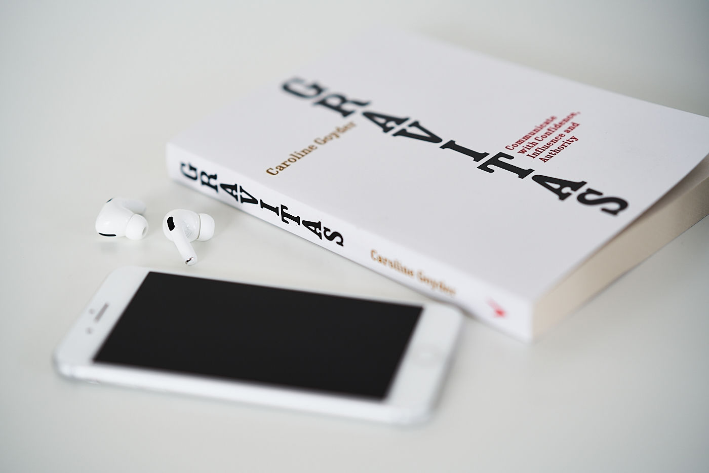

I am a constant joker! Most of the time there's nothing bad about this, but in a senior-level position in a big software company, some level of seriousness can be helpful. The power to be a great communicator lies somewhere in-between, doesn't it?

I decided to dedicate some time to find that sweet spot and picked up ["Gravitas: Communicate with Confidence, Influence and Authority" by Caroline Goyder](https://www.goodreads.com/book/show/18685594-gravitas). It was a great choice! It's a combination of bite-sized chapters about multiple subjects involved in finding your own "gravitas". A great read for everyone who is willing to enhance their influence, become a better writer or perhaps a public speaker or presenter. It is very well written but for fans of audiobooks, I can assure you that Caroline's voice on the Audible version is pleasant and easy to listen to. Until next time, bye :-*
