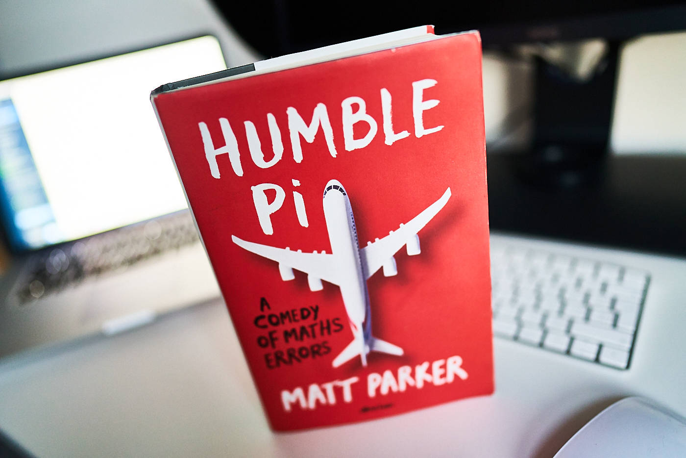
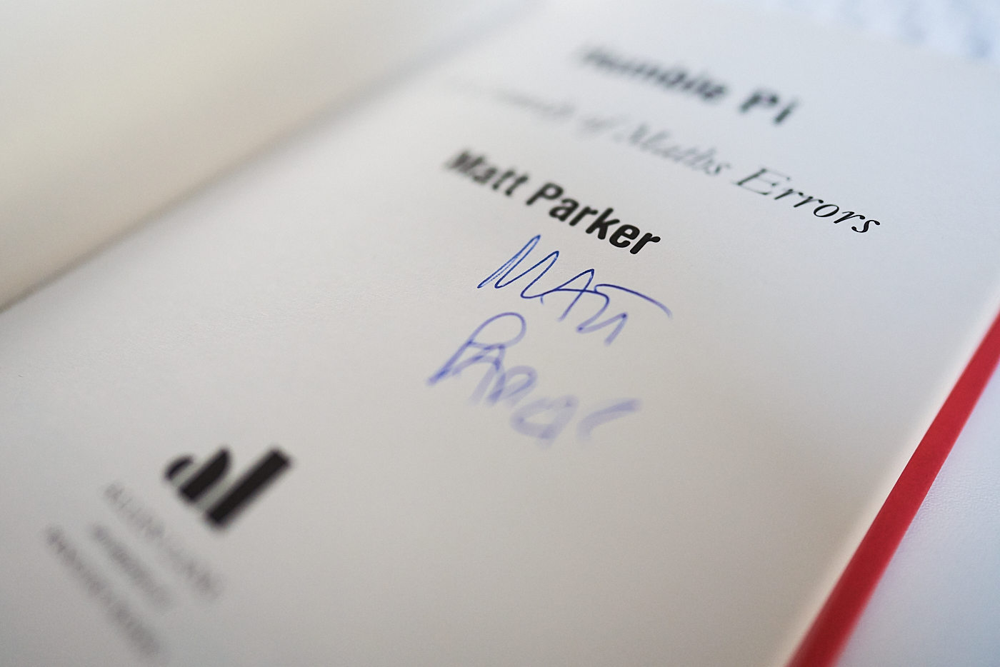

Despite the fact that I have never had a trophy for being the best maths student at school, I always enjoyed mathematics. An understanding of the basics has helped me a lot in a real-life and probably not harmed my career either. I can get through some simple equations but everything more challenging than trigonometry or matrices normally ends up being a spectacular fiasco. My failures are very insignificant compared to the ones described in the book that I just read.

["Humble Pi: A Comedy of Maths Errors"](https://www.goodreads.com/book/show/39074550-humble-pi) by [Matt Parker]() is all about what happens when maths goes wrong. Short, humorous (with a few exceptions) real-life anecdotes from various fields like finance, internet, big data, architecture, electronics, statistics and more. The publication by itself is full of real geek touches like pages following reversed order. I have a signed hardcopy and if you are quick you can still get yours from the [Maths Gear online store](https://mathsgear.co.uk/collections/books/products/humble-pi-a-comedy-of-maths-errors).

