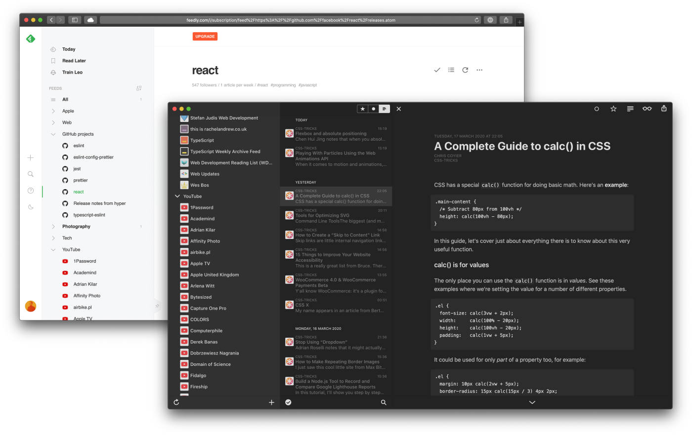

Today is a quick tip but a massive time saver in the long run. We all know how easy it is to end up on an endless loop of watching YouTube videos. Let's stop it and watch only what we care about by subscribing to RSS feeds of channels and playlists. The patterns to get the RSS channel or playlist feed look like this:

```
https://www.youtube.com/feeds/videos.xml?channel_id={{CHANNEL_ID}}
```

```
https://www.youtube.com/feeds/videos.xml?playlist_id={{CHANNEL_ID}}
```



Add it to your RSS subscription service of choice and, Bob's your uncle. Personally, I use the free version of [Feedly](http://feedly.com/). I heard just great things about [Feedbin](https://feedbin.com) too. My RSS client of choice is [Reeder by Silvio Rizzi](https://www.reederapp.com). If you are too stingy and don't want to support amazing independent developers, you will like [NetNewsWire](https://ranchero.com/netnewswire/).

## Bonus tip — RSS for GitHub project releases / tags

For the geeky part of my audience, I have got something special. GitHub gives us RSS feeds for project releases and tags. Thats my preferred way of finding out about my followed projects, fixed bugs, and new features.

```
https://github.com/{{username}}/{{repository}}/releases.atom
```

```
https://github.com/{{username}}/{{repository}}/tags.atom
```

Stay productive 👋
