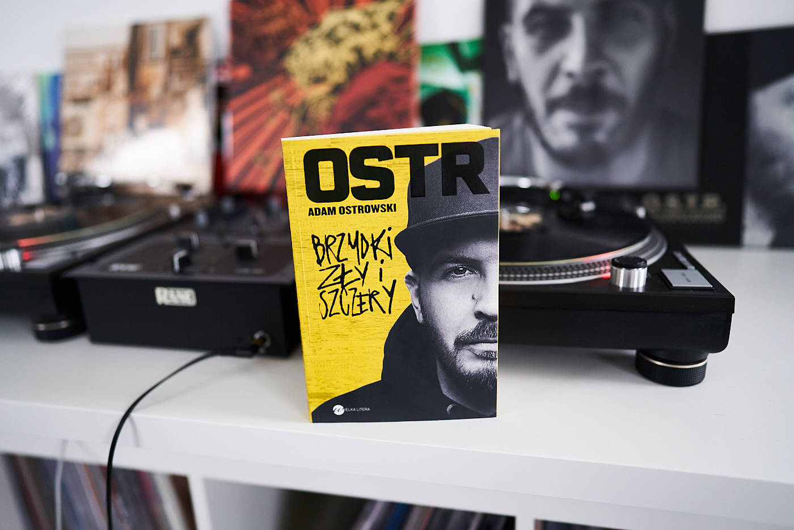
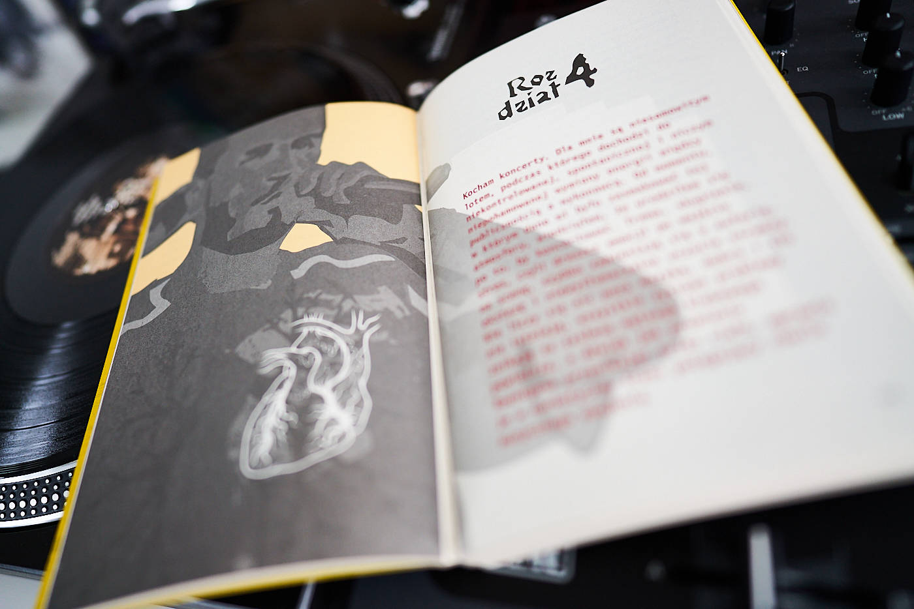

As a 14 years old keen dancer I was extremely excited about the "Battle Of The Year" that took place in my hometown, Szczecin (Poland). Back then, it was one of the most prestigious breakdancing competitions in the world. I still have a great memories of some of the shows that took place that day. Another thing that I remember well is an MC who hosted the event — O.S.T.R. I kept dancing for the next decade until I struggled with a serious backbone injury, but O.S.T.R. still is one of my favourite polish MCs. I was buzzing when my mom gave me the book ["Brzydki, Zły i Szczery" by Adam Ostrowski](https://www.goodreads.com/book/show/45835109-brzydki-z-y-i-szczery). By the way, my mom is a big fan of him and she read it first. Thanks, mom!

MC and producer Adam Ostrowski, better known as O.S.T.R. reveals quite a lot of his art but also personal life. His autobiography is funny and easy to read but also emotional and filled with passion. A mandatory position for all die-hard fans. From initial fascination of rap music, throughout tons of concert anecdotes, to the big turning point in his career and life. No spoilers for those who don't know the story or a few recent albums.

Peace 👋
