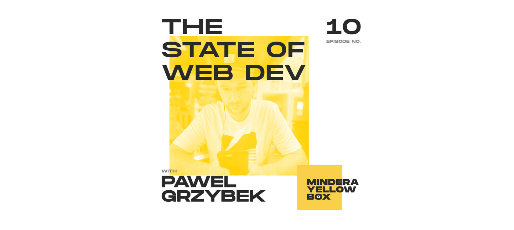

I was invited to the [Mindera Yellow Box Podcast](https://podcasts.apple.com/gb/podcast/mindera-yellow-box/id1515227462) to have a chat with Jose Fonseca about ["The state of the Web development"](https://podcasts.apple.com/gb/podcast/mindera-yellow-box/id1515227462?i=1000483984483). It was my podcasting debut and I was a bit stressed, but I managed to convey the message and I'm quite proud of how it's turned out! You might disagree with some opinions, which is fine, I'm more than happy to have a beer and discuss. 

Enjoy 🎙

