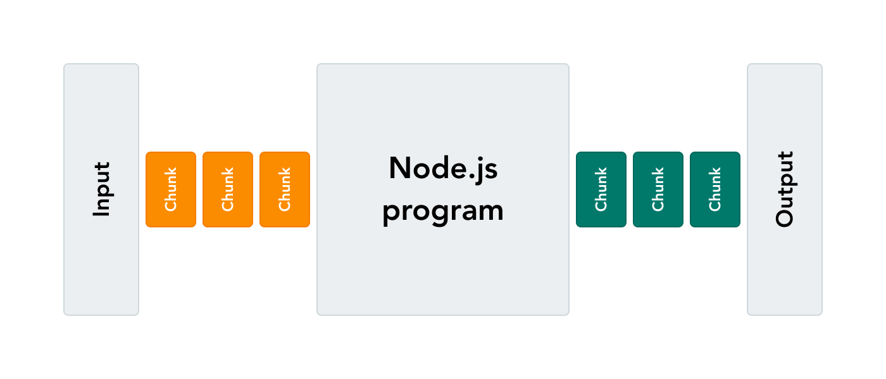
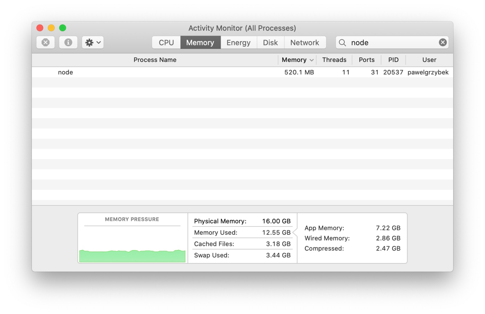

The results of [Stack Overflow Developer Survey 2020](https://insights.stackoverflow.com/survey/2020#technology-other-frameworks-libraries-and-tools) for the second year in a row proved the popularity of [Node.js](https://nodejs.org/). It also hit the top of the list of [the most wanted technologies](https://insights.stackoverflow.com/survey/2020#technology-most-loved-dreaded-and-wanted-other-frameworks-libraries-and-tools-wanted3) to learn by programmers who are not using it. It’s an obvious choice for frontend developers who are keen to move their JavaScript knowledge to the server-side . Apart from all of the similarities to the language used on a browser, it comes with a few hard to understand concepts. A stream is one of them (at least it was for me).

This article is for people who are familiar with JavaScript language, digging into Node.js, eager to understand streams. Knowledge from this article can easily be applied to [Streams API](https://streams.spec.whatwg.org) in your browser, although I am going to put my main focus on Node.js runtime. I promise that this subject won’t be confusing when your reach the end of this article.

1. [What is a stream?](#what-is-a-stream)
2. [Stream by example](#stream-by-example)
3. [Streams composability using pipe method](#streams-composability-using-pipe-method)
4. [Types of streams](#types-of-streams)
    1. [Readable](#readable-input-stream)
    2. [Writable](#writable-output-stream)
    3. [Duplex](#duplex)
    4. [Transform](#transform)
5. [Conclusion](#conclusion)

## What is a stream?

Streams in nature flow water from one side to the other, streams in programming are the same but instead of water, they flow chunks of data. It is a sequential way of handling chunks of bytes. Instead of loading a large amount of data to the memory all at once, streams are much more memory and time-efficient as they allow us to process an individual chunk as soon as it arrives. Streams are very useful (and sometimes the only way) to work with large amounts of data.



Apart from the implementation in Node.js, the concept of streams is present in many other programming languages like C++, Java and .NET. It’s used for things like reading from and writing to a file, network communications and any other information exchange.

You can achieve a lot without using streams at all, but a thorough understanding of them will make you a much better developer. Often you will use them without even knowing that your favourite package heavily relies on them under the hood. A bunch of built-in modules in Node.js implement the streaming interface (`http`, `zlib`, `crypto` just to name a few).

## Stream by example

A classic example to illustrate the power of streams is a server sending a file to a client. To keep things a bit more spicy let's assume that the `file.txt` is a 500MB pile of data.

```js
import server from "http";
import { promises as fs } from "fs";

const app = server.createServer();

app.on("request", async (req, res) => {
  const file = await fs.readFile("./file.txt");
  res.end(file);
});

app.listen(8000);
```



In theory — it works. The problem is that we had to load a file entirely to memory (RAM) before we sent it to the client (I used `curl http://localhost:8000` to send a request). As a result, this operation consumed a lot of memory (around 500MB + some internal Node.js operations) and it took much longer than it should. Let's rewrite it using streams.

```js
import server from "http";
import fs from "fs";

const app = server.createServer();

app.on("request", async (req, res) => {
  const stream = fs.createReadStream("./file.txt");
  stream.pipe(res);
});

app.listen(8000);
```


If you don’t understand the code above yet, that’s fine for now — I’ll explain later. The point here is to illustrate that changing a few lines of code, made this program much more time and memory efficient (around 28MB). Hopefully, this significant difference is convincing enough for you to stick around and learn streams.

## Streams composability using pipe method

If you are somehow familiar with basic Unix commands, you must have chained multiple programs together using pipe operator (`|`) before. If not, look!

```
ls | grep .json 
```

This example lists files in a current directory (`ls`), and pipes the results to `grep` program that returns filtered by search pattern (`.json`) results.

This example shows the greatest power of [Unix philosophy](https://en.wikipedia.org/wiki/Unix_philosophy) — [code composability](https://en.wikipedia.org/wiki/Composability). Small, simple, encapsulated single responsibility modules. Yes, you guessed it, Node.js streams allow us to do the same using the [`pipe()` method](https://nodejs.org/api/stream.html#stream_readable_pipe_destination_options). Example!

```js
streamOne.pipe(streamTwo).pipe(streamThree)
```

## Types of streams

In Node.js the [built-in `stream` module](https://nodejs.org/api/stream.html) is useful for creating new types of stream instances, although it’s usually not necessary to use it because a lot of higher-level modules inherit from it. There are four types of streams and we are going to explore all of them.

1. [Readable](#readable-input-stream)
2. [Writable](#writable-output-stream)
3. [Duplex](#duplex)
4. [Transform](#transform)

### Readable (input stream)

A readable stream produces data. It can be consumed directly but most often it is fed into other types of streams (writable, transform, or duplex). They are also known as input streams. Commonly used readable streams in Node.js are HTTP server [`request`](https://nodejs.org/api/http.html#http_event_request), [`fs.ReadStream`](https://nodejs.org/api/fs.html#fs_class_fs_readstream) returned by calling `fs.createReadStream()` or [`process.stdin`](https://nodejs.org/api/process.html#process_process_stdin) just to name a few. Let's create a basic form of a stream and fill it with some data to be consumed later on.

```js
import { Readable } from "stream";

// create a readable stream
const readableStream = new Readable();

// push some data to the stream
readableStream.push("some data 1");
readableStream.push("some data 2");
readableStream.push(null);
```

Confusingly, we explicitly pushed a [`null` to the stream that signals the end of the stream (EOF)](https://nodejs.org/api/stream.html#stream_readable_push_chunk_encoding), after which no more data can be written. It can also be achieved by implementing a [`_read`](https://nodejs.org/api/stream.html#stream_readable_read_size_1) function. This is quite an advanced and detailed, definitely out of the scope of this tutorial.

### Writable (output stream)

A Writable stream allows us to consume data. They are also known as output streams. Commonly used writable streams in Node.js are HTTP server [`response`](https://nodejs.org/api/http.html#http_class_http_serverresponse), [`fs.WriteStream`](https://nodejs.org/api/fs.html#fs_class_fs_writestream) returned by calling `fs.createWriteStream()`, `process.stdout` and `process.stderr` just to name a few. Time to consume the input from the previously created readable stream. 

```js
import { Readable, Writable } from "stream";

// create a stream
const readableStream = new Readable();

// push some data to the stream
readableStream.push("some data 1");
readableStream.push("some data 2");
readableStream.push(null);

// create a writable stream
const writableStream = new Writable()

writableStream._write = (chunk, encoding, next) => {
  console.log(chunk.toString())
  next()
}

// connect readable and writable streams
readableStream.pipe(writableStream)
```

Like in readable stream we have to indicate the end of the stream using `null` value or `_read` function, in writable stream `_write` implementations must be provided to send data to the underlying resource. Again — it’s not something that you are going to do a lot as it’s normally the lower-level implementation that you rarely have to care about. Here it’s just for example completeness. Can you see how readable stream has been piped to the writable stream using the previously discussed `pipe()` method? So, so, so nice!

### Duplex

Duplex streams are implementing everything that we learned so far — readable and writable stream functionalities. Whenever you come across something that looks like an example below, most likely you deal with the duplex type of a stream.

```js
readableStream.pipe(duplexStream).pipe(writableStream)
```

### Transform

Similarly to duplex streams, transform streams are readable and writable streams at the same time. Based on the input, they transform the output. You may come across "through streams" name that describes the same thing.

## Conclusion

I hope that after reading this article and seeing “this API inherits from stream module” won’t scare you away. I promise you that embracing the power of streams in Node.js will up your skills  to the next level.

By the way, I spent a few hours writing this article and about a day on the image on the “What is a stream” section, so you better appreciate it and share it on Twitter or whatever that makes your friends read. Please! See you next time! 
