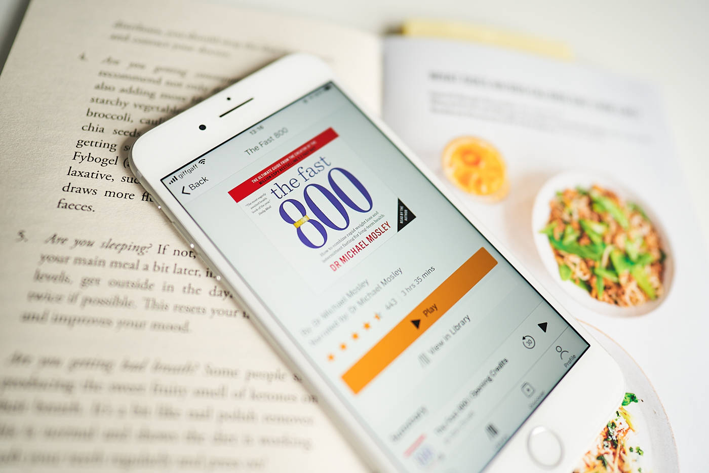
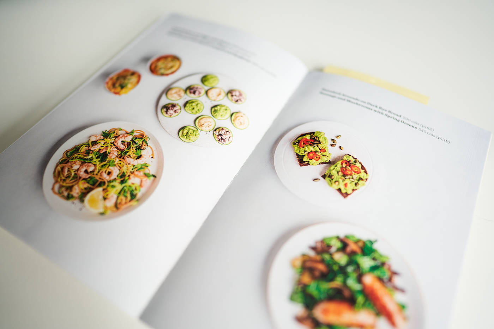

I like testing out things on my body and there probably won't be a better time to do it right now during this global pandemic. I've tried out multiple diets which have given me various results, but intermittent fasting is something that I've heard around a lot but never actually tried. If I can drop a few kilos during this process, I won't complain. I was browsing the Audible library recently and have been eager to spend my credit points on something informative. I came across ["The Fast 800: How to Combine Rapid Weight Loss and Intermittent Fasting for Long-Term Health" by Dr Michael Mosley](https://www.goodreads.com/book/show/43226870-the-fast-800).

The book is well researched, well written and well-read by the author (for Audible users). Even though the book is full of scientific researches it is surprisingly easy to follow even for a non-native speaker who isn't familiar with medical terminology. A clear and concise way of conveying all the information to get into intermittent fasting. No boring life stories, no monotonous elaborations, just straight to the point. The second half of the paper copy or attached to the audiobook PDF is filled with inspiring 800 calories recipes 🥗
