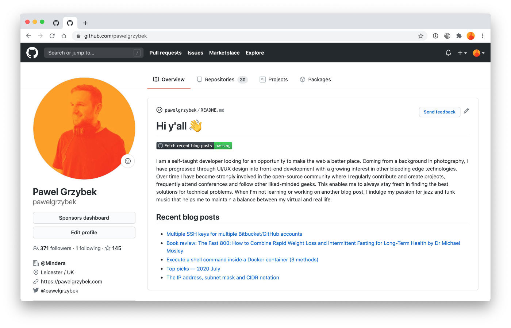

GitHub workflow is a feature that lets us run actions on particular software development life cycle (SDLC) or a scheduled interval. Another cool feature of GitHub is a way to customise your public profile page using `README.md` file inside repository named by your username. I combined these two features to display the most recent articles from my RSS feed on my GitHub public profile page.



## Workflow setup

GitHub workflows are sets of actions defined in `.yml` file that run on a particular life cycle or at the scheduled interval. The workflow needs to be defined in `.github/workflows/` directory. [The documentation for GitHub workflows and actions](https://docs.github.com/en/actions) is easy to understand and full of helpful tips. Let's recap what we want to achieve and express it using GitHub workflow.

1. Create a workflow that runs every 6 hours (`"* */6 * * *"`).
2. Spin up an Ubuntu instance (`runs-on: ubuntu-latest`).
3. Check out the GitHub repository (`actions/checkout@v2`).
4. Set up Node.js (`actions/setup-node@v2-beta`).
5. Install node dependencies (`yarn`).
6. Run custom Node.js script (`yarn build`).
7. Commit changes.

```yml
name: Fetch recent blog posts
on:
  schedule:
    - cron: "* */6 * * *"

jobs:
  fetch-recent-blog-posts:
    name: Fetch recent blog posts
    runs-on: ubuntu-latest
    steps:
      - name: Check out repository
        uses: actions/checkout@v2
      - name: Setup node
        uses: actions/setup-node@v2-beta
        with:
          node-version: "12"
      - name: Install node dependencies
        run: yarn
      - name: Run node script
        run: yarn build
      - name: Git setup
        run: git config --global user.email readme-bot@example.com && git config --global user.name readme-bot
      - name: Git commit README.md file
        run: git diff --quiet && git diff --staged --quiet || git commit -am '[BOT] Update readme' && git push
```

## Fetch RSS feed using Node.js and override READMe.md

Assuming that you already created `README.md` file in your repository, we need to decide how to put dynamic content into it. I achieved it by placing custom comments inside the file and the dynamically generated content will be placed between them. Have a look at the example.

```md
# Hi y'all 👋

Some cool text about me.

## Recent blog posts

<!-- FEED-START -->
<!-- FEED-END -->
```

Let's review the list of operations that need to be performed and let's express that using Node.js script.

1. Fetch RSS feed from my blog.
2. Convert it to JSON.
3. Create a list of 5 most recent posts.
4. Place list between the custom comments.

```js
import fs from "fs";
import fetch from "node-fetch";
import parser from "xml2json";

const FEED_URL = "https://pawelgrzybek.com/feed.xml";
const TAG_OPEN = `<!-- FEED-START -->`;
const TAG_CLOSE = `<!-- FEED-END -->`;

const fetchArticles = async () => {
  const articles = await fetch(FEED_URL);
  const articlesText = await articles.text();
  const articlesJSON = parser.toJson(articlesText);
  const newC = JSON.parse(articlesJSON).rss.channel.item.slice(0, 5);

  return newC.map(({ title, link }) => `- [${title}](${link})`).join("\n");
};

async function main() {
  const readme = fs.readFileSync("./README.md", "utf8");
  const indexBefore = readme.indexOf(TAG_OPEN) + TAG_OPEN.length;
  const indexAfter = readme.indexOf(TAG_CLOSE);
  const readmeContentChunkBreakBefore = readme.substring(0, indexBefore);
  const readmeContentChunkBreakAfter = readme.substring(indexAfter);

  const posts = await fetchArticles();

  const readmeNew = `
${readmeContentChunkBreakBefore}
${posts}
${readmeContentChunkBreakAfter}
`;

  fs.writeFileSync("./README.md", readmeNew.trim());
}

try {
  main();
} catch (error) {
  console.error(error);
}
```

Look, ECMAScript modules! YOLO 😜

## Do it and share it!

Hopefully you like this simple idea for a quick GitHub workflow. Feel free to check the [source code](https://github.com/pawelgrzybek/pawelgrzybek/) for the live example implemented on this post. The code above isn't perfect so please don't leave comments like "Eh dude, you should use XYZ for this one". It works and it is all that's needed. Have a great day and keep on coding 👩‍💻👨‍💻
