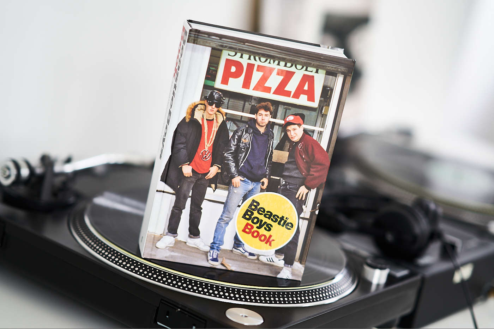
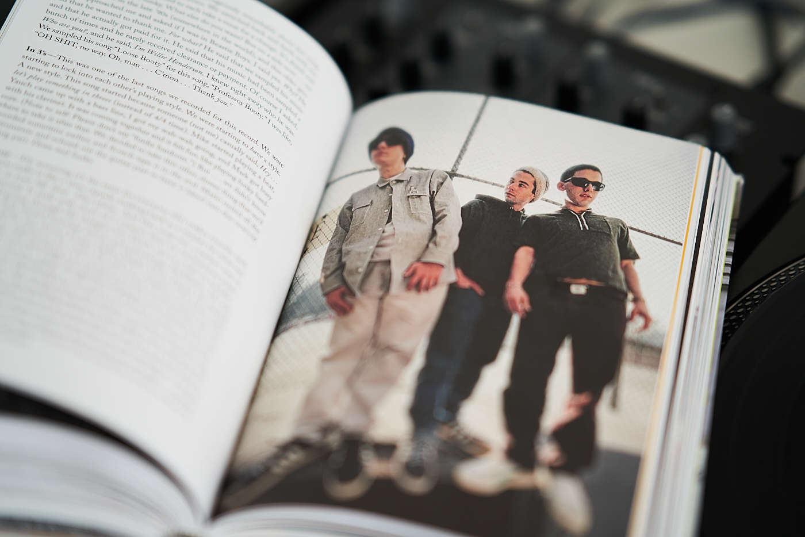

I was stoked when I found ["Beastie Boys Book" by Michael Diamond and Adam Horovitz on Audible](https://www.audible.co.uk/pd/Beastie-Boys-Book-Audiobook/0571353142). The story of one of the most influential groups in hip hop culture. It’s told by the members of the group and narrated by original authors and other individuals including Chuck D, Snoop Dogg, Kim Gordon, LL Cool J, Spike Jonze, Talib Kweli, Mix Master Mike and a lot more. I couldn’t resist!

["Beastie Boys Book"](https://www.goodreads.com/book/show/38799788-beastie-boys-book) is a detailed story that started in the late 70’s where three talented punk fans met and formed a group that left a significant manifesto on music history. From the early relationship with music on cassettes and wax, through to the first gig. The transition from punk heads to hip hop lovers and digging breaks in record stores of NYC! From highs to lows, their first contracts with music labels, inspirations, gigs, albums, tours and sadly to the death of Adam Yauch.

I love this band, so I’m biased but please don’t hesitate any longer, go and get this audiobook or/and a hard copy of this honest, funny and insightful story. A must-read for every single fan. ["Beastie Boys Story" on Apple TV+](https://tv.apple.com/gb/movie/beastie-boys-story/umc.cmc.6d0mrskjsusw2jd2d228p88c2) is another gem.

RIP Adam Yauch aka MCA 🙌


