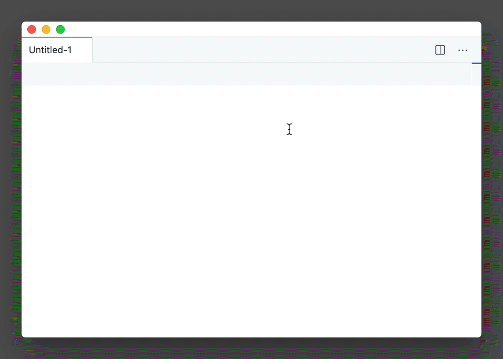

I recently joined a new team that follows [Conventional Commits](https://www.conventionalcommits.org/en/v1.0.0/) methodology for `git` commit messages. Multi-paragraph format of commit messages was new to me and I didn't have a clue how to do it. Turns out there are multiple ways of doing it using CLI and also my favourite code editor Visual Studio Code.

## Multi-paragraph git commit message using CLI

Presumably, git CLI is the most common way to interact with this version control system. I found three different methods to achieve multi-paragraph commit message using this method.

```
git commit -m 'Line  one' -m 'Line two' -m 'Line three'
```

```
git commit -m 'Line one

Line two

Line three'
```

```
git commit -m $'Line one\n\nLine two\n\nLine three'
```

All three methods above will produce exactly the same commit message:

```
Line one

Line two

Line three
```

## Multi-paragraph git commit message using Visual Studio Code

Let's be honest, it is a lot of typing and I am a crap touch typer. Luckily we can always use the code editor to edit commit messages. By default most UNIX operating systems come with `vim` preconfigured as a default editor. This is not the option that I love. I barely can exit this editor and ["How do I exit the Vim editor?" post on Stack Overflow](https://stackoverflow.com/a/11828573/2290040) makes me think that I am not the only one. Luckily we can change [`core.editor` for git](https://www.git-scm.com/book/en/v2/Customizing-Git-Git-Configuration#_core_editor). My preferred one is Visual Studio Code.

```
git config --global core.editor "code --wait"
```

Now on you can simply use `git commit` command to enter Visual Studio Code to edit a message. It is going to wait until the VSCode tab is closed to send a signal to `git` CLI that we finished editing. That's so much nicer for multi-paragraph git commit messages in my opinion!

There is more to it. If you follow some particular pattern for your commit messages you can create a [VSCode snippet](https://code.visualstudio.com/docs/editor/userdefinedsnippets) for it. I made [one for conventional commits](https://snippet-generator.app/?description=Conventional+Commits&tabtrigger=commit2&snippet=%24%7B1%7Cbuild%2Cci%2Cdocs%2Cfeat%2Cfix%2Cperf%2Crefactor%2Crevert%2Cstyle%2Ctest%7C%7D%24%7B2%3Ascope+%28optional%29%7D%3A+%24%7B3%3Adescription%7D%0A%0A%24%7B4%3Abody+%28optional%29%7D%0A%0ARefs+%23%24%7B5%3Aticket+number%7D&mode=vscode), look!



```json
{
  "Conventional Commits": {
    "prefix": "commit",
    "body": [
      "${1|build,ci,docs,feat,fix,perf,refactor,revert,style,test|}${2:scope (optional)}: ${3:description}",
      "",
      "${4:body (optional)}",
      "",
      "Refs #${5:ticket number}"
    ],
    "description": "Conventional Commits"
  }
}
```

Keep on coding and I will catch you next time 👋
