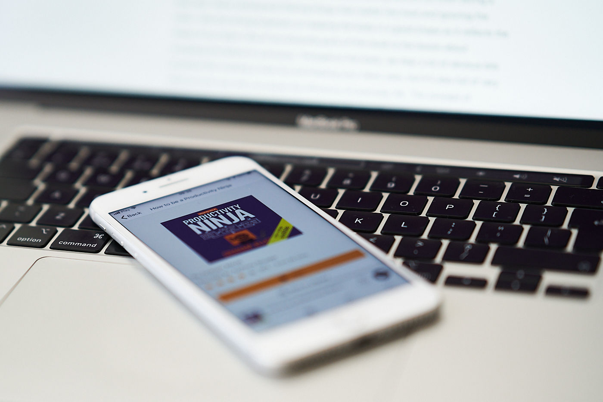

I always strive to make my learning process more efficient and to boost my productivity. I’m pretty happy with my knowledge absorption but living in the age of massive information overload I still want to improve the number of things that I’m able to accomplish during the day. Even though the title of [Graham's Allcott's book "How to be a Productivity Ninja"](https://www.goodreads.com/book/show/16147694-how-to-be-a-productivity-ninja) sounds super corny, there is nothing corny about the content of this publication.

This book is about making sense of all the tasks floating around our brain during a busy day. About storing and filtering things that matter the most and ignoring the noise. I like the strong emphasis on keeping the body in a good shape as it reflects the shape of our brain. One of my favourite parts of this book is the lesson about accepting the failure in a process. Throughout the book, we hear a lot of obvious bits of advice like creating a todo list and keeping your inbox-zero, but it’s also full of very obscure little tips that can boost the efficiency of everyday life. The concept of daily/weekly reviews finally clicked in my brain after reading this one — thanks!

Highly recommend this snappy read. For lazy ones like me, [the Audible version](https://www.audible.co.uk/pd/How-to-be-a-Productivity-Ninja-Audiobook/B01N4EC5I2) can be a great companion for the weekend. Thanks for reading. Stay curious!
