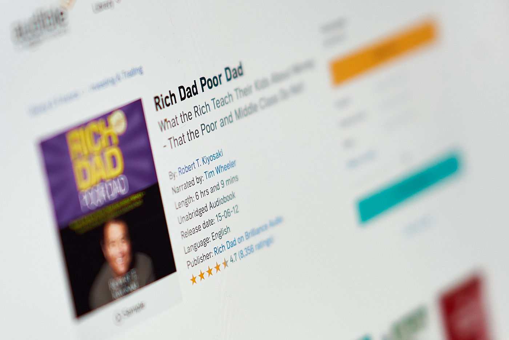

Personal finance is something that interests me a little bit more recently. Am I becoming mature now? I decided to educate myself on this subject, to get into it I chose [“Rich Dad Poor Dad” by Robert T. Kiyosaki](https://www.goodreads.com/book/show/69571.Rich_Dad_Poor_Dad).

The story of a dude who grew up next to his well-educated dad (poor dad) and another business-focused dad who had dropped out of school (rich dad). The essence of this book is the successful path which the author took whilst surrounded by contrasting opinions of both old men. The author clearly differentiates an asset and a liability and blame education system that doesn’t put enough emphasis on the subject of money.

Even though the book is full of helpful bits of advice, it is too lengthy for the content conveyed in [6 hours long audiobook](https://www.audible.co.uk/pd/Rich-Dad-Poor-Dad-Audiobook/B008BT35R2) or [336 pages of a paper copy](https://www.amazon.co.uk/Rich-Dad-Poor-Teach-Middle/dp/1612680194/ref=sr_1_1). The language is very monotonous, which makes the material feel more boring than it should be. I will keep looking for some more digestible publications on personal finance.
