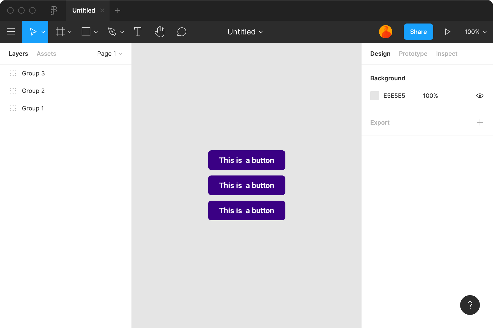
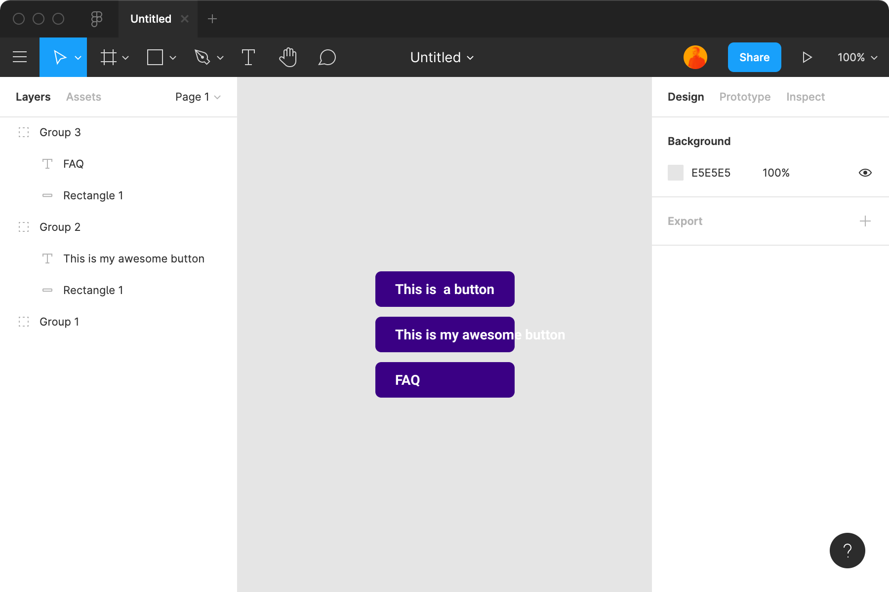
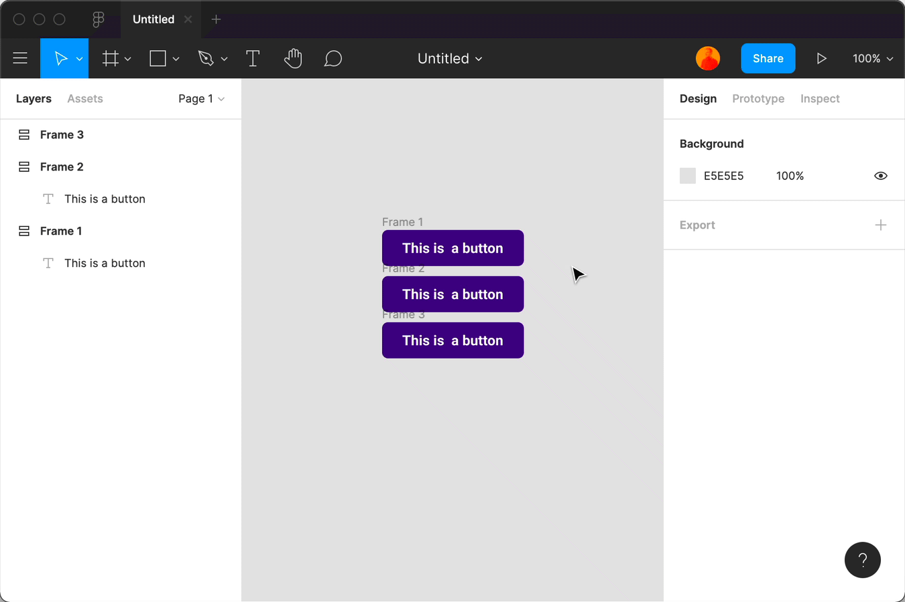
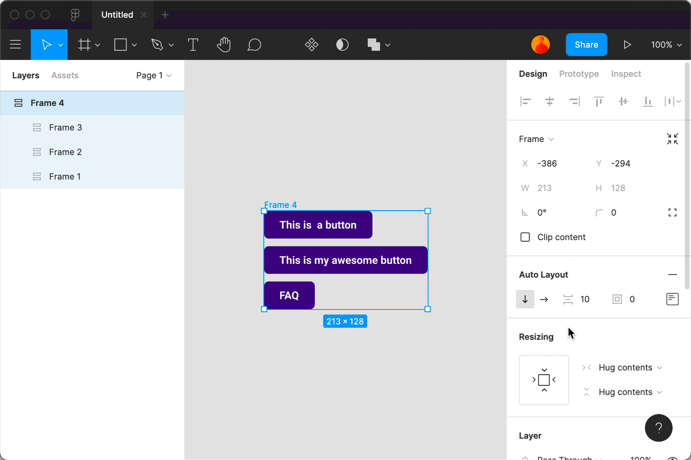

Let's build a quick prototype, literally just a few buttons. One rectangle, a bit of text and the button is ready. Easy-peasy!

Let's group it using <kbd>⌘ + G</kbd> keyboard shortcut and duplicate multiple times using <kbd>⌘ + D</kbd> combination. Let's go!

What's the point of having a prototype with the same buttons? Let's change the text inside them to reflect prototype requirements.

What just happened here?! After changing text, the rectangle didn't adjust its size to reflect the text length. There's no chance that I'm going to do it manually! That seems like a tedious task for a few buttons, so imagine doing this with hundreds of them.

Now my UI designer career is over, and I am going back to coding!

Wait a sec bro! There is hope.

## Grow, shrink and reflow elements with Figma Auto Layout

[Figma Auto Layout](https://help.figma.com/hc/en-us/articles/360040451373) is a game-changer. It lets you dynamically grow, shrink and reflow frames. Adjust the size of a button based on a text length — no problem! Reflow elements when new items are added to the list — easy! Let's recreate my prototype using this feature.

Text is all we need for now. Let's wrap it with an auto layout frame by clicking "Add auto layout" from the contextual menu or using keyboard shortcut <kbd>⇧ + A</kbd>. The element is now wrapped in a fully customizable auto-layout frame. We can add a background colour and padding to it. Adding padding follows the same rules as the CSS `paddin` property. In my case, it is `10 20` that corresponds to 10px on the vertical axis and 20px on the horizontal one. Nice!

Time to duplicate the button instance and adjust the inner text. Look!

This is pretty magical, and now I can carry on my UI designer journey. There's a lot more to it, let me show you a little bit about what you can achieve with Auto Layout in Figma.

### Auto-placement and reflow

If you wrap multiple elements into an auto-layout frame, you can delegate auto-placement of elements to Figma. You can control the spacing between elements in "Spacing between elements" in "Auto Layout" section on the sidebar. You can also control the direction of auto-placement. The most mind-blowing feature is the ability to reorder elements using drag & drop or using arrows on the keyboard.

That's it for today. If you think this isn't cool, I don't know what is. Hopefully, you found it helpful and exciting. Until next time, stay creative 👋

