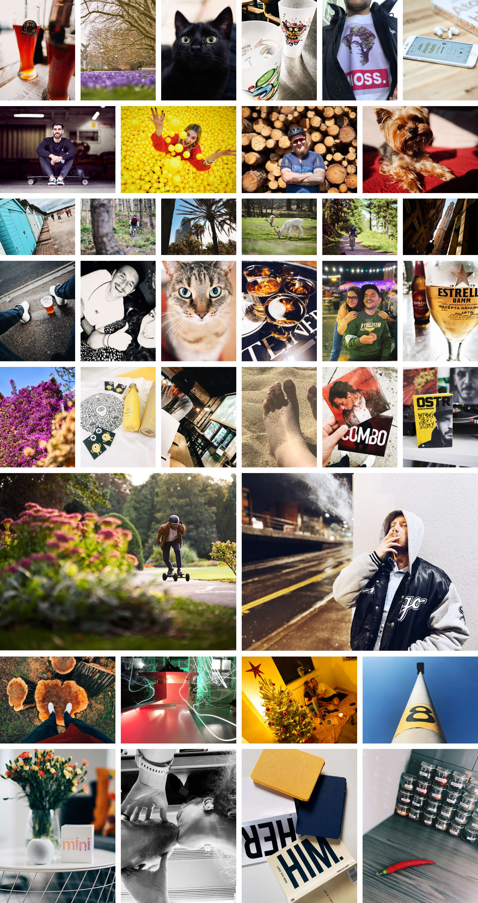
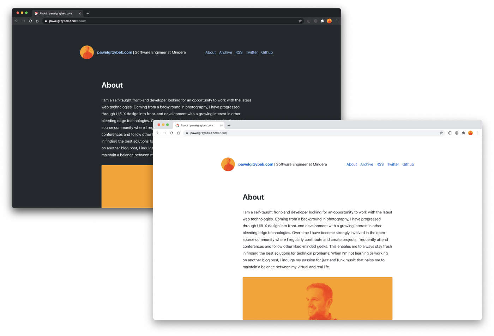
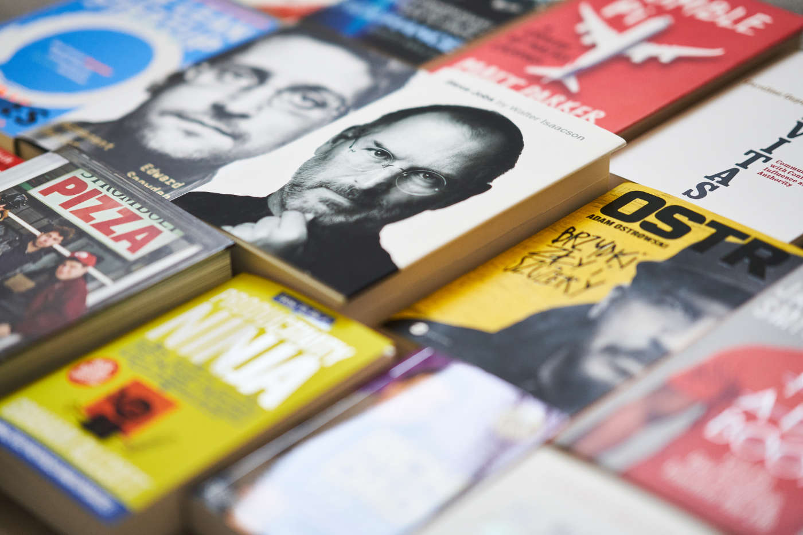
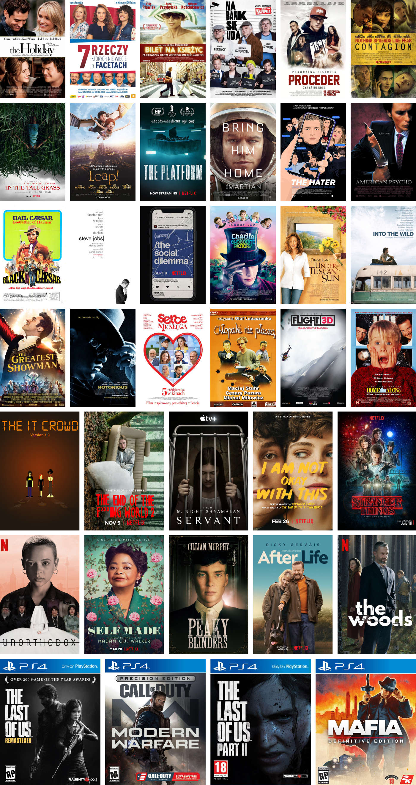

This year was a little bit "different" for all of us. I'll try to stay focused on the positives because I managed to accomplish a few things worth bragging about. Exactly a year ago, at the beginning of 2020, I was confident that it was going to be the best year of my life. Even though we had a lot of madness going on, I somehow managed to make it reality and turn 2020 into the best year of my life.

After ["A look back at 2016"](/a-look-back-at-2016/), ["A look back at 2017"](/a-look-back-at-2017/), ["A look back at 2018"](/a-look-back-at-2018/) and ["A look back at 2019"](/a-look-back-at-2019/), it's time to compile a list of my personal and professional accomplishments from the past year. I've also got some rough plans for 2021. This article is a very personal one that I commit to once a year, so if you are after technical read about another programming concept, this one isn't for you.

## Professional

I feel incredibly privileged to be in an industry that wasn't affected by the pandemic. I had more work to do than I had in previous years. I would love to thank my employer [Mindera](https://mindera.com), for such generous mental support during the last year.

Professionally I dedicated this year to work on my soft skills more than embracing new technical knowledge. I worked hard on communication, improving relationships between team members and overall strived to build and be part of a well-balanced team.

At the beginning of a year, I had my debut as a tutor at Leicester University. With my super talented friend [Rob](https://twitter.com/heymynameisrob), we delivered a quick introduction to building modern, scalable client-side applications. We received excellent feedback from students, and just because of the unfortunate circumstances of 2020, we had to postpone further lectures for the next year. This is something I'm super excited to pick up in the future.

I had one more debut on a new field in 2020 — I was invited to the [Yellow Box Podcast](https://podcasts.apple.com/gb/podcast/mindera-yellow-box/id1515227462) to discuss [the state of web development](https://podcasts.apple.com/gb/podcast/10-the-state-of-web-development-with-pawel-grzybek/id1515227462?i=1000483984483). I found this experience extremely stressful initially, but sharing my knowledge with a new audience was very satisfying. I'd love to be involved in things like this more often.

<iframe allow="autoplay *; encrypted-media *; fullscreen *" frameborder="0" height="175" style="width:100%;max-width:660px;overflow:hidden;background:transparent;" sandbox="allow-forms allow-popups allow-same-origin allow-scripts allow-storage-access-by-user-activation allow-top-navigation-by-user-activation" src="https://embed.podcasts.apple.com/gb/podcast/10-the-state-of-web-development-with-pawel-grzybek/id1515227462?i=1000483984483"></iframe>

## Personal

Pandemic sucks! Depression, anxiety, motivational and financial struggles were present all over the place. Somehow I managed to look at the whole situation as an opportunity for personal development and dedicated this time to fitness, books and growth of my soft skills.

I started this year at 98kg (15.4 stones) on the scales and ended up 14kg (2.2 stones) lighter. I consider this to be one of the most extraordinary things that I have done for myself. Because of that change, I feel more confident, my favourite Levis jeans look better on me, and I'm not afraid of shopping anymore. My cycling and running abilities have improved a lot too.

This very website that you are reading now has always been a great focus of mine. It went through a slight redesign. I added dark theme support and improved the tech behind it. Most importantly, I managed to publish 46 posts from quick one-paragraph tutorials, through some book reviews to lengthy technical publications. I'm proud of how it went!

As I mentioned before, I spent a lot of time reading books and listening to audiobooks. The main subject was the self-development. It helped me to identify my personal goals and to redefine happiness. It's because of the books that I made a significant transformation of my body. I went through a relationship rollercoaster and started enjoying being myself again like when I was a kid. After a few years of a night to night struggle, my insomnia went away, and I re-learned what it means to do “nothing” for a moment. If you asked me what was the most influential book for me in 2020, ["Atomic Habits" by James Clear](/book-review-atomic-habits-an-easy-proven-way-to-build-good-habits-break-bad-ones-by-james-clear/)  is a clear winner.

- ["Atomic Habits: An Easy & Proven Way to Build Good Habits & Break Bad Ones" by James Clear](/book-review-atomic-habits-an-easy-proven-way-to-build-good-habits-break-bad-ones-by-james-clear/)
- ["Peter Pan" by J.M. Barrie](/book-review-peter-pan/)
- ["Gravitas" by Caroline Goyder](/book-review-gravitas-by-caroline-goyder/)
- ["Humble Pi: A Comedy of Maths Errors" by Matt Parker](/book-review-humble-pi-a-comedy-of-maths-errors-by-matt-parker/)
- ["Endurance" by Scott Kelly](/book-review-endurance-by-scott-kelly/)
- ["The Lean Startup" by Eric Ries](/book-review-the-lean-startup-by-eric-ries/)
- ["Permanent Record" by Edward Snowden](/book-review-permanent-record-by-edward-snowden/)
- ["Steve Jobs: The Exclusive Biography" by Walter Isaacson](/book-review-steve-jobs-the-exclusive-biography-by-walter-isaacson/)
- ["Brzydki, Zły i Szczery" by Adam Ostrowski](/book-review-brzydki-zly-i-szczery-by-adam-ostrowski/)
- ["Not a Diet Book" by James Smith](/book-review-not-a-diet-book-by-james-smith/)
- ["The Fast 800: How to Combine Rapid Weight Loss and Intermittent Fasting for Long-Term Health" by Dr Michael Mosley](/book-review-the-fast-800-how-to-combine-rapid-weight-loss-and-intermittent-fasting-for-long-term-health-by-dr-michael-mosley/)
- ["Beastie Boys Book" by Michael Diamond and Adam Horovitz](/book-review-beastie-boys-book-by-michael-diamond-and-adam-horovitz/)
- ["How to be a Productivity Ninja" by Graham Allcott](/book-review-how-to-be-a-productivity-ninja-by-graham-allcott/)
- ["Rich Dad Poor Dad" by Robert T. Kiyosaki](/book-review-rich-dad-poor-dad-by-robert-t-kiyosaki/)
- ["We Need To Talk About Love" by Laura Mucha](/book-review-we-need-to-talk-about-love-by-laura-mucha/)

I watched some movies, enjoyed a few TV shows and had great fun playing console games. ["The Social Dilemma"](https://www.imdb.com/title/tt11464826/), ["The IT Crowd"](https://www.imdb.com/title/tt0487831/), ["Stranger Things"](https://www.imdb.com/title/tt4574334/), ["The End of the F***ing World"](https://www.imdb.com/title/tt6257970/), ["Peaky Blinders"](https://www.imdb.com/title/tt2442560), ["After Life"](https://www.imdb.com/title/tt8398600/) and ["The Last of Us Part II"](https://www.metacritic.com/game/playstation-4/the-last-of-us-part-ii) are probably the ones that I enjoyed the most.

## In 2021 I will…

I'm ready for the new year like never before. I have some rough ideas, and I'd like to share a few with you.

Professionally there's a new challenge waiting for me. I recently got promoted at Mindera and at the beginning of the new year I am starting a new leading position for a brand new team. We are going to work for one of the worlds leading fashion brands. Unfortunately I can't tell you more than that at the minute, but stay tuned! This level of responsibility is something new for me. Even though I'm a tad stressed about it, I'm really looking forward to this challenge and I want to put 100% of my heart into this new role.

I hope I will be able to pick up the subject of lectures at local Universities — sharing my knowledge with students hungry to learn more is one of the most satisfying things that I have ever experienced. Fingers crossed!

In my personal life, I would like to dedicate even more time to fitness. I'm not necessarily focused on losing weight this time, but I would like to build some muscle and push my body to its limits. I would love to do at least one challenging bike ride, run a half-marathon distance and maybe get involved in a new sporty hobby. I have a lot of friends who enjoy inline-skating in my area, which sounds like good fun to me. Would be cool to do a long time postponed snowboard trip soon too!

That's it from me. I wish you all the best in 2021 👋
