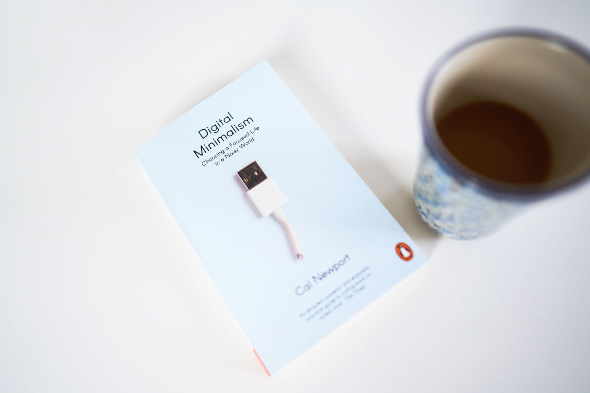

My girlfriend and I decided to live without Facebook products (including Instagram and WhatsApp) for a month and see how it’s going. Even though we are halfway through the month, I already observed a lot of positive incomes. I am going to wait until the end of the month to publish my insights about this.

To fully embrace life without Mark’s Zuckerberg’s products, I decided to deepen my psychological knowledge of this tech-saturated generation, and its impact on a happy, fulfilled life. ["Digital Minimalism" by Cal Newport](https://www.goodreads.com/book/show/40672036-digital-minimalism) has been recommended to me multiple times, and I couldn’t pick a better time of my life to read it.

Creating an account on Facebook to hypothetically connect you with your friends is the moment when you start disconnecting with the real world. The feedback loop of social validation, constant craving for likes and feelings of rejection when your most recent vegan burger picture doesn’t generate sufficient traction. This psychological effect and many more outcomes of tech-saturated routines are very well explained in the opening chapter of the book.

"Digital Minimalism" is the philosophy of life that requires a critical review of the technology around us and determine if it brings a necessary value for our happiness and fulfilled life. Meaningful activities and the offline world's pleasures should replace the cost of the technological clutter. The book doesn't enforce Amish-like rigorous life without a smartphone or a computer — the author by himself is a computer scientist.

> "We need solitude to thrive as a human beings. In the recent years without even realising it we have been systematically reducing this crucial ingredient from our lives. Simply put — humans are not wired to be constantly wired."

I would highly recommend this book to everyone who lives in a highly-digitalized world (yes, probably you are in that group if you are reading this blog). It will re-open your eyes on obvious benefits of structured social interactions in the real world.
