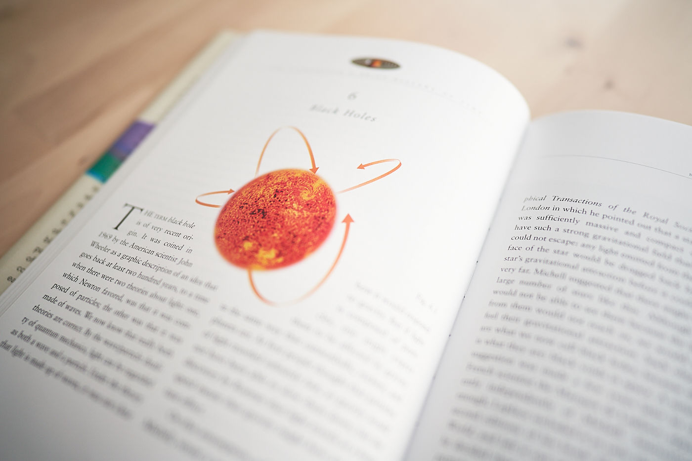

Many times in my life, I have thought about abstract things like space travel, the size of a universe, the importance of time, gravitational force, and other stuff like that. Do you sometimes contemplate anti earthly subjects like that, or is it just me? I had no idea where to seek answers for my questions, but luckily, I came across ["A Brief History of Time" by Stephen Hawking"](https://www.goodreads.com/book/show/3869.A_Brief_History_of_Time).

In this three-decades-old publication, Stephen Hawking demystified modern theoretical physics in an understandable way for ordinary people. From the basic definitions of space and time through big bang theory, expansion of the universe, black holes, time travel, and everything else that connects general relativity and quantum mechanics. I love that Hawking doesn't battle between religion and science like many books on that subject tend to do.

Even tho it's only around 250 pages, it takes a while to digest all the abstract-sounding concepts in this book, so don't expect to smash it in one evening. The copy that I have is full of beautiful illustrations that I found helpful in grasping some of the concepts. I would recommend this publication to every curious one out there. I will catch you next time but until then, stay curious 👩‍🏫 👨‍🏫
