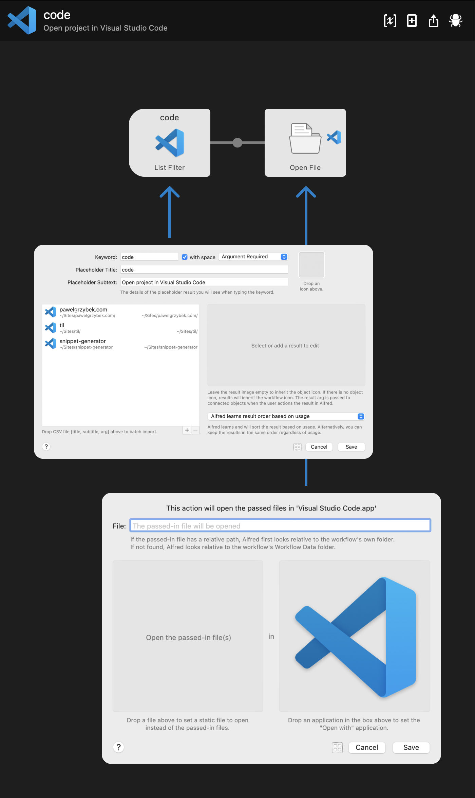

I spend a lot of time using Visual Studio Code, jumping from one project to another. To make it more efficient, I would love to have a simple project manager baked into the editor. I know there are many great plugins for it, but they are all too complex for my taste. I want to hit a shortcut, type the project's name, hit enter and start working.

I don't have enough time to build a plugin for it right now, maybe one day, but I found a moment to put together a simple Alfred workflow that does just that. Because I found it so helpful that I decided to share this idea with you. Look!

Because some degree of customization is required to make it work for you, I decided not to share a download link to the complete workflow file. It's equally as easy to craft one as importing a file that requires some projects configuration.

Hopefully, that helps. I will catch you later 👊
