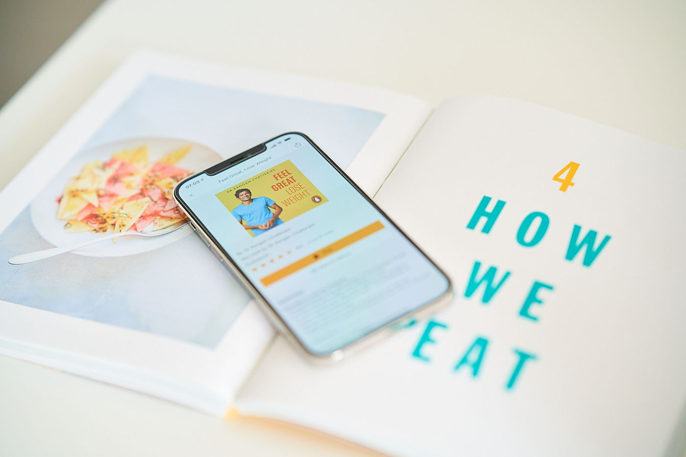
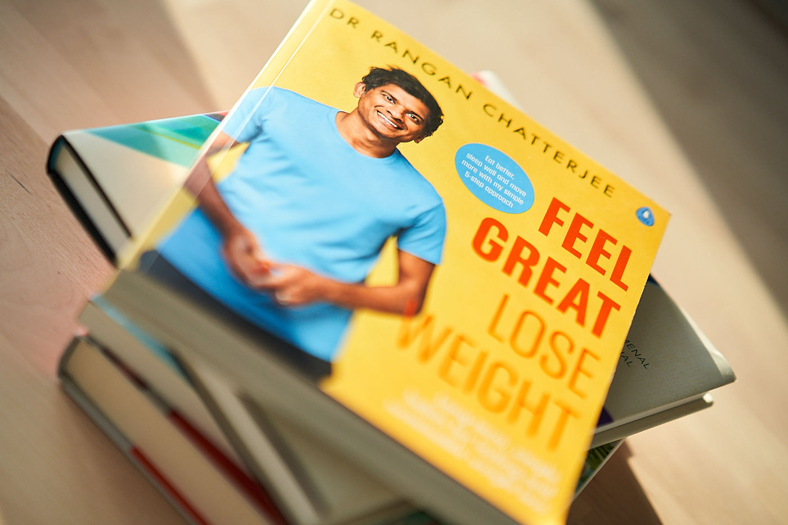

Ever since I started controlling my weight and being more conscious about what and how I eat, the quality of my life has improved a lot. I'm just a human and snacking, like anything else that produces dopamine in our bodies, is hard to resist. A hard-working and demanding job doesn't help. So recently, I have been slacking with my nutritional regime. I was looking for a bit of motivation to get back on the right track. I discovered ["Feel Great, Lose Weight" by Dr Rangan Chatterjee](https://www.goodreads.com/book/show/54367215-feel-great-lose-weight) by listening to a ["Feel Better, Live More" podcast](https://podcasts.apple.com/gb/podcast/feel-better-live-more-with-dr-rangan-chatterjee/id1333552422) recorded by the same author.

This book doesn't come with silver bullet macros that magically make everyone fit. Apart from very few suggestions of what kind of food to prioritise, this book doesn't contain restrictive and hard-to-follow meal plans — which is probably my favourite part about this book. It's simply about living a happier and healthier life by following few simples practices. It emphasizes the importance of factors that you would never associate with weight loss, like quality sleep and stress. Dr Rangan Chatterjee shares many habits that are easy to apply in day-to-day life.

To top it off, the book by itself is beautiful. High-quality print on thick paper, full of great-looking photos and illustrations. Hard to believe it was just a [tenner on Amazon](https://www.amazon.co.uk/gp/product/0241397839/ref=ppx_yo_dt_b_asin_title_o02_s00)! A well-recommended addition to your bookshelf.
