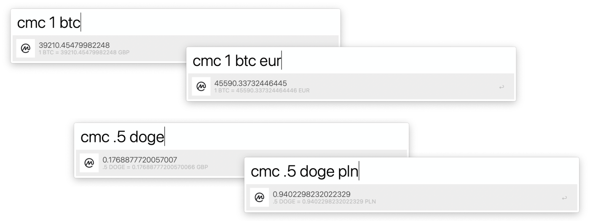

Hi, all cryptocurrencies maniacs! I recently got into it, and I found myself checking [CoinMarketCap](https://coinmarketcap.com) about a trillion times a day. I knew there must be a better way! I have great news for all users of my favourite productivity helper — Alfred. I built a quick conversion workflow using CoinMarketCap API. All you need is:

- [Alfred](https://www.alfredapp.com)
- [Node.js](https://nodejs.org/)
- [CoinMarketCap API key](https://coinmarketcap.com/api/)

At the setup stage, you will be asked to fill variables with your CoinMarketCap API key `API_KEY` and your default conversion currency `DEFAULT_CURRENCY`. You can obtain your key for free — yeah, basic license should be more than fine for personal use. Using it is dead simple!

- `cmc 1 btc` - Convert 1 Bitcoin to your default currency
- `cmc 1 btc eur` - Convert 1 Bitcoin to specified currency (Euro in this case)
- Hit <kbd>↵</kbd> to copy the result to clipboard
- Holding <kbd>⌘</kbd> key, hit <kbd>↵</kbd> to open CoinMarketCap website on selected coin

This little thing helped me a ton, and I found myself using it all the time. Because it helps me, it may also help you, so I decided to share it. [The workflow file and the source code is available on GitHub](https://github.com/pawelgrzybek/alfred-cointmarketcap). Enjoy 🤑
