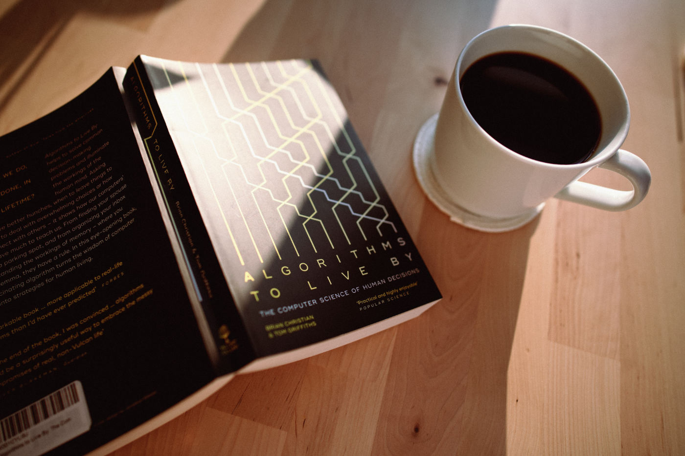

How many times should you go around a car park to find a space before you give up? Should you go back to your favourite restaurant or explore a new one? Minimise risk or reduce potential regrets? What's the best way to sort books on your bookshelf? Is it even worth spending time sorting them?

These types of questions are things that I think about a lot! Being a Software Engineer doesn't help because I always strive for logical proof of taken decisions. I found ["Algorithms to Live By: The Computer Science of Human Decisions" by Brian Christian and Tom Griffiths](https://www.goodreads.com/book/show/25666050-algorithms-to-live-by) particularly interesting because it helps to shape decisions around ordinary perplexities like these.

Before reading it, I didn't even realise how applicable algorithmic thinking can be in everyday life. Each chapter focuses on a specific problem like optimal stopping, sorting, caching, randomness etc. This book is full of interesting little facts about everyday life but also about computer science. It's not the easiest one to follow if you're an audiobook person - sometimes you have to stop and digest. Overall it's a super exciting publication for geeky heads like myself.
