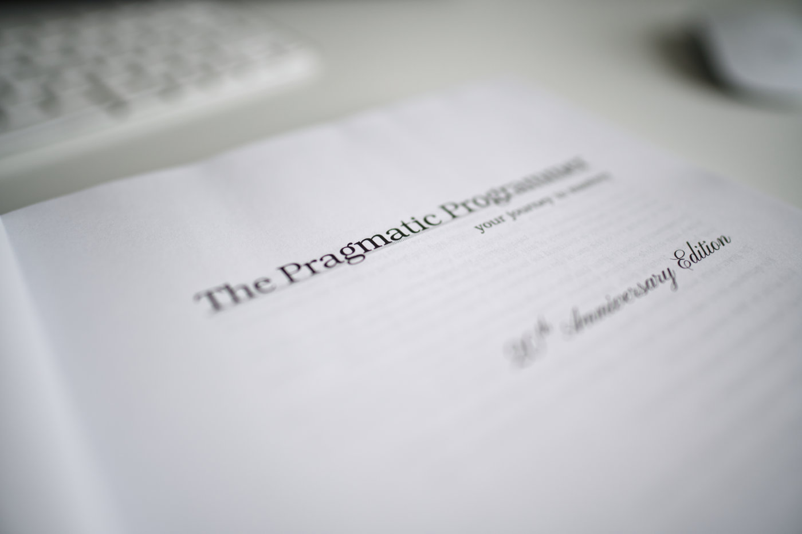

As you would expect from a passionate geek, I love books about programming but I also enjoy reads about self-development. It's hard to find a combination of these two categories in one publication but I found one! And I can't recommend it enough - ["The Pragmatic Programmer" by David Thomas and Andrew Hunt](https://www.goodreads.com/book/show/4099.The_Pragmatic_Programmer).

I've heard about this book a lot in the past and I regret that I didn't pick it up at an earlier stage of my career. This book contains 53 topics about specific aspects of a software developers everyday life, from high-level subjects like communication to very detailed recommendations about writing good, testable code. You can tell that both authors are experienced programmers who value practicality over theoretical gibberish.

As I mentioned before, I consider this book a must-read for everyone working in this field. So, let me leave you with the last tip from this book and for sure the most important one.

> It is your life. Share it. Celebrate it. Build it. And have fun!
